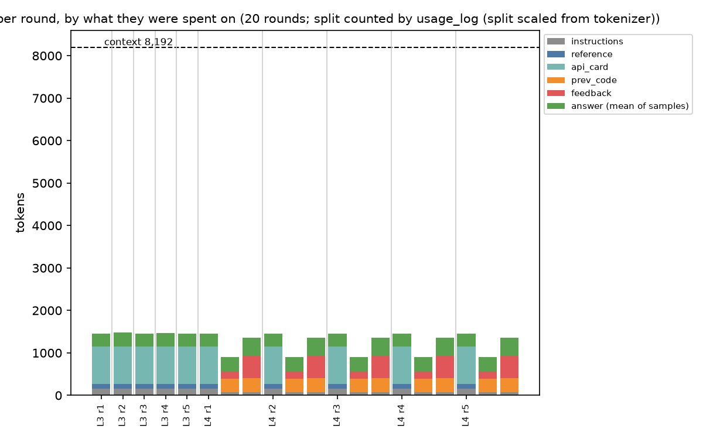

# Project 2: an NKI kernel agent that knows when it failed

Team submission, NYU × Annapurna Labs Trainium hackathon, 2026-10-10. Team 24, "Saturday team" (seats
115–119): yl8406, tg3077, sz3941, sm14493, yx3019.

**Start here.** Section 1 is the one-page note: what we ran, on what, what came out, how many runs, the
spread, and how to reproduce it. The sections after it are the evidence. Unless a line says *on chip*,
every number comes from the NKI 0.6.0 CPU simulator (`nki.simulate`), graded by our checker.

**In one paragraph.** We built a checker-driven agent that writes NKI kernels with a model that sees 8,192
tokens (Qwen3-8B, served on the seat's Trainium2). The organizers' agent solved only level 2 (3 runs of 5).
Ours solved levels 3 and 4 in every run and level 1 for the first time today, and every solve passed a
fresh-process re-audit and a held-out set of new shapes and hostile values [[TBD: final-run numbers]]. The
model never changed; what it was shown did. One worked example in the first prompt solves level 3; the code
in the repair messages solves level 4 (hollowed out, level 4 stopped solving); a compiler gate turns level
1's simulator-only solutions into kernels that build for trn2. Along the way we found that the seat's model
server is deterministic, so "5 runs" were often one run five times. We report distinct runs next to every
rate and changed the agent so its samples actually differ.

**Where each required item is.**

| asked for | where |
|---|---|
| the checker, and why it accepts and rejects what it does (README Part 4) | §2, [CHECKER.md](projects/02-kernel-agent/CHECKER.md) |
| the attempt log, every attempt with its score (Part 4) | [analysis/logs/](analysis/logs/README.md) |
| a one-page note: what ran, on what, how many runs, the spread (Part 4) | §1 |
| the agent (kernel-agent challenge) | §3, [V7.md](projects/02-kernel-agent/V7.md) |
| the verification harness, with its tolerance and the reasoning | §2, [EVAL.md](projects/02-kernel-agent/EVAL.md) |
| the eval set, hostile values included | [EVAL.md](projects/02-kernel-agent/EVAL.md) |
| the failure taxonomy | §7 |
| token instrumentation | §6 |
| a one-page reproduction note | §1, "Reproduce" |
| does the agent know when it failed | §5 |
| a failure and the recovery | §8 |

---

## 1. One-page note

**What we ran.** An agent loop that asks a model for an NKI kernel, grades it, turns the checker's verdict
into one repair instruction, and tries again: at most 8 rounds of 4 samples per level, inside an
8,192-token context. The final agent is `feedback_v7.py`, which layers v2–v7 over the organizers'
`agent.py` (configuration and every change: [V7.md](projects/02-kernel-agent/V7.md)). [[TBD: plus E-F if adopted]]

**On what.**

| | |
|---|---|
| model | Qwen3-8B, thinking off, served by vLLM on the seat pod's Trainium2 chip: one chip at LNC=2, tensor parallel 2, max-model-len 8192, max-num-seqs 4 |
| checker | `nkibench.py` on NKI 0.6.0, simulating trn2 (on a seat pod NKI picks trn2 from the hardware, which we confirmed with a probe kernel; the v7 runs also set it explicitly; the baseline and experiment A re-graded under trn2 and trn3 give identical scores, [analysis/sim_target_check.md](analysis/sim_target_check.md)), with an on-chip allocation audit and a held-out set: [CHECKER.md](projects/02-kernel-agent/CHECKER.md), [EVAL.md](projects/02-kernel-agent/EVAL.md) |
| where | [[TBD: 5]] seat pods in parallel, one agent process per model server |
| speed | about 50 s per round of 4 samples, bound by generation: 13.9 tok/s for one stream, 22.1 tok/s in total for four |

**What came out.** Round 2 numbers below (v7, 14:07–14:50); the final run replaces them. Rounds count
from 0: round 0 is the first prompt, round k the k-th repair. [[TBD: final-run table from `scripts/report.py`]]

| level | operation | baseline (organizers' agent): solved, scores | v7: solved, first 1.0 at round, distinct runs | held-out (v7) |
|---|---|---|---|---|
| 1 | average pool 2D | 0/5 · .30 .30 .30 .30 .30 · 1 distinct run | 0/1 · best 0.50; 3 of 8 rounds cut off at the token limit | not solved |
| 2 | 2D transpose | 3/5 · 1 .30 1 .30 1 (replication: 2/5) | [[TBD]] | [[TBD]] |
| 3 | matmul, one tile | 0/5 · .30 .30 .30 .30 .30 | **5/5** · round 0 · 3 distinct | 5/5 VERIFIED |
| 4 | matmul, tiled | 0/5 · .62 .62 .50 .62 .62 | **5/5** · round 2 · 1 distinct (the five runs are identical) | 5/5 VERIFIED |

**What we learned.**

1. **The checker and the prompt are the agent.** The model did not change; what it was shown did. Level 3
   went from 0/5 to 5/5 on a worked example in the first prompt, and the ablation says that example is the
   one layer level 3 cannot do without (§3).
2. **A simulator pass is not a chip pass.** Our allocation audit rejects kernels the simulator runs but
   no chip can hold (§8 shows one in a live run). liuyq's compiler gate finds level-1 kernels the simulator
   accepts and the trn2 compiler rejects.
3. **The model server is deterministic**: the same request returns the same text, even at temperature
   0.7, so 5 runs were often one run five times. We report distinct trajectories next to every rate, and v8 makes the samples differ (§4).
4. **The token budget was not what bound us; reading `finish_reason` was.** Prompts stay near 1,100
   tokens, repairs near 750, far below 8,192 (§6). But one layer dropped the `finish_reason` check, and a
   level-1 run lost 22 minutes to cut-off answers graded as syntax errors (§9).

**How many runs, and the spread.** Every cell is 5 runs of one configuration. We report the rate, never the
best run, and next to it the number of **distinct trajectories**: the seat's model server is deterministic
(4 concurrent identical requests at temperature 0.7 come back byte-identical, and so does `n=4`; only a
different request, or different sampling settings, gives different text), so 5 runs are often the same run
5 times. [[TBD: E-div result: whether per-sample prompt variation made the runs distinct]] [[TBD: one sentence on the spread of the final run.]] The baseline was run twice,
on two seats with the organizers' agent: L1 0/5, L2 3/5 and 2/5, L3 0/5, L4 0/5 both times, with identical
scores on L1, L3 and L4. Both logs were re-graded from scratch with the current checker under trn2, and
every attempt matched ([analysis/calibration_baseline_seat116.md](analysis/calibration_baseline_seat116.md),
[analysis/calibration_replica_seat119.md](analysis/calibration_replica_seat119.md)).

**Reproduce.** Everything except the model runs on a laptop; the agent itself runs on a seat pod.

On a seat pod (`kubectl exec -it seat-<N> -- bash`; wait for the `root@seat-<N>:/workspace#` prompt). `/workspace`
is the organizers' repository; put ours next to it:

```bash
git config --global --add safe.directory '*'
git clone https://github.com/liuyq123/trainium-agent-labs.git /workspace/team
cd /workspace && MAX_MODEL_LEN=8192 ./serve.sh      # the model server: about 4 minutes, keeps this shell
```

In a second shell on the same pod:

```bash
cd /workspace/team/projects/02-kernel-agent
python nkibench.py --selftest                                                        # SELFTEST PASSED
for l in 1 2 3 4; do python nkibench.py --level $l --eval reference_level$l.py | head -1; done   # 20/20 16/16 4/4 16/16
# the exports in V7.md "Run it", with per-level file names, then for each level N:
export NKI_VERDICTS=nki_verdicts_LN.jsonl USAGE_LOG=usage_LN.jsonl
nohup python3 feedback_v7.py --level N --rounds 8 --samples 4 --context 8192 --repeat 5 \
    --log attempts_LN.jsonl --verdicts verdicts_LN.jsonl > run_LN.log 2>&1 < /dev/null &
```

Without a seat, the checker and the agent's loop still run (no model: `--offline` replays the reference
kernels). Set up NKI 0.6.0 per [SETUP_PYTHON.md](SETUP_PYTHON.md) (on a Mac, its Docker step), then, with
`~/venvs/nki/bin` on your PATH and `export NEURON_PLATFORM_TARGET_OVERRIDE=trn2`, the same `--selftest` and
`--eval` lines, and V7.md's exports with `python3 feedback_v7.py --offline --all`. Offline runs make no model
calls, so they write no `USAGE_LOG`.

The tables, from the logs (on a laptop; `python3` with matplotlib for the token chart):

```bash
python3 -m venv .venv && .venv/bin/pip install matplotlib
.venv/bin/python scripts/report.py analysis/final analysis/logs/final      # checks, summary, taxonomy, token chart
.venv/bin/python scripts/report.py /tmp/baseline analysis/logs/baseline    # the baseline: L1 0/5, L2 3/5, L3 0/5, L4 0/5
```

---

## 2. The checker: what it accepts, what it rejects, and why

Full account: [CHECKER.md](projects/02-kernel-agent/CHECKER.md). The decisions that matter:

- **Order.** Parse, static rules, load from a fresh file, simulate with the allocation audit on, compare
  numerics on every loop shape, score. When a level ends, the held-out set runs once.
- **Tolerance: max |error| ≤ 2e-2 × RMS(reference output).** Relative to the output's RMS, because
  per-element relative error blows up where matmul and avgpool outputs cross zero. Measured, not chosen:
  rounding the inputs to bf16 moves the reference by at most 0.0134 RMS; the smallest error any real bug
  produced was 0.393 RMS.
- **Hardware legality before numerics.** The simulator allocates tiles without checking hardware limits,
  so a kernel can pass numerically and still be illegal. The audit records every on-chip allocation and
  rejects a partition dimension over 128, PSUM over 16 KiB per partition, and SBUF over 192 KiB per
  partition. 192 KiB is deliberately conservative (trn2 has 224 KiB): it can only reject a legal
  kernel, never pass an illegal one.
- **A held-out set the model never sees.** New shapes per level times four kinds of values: a fresh
  normal draw, a ramp (every element distinct), ×1e4 (float16 overflows), and float16 inputs, plus an
  output dtype check. The reference kernels pass all of it (20/20, 16/16, 4/4, 16/16). Four deliberately
  wrong kernels that pass every loop shape are all caught. [EVAL.md](projects/02-kernel-agent/EVAL.md)
- **Bugs we found in our own checker, and what we re-checked.**
  - *Path cache.* NKI caches a kernel by its file path. Grading several candidates from one path in one
    process graded a later candidate as the first one, numerics included, which can make both false solves
    and false failures. Fixed by a fresh file per candidate (c39c0ce; diagnosis in ded1ef2). Every log from
    before the fix was re-graded from scratch: baseline 424/424, replication 420/420, experiment A 160/160,
    v3 100/100 attempts identical to what was logged.
  - *Audit left installed.* The audit's wrappers stayed in place after a simulation and broke the trn2
    compiler in the same process. They are now installed only while a simulation runs (183b384).
  - *Simulation target.* Without a Neuron device, NKI 0.6.0 simulates trn3, which accepts a 1024-wide moving
    tile that trn2 rejects. On a seat NKI picks trn2 from the hardware; the v7 runs also set it, and the
    earlier logs give the same scores under both targets (530ab9a).
- **What it does not check.** Speed on the device (every number is simulated; levels 5–7's traffic bars
  are a model, not a measurement). Level 3 has a single loop shape, because the organizers' reference
  asserts it. The static rules are a text scan. The output dtype is checked only in the held-out set. SBUF
  is held to 192 KiB per partition, below trn2's 224 KiB.

## 3. The agent: what changed, and the rule behind every message

The loop is the organizers' `agent.py`: up to 8 rounds of 4 samples, the round's best kernel is repaired
next, the same failure twice adds a one-line-per-attempt ledger of what already failed. On top of it, the
final agent stacks these layers (full list and sources: [V7.md](projects/02-kernel-agent/V7.md)):

| layer | what it changes | the failure it answers (baseline counts) |
|---|---|---|
| first prompt (`PROMPT1=v2`) | states the exact `def` line and a short block of real NKI calls, each checked to lower for trn2 | invented APIs: 80 of 160 level-1 attempts |
| worked example (`CARD=category`) | one example chosen by the operation's category: a row mean for matmuls, a channel mean for reductions | 1-D tiles, reshape instead of slicing (70 of 112 level-3 attempts) |
| repair messages (v2–v5) | quote the failing line; for a known error class give the fix as lines to paste, in the model's own variable names; a too-large matmul operand gets the whole three-loop tiling at once | partition over 128 (55 of 84 level-4 attempts) and copy-size mismatches |
| repair prompt (`restructure`) | "use the code given; restructure around new loops or tiles if needed" replaces "keep everything else identical" | the old line forbade the loop restructuring tiling needs |
| invented-name map (our experiment A) | known invented calls (`nisa.multiply`, `transpose_moving`, …) mapped to the real 0.6.0 call | invented APIs |
| grading fixes, compiler gate | a fixed `grade()` with a 120 s timeout; a full-score kernel using a form the trn2 compiler rejects is held at 0.95 and given the rewrite | compiler-only failures |
| verdict | after each level: a confidence, then extra hostile cases and lowering for trn2 | see §5 |
| sampling (`SAMPLING=qwen`) | Qwen3's thinking-off sampling settings | none on levels 3 and 4 (ablation below); [[TBD: level 2]] |

**Which layer did it: leave-one-out ablation.** Each row switches one v7 layer back to the organizers'
original and keeps the rest. Because the server is deterministic, one run is the trajectory, so each cell is one run.
Rounds count from 0. [[TBD: compare.py table and log paths]]

| switched back | level 3 | level 4 |
|---|---|---|
| nothing (v7) | 1.0, round 0 | 1.0, round 2 |
| first prompt (`PROMPT1=theirs`) | 1.0, round 0 | 1.0, round 1 |
| **worked example (`CARD=theirs`)** | **0.30, not solved** | 1.0, round 4 |
| all-dims tiling message (`MESSAGES=v4`) | 1.0, round 0 | 1.0, round 4 |
| repair prompt (`REPAIR_PROMPT=theirs`) | 1.0, round 0 | 1.0, round 2 |
| sampling settings (`SAMPLING=theirs`) | 1.0, round 0 | 1.0, round 2; rounds 0–1 identical to v7 |

Level 3 needs exactly one layer, the worked example in the first prompt; without it, level 3 stays
unsolved at 0.30. [[TBD: its failure modes]] Level 4 needs no single layer: the example and the all-dims tiling
message each save two rounds, and v7's longer first prompt costs one. On level 4, switching the sampling
settings back did not move the trajectory (rounds 0–1 identical).

The rule for feedback: one failure, one instruction, naming the failing line. A verdict ("line 16 calls a
banned function") is rewritten as an instruction ("change this call; keep everything else"). **For known
error classes the instruction is code**: the lines to paste, written in the model's own variable names and
shape expressions, never the test shapes' numbers and never taken from a reference kernel. The model
copies them (§8 shows it doing so). We chose this deliberately and report it, because it means part of
the solution comes from the checker, not the model.

**What the model sees, and what it never sees.** The first prompt carries one worked example chosen by the
operation's category: a row mean for matmul levels, a channel mean for reductions, nothing otherwise. For
level 1 (average pooling) the channel mean is a strong hint, and we say so: it has the same pipeline (load
to SBUF, `nl.sum` with `keepdims`, scale with `tensor_scalar`, store) but not the windowed access pattern
that turns a mean into a pooling. It is not the answer; judge for yourself. What never reaches a prompt: the
NKI tutorial kernels, the organizers' reference kernels for levels 1–4, and our answers for levels 9–14. A
line-by-line scan of every request v7 sends (35 distinct prompts, first and repair rounds, levels 1–4 and
9–14) and of 2,851 string constants in the agent found 0 lines from any of them; the same scanner finds 95
on a positive control. ([analysis/prompt_leak_check.md](analysis/prompt_leak_check.md))
Thinking stays off. The organizers measured it on this model: with thinking on, a round took 446 s and every
sample was cut off before any code ([projects/02-kernel-agent/README.md](projects/02-kernel-agent/README.md)).

## 4. Experiments, one change at a time

Each change was measured with `--repeat 5` against the current reference and kept or rolled back by rules
written down before the results came in ([PLAN.md](PLAN.md) §4).

| id | change | level | result (solved, scores) | decision |
|---|---|---|---|---|
| E-A | invented NKI names mapped to the real 0.6.0 calls | L1 | 0/5, all 0.30; invented names 80 → 20, the failures moved one layer deeper | kept as groundwork |
| E-v3 | feedback_v3 | L4 | 1/2 before the seat went to v7: solved on round 6, then a 0.75 | superseded by v7 |
| E-F | wrong argument list: failing line + real signature + one instruction | L1 | 0/5, all 0.30, one trajectory; wrong-signature errors 8 → 3 per run, the run then stalls on copy sizes | not carried into v7: v7's level-1 failures are different, and with a deterministic server any message change can move v7's solved trajectories |
| E-v7 | feedback_v7 as a whole | L1, L3, L4, L2 | L3 5/5 (round 1), L4 4/4 (round 3, one trajectory), L1 [[TBD]], L2 [[TBD]]; all solves VERIFIED [[TBD: final after re-audit]] | adopted |
| E-div | v7, plus a one-line `(attempt k of n, run r)` tag on samples 2–4 so a deterministic server returns different samples | L3, L4 | L3 5/5 (3 distinct runs, was 1 under v7's L4), L4 4/4 | kept (in v8) |
| v8 | E-div + skeleton feedback + cut-off answers not graded + level-1 call fixes; liuyq's level-1 compiler gate in the base | L1–L4 | **L1: first solve of the day**, in its first repair round; VERIFIED by both verdicts, held-out 20/20, lowers for trn2, re-audit PASS (1 of 3 runs). L4: 0.62 twice (v7: 5/5). L3: solved, two rounds later than v7. L2, round 0 only: 0/20 | skeleton dropped (see below); the rest kept |
| L2 sampling | v8 with the first prompt and the sampling settings back to the organizers' | L2, round 0, 20 samples | 2/20, the same as the organizers' agent re-run today (2/20); with v7's sampling settings 0/20 | the level-2 regression was v7's sampling settings |
| v8.1 | v8 without the skeleton, plus samples 1 and 3 on the original sampling and 2 and 4 on v7's, plus one sentence restating the level-2 task when the model transposes the whole input | L1–L4 | [[TBD]] | [[TBD]] |

**The skeleton gamble, and why it lost.** v8 hollowed out the code in the repair messages (`t[<…>]`) so that the
model would have to work out slices and shapes itself. On level 4 it could not: it filled the holes with
out-of-range slices twice and stalled at 0.62 both times, where v7, given the lines, solved every run. So the
code in v7's messages is not decoration; on level 4 it is the part of the solution the model does not find
on its own. We report that rather than claim the model wrote it.

What did not work, kept here because each one cost us time:

- **Both message fixes for level 1 moved the failure, not the score.** Experiment A cut invented calls from
  80 to 20 and E-F cut wrong-signature errors from 8 to 3 per run; both stayed at 0.30, stuck on the next wall.
- **Compiling the model server with -O3** to make rounds faster: still compiling after 33 minutes. Dropped;
  it would also have invalidated the baseline.
- **A `seed` parameter**, to get independent samples from a deterministic server: HTTP 500, and it took the server
  down once.
- **Splitting an experiment's runs across seats** to get results sooner: with a deterministic server the runs
  are mostly copies, so it buys speed without information. E-div (§4 table) is the fix we tried instead.

## 5. Does the agent know when it failed?

Two verdicts, one yardstick. When a level ends, the agent states a confidence from what the loop saw and
nothing else (0 if unsolved; 0.9 if solved, ×0.7 if the loop tested one shape, ×0.5 for a test-shape size
written into the code, ×0.6 for a hard-coded output dtype; [EVAL.md](projects/02-kernel-agent/EVAL.md)).
v7 adds its own verdict after extra hostile cases and lowering for trn2. Both are then scored against our
held-out set, which neither has seen.

| runs | level | held-out | ours: confidence, Brier | v7's: confidence, Brier | confident (≥ 0.5) but wrong |
|---|---|---|---|---|---|
| v7, round 2 | 3 | 5/5 VERIFIED | 0.63, 0.137 | 0.74, 0.067 | 0 and 0 |
| v7, round 2 | 4 | 5/5 VERIFIED | 0.90, 0.010 | 0.88, 0.014 | 0 and 0 |
| [[TBD: final run, every level]] | | | | | |

Neither verdict ever claimed a kernel that then failed. Ours is too cautious on level 3 (§9). The first
level-1 solve (v8) was claimed VERIFIED by both verdicts, and it holds: held-out 20/20, 35 extra hostile
cases, lowered for trn2, re-audit PASS.
([analysis/round2_v7/](analysis/round2_v7/README.md))

Baseline, scored after the fact with the same confidence function: the 3 solved runs said 0.90 and all
passed the held-out set; the 17 unsolved said 0. Brier 0.001, or 0.010 over the 3 real predictions; no
confident-but-wrong claim. The replication adds 2 more solves, both 0.90 and both passing the held-out set.
Five predictions say little, which is why the final run matters.
([analysis/calibration_baseline_seat116.md](analysis/calibration_baseline_seat116.md))

## 6. Where the tokens went



Round 2, levels 3 and 4, counted by the server ([analysis/round2_v7/](analysis/round2_v7/README.md)). A
first prompt averages 1,148 tokens: 77% the API card and the worked example, 14% instructions, 10% the NumPy
reference. A repair prompt averages 744: 47% the checker's feedback, 44% the previous kernel, 9%
instructions. Neither comes near 8,192. The budget goes to the two things the model cannot work out by
itself, real API calls up front and the checker's diagnosis afterwards, and the repair prompt drops the
docs. [[TBD: final-run chart and numbers]]

## 7. Failure taxonomy

Under v7 (round 2), level 3's walls are gone: the baseline's reshape (48), copy size (26), 1-D tile (22) and
out-of-bounds (16) failures do not occur, the 7 failures left are all a tile in the wrong memory, and every
run solves in round 0. Level 4 still meets the baseline's wall first (partition over 128, 20 attempts in round
0; the baseline never got past it), then a broadcast shape mismatch (20 in round 1), and solves in round 2.
[[TBD: final table from scripts/taxonomy.py]]

**A failure mode we only found by reading the repairs: transposing the whole input.** On level 2 the repair
rounds never once succeeded, in the baseline or under v7. In 81 of 134 failed repairs the model was
transposing all of `x` instead of the small matrix inside each row: index out of range on the second axis, or
"Partition dim size must be preserved, got 32 -> 3". The checker reported the symptom each time and never
the misreading, so v8.1 adds one sentence restating the task when these errors appear (no code).

Baseline, 424 attempts in 25 named modes: index and size
arithmetic 52%, unfamiliar API 24%, tiling rules 18%, memory placement 5%. Four modes were never fixed by the
original feedback once they appeared (stuck rate 100%): out-of-bounds index, reshape instead of slicing,
invented function, partition dimension over 128.
([analysis/taxonomy_baseline_seat116.md](analysis/taxonomy_baseline_seat116.md))

## 8. A failure, and the recovery

Level 4 (tiled matmul), feedback v3 (v7's predecessor), run 1: the first level-4 solve of the day. Every
message below is in the log; the full transcript, with the code that changed each round and the prompts
rebuilt to the logged length, is [analysis/recovery_v3_L4_run1.md](analysis/recovery_v3_L4_run1.md)
(log: [analysis/logs/ev3_L4/](analysis/logs/README.md), lines 29–52).

| round | best of 4 | what the checker said | what went back to the model |
|---|---|---|---|
| 0 | 0.62 | `dma_copy dst partition dimension 256 exceeds maximum 128`: one SBUF tile for a whole operand | loop over the partition dimension in chunks of at most 128, allocate each tile inside the loop |
| 1 | 0.62 | `Matmul stationary free dimension 256 exceeds gemm_stationary_fmax=128` | the loop over output rows, as code in the model's own names |
| 2 | 0.62 | `Matmul moving free dimension 1024 exceeds max 512 for nc_version.gen3` | the loop over output columns, as code |
| 3 | 0.62 | **ILLEGAL ON HARDWARE**: SBUF tiles of (256, 256) and (256, 1024) | allocate each tile inside the loop, with the chunk's own shape |
| 4 | 0.62 | the same, a second time | the same message, plus a ledger: "These approaches have already failed, so do something different" and one line per failed attempt |
| 5 | **1.00** | correct on every shape | |

Three things happen here. The model pasted the code-form messages almost verbatim, so each round removed
exactly one wall (rounds 1 to 3). At round 3 the simulator ran the kernel on every shape; only our
allocation audit knew that no chip holds a (256, 1024) SBUF tile, and it said so. The same failure twice
brought in the ledger, and the next answer rewrote the allocations as (128, 128) and (128, 512) tiles:
solved, after 21 attempts. Then, before seeing anything new, the agent stated a confidence of 0.90; the
held-out set (4 new shapes × 4 kinds of values) passed 16/16. Verdict: VERIFIED, and the claim was right.
The solving kernel is correct, not fast: 36.6 Flops/Byte, memory-bound.

## 9. Limits

- **The simulation target matters in general.** With no target set and no `neuron-ls` on the machine,
  NKI 0.6.0 simulates trn3. A level-4 kernel with a 1024-wide moving tile passes 2/4 shapes under trn3 and
  0/4 under trn2 ("moving free dimension 1024 exceeds max 512 for nc_version.gen3"). We set trn2
  explicitly and re-graded earlier runs under it. ([analysis/sim_target_check.md](analysis/sim_target_check.md))
- **A deterministic server.** The seat's model server returns the same text for the same request, whatever the
  temperature, so repeated runs of one configuration are mostly copies, and "5/5" can mean one trajectory five times. We report distinct
  trajectories next to every rate. A request with a `seed` parameter returned HTTP 500 and took the server down once.
- **Simulator numbers.** Every score comes from `nki.simulate` on a CPU. [[TBD: which hand-in kernels were
  also compiled for trn2 and run on a NeuronCore]]
- **Five runs per cell, and fewer distinct trajectories.** A 3/5 against a 4/5 is noise.
- **Level 3 has one loop shape**, because the organizers' reference asserts it; its held-out cases change
  only the values.
- **The confidence rule is stated, not fitted.** Its weights were fixed at 13:40, before any held-out
  result, and never tuned. It is underconfident on level 3: it docks every level-3 kernel ×0.7 for having
  been tested on a single loop shape, which the level's own contract fixes, so it said 0.63 for five kernels
  that were all right.
- **Part of each solution comes from the checker.** Code-form messages are pasted by the model (§3, §8),
  and the level-1 example is a strong hint (§3).
- **v7 is a bundle of layers**, and only part of it is explained: the ablation (§3) shows level 3 rests on the
  worked example alone and level 4 on no single layer; what each layer does on levels 1 and 2 we did not ablate.
- **Levels 9–14 are liuyq's own held-out operations**, not the official ladder, and are reported apart from it.
- **The SBUF limit is conservative**: 192 KiB per partition, below trn2's 224 KiB.

## 10. Who did what, and where each number comes from

| part | by | where |
|---|---|---|
| the agent loop, the original checker, the reference kernels and the API card for levels 1–8 | the organizers | `agent.py`, `nkibench.py`, `reference_level*.py` |
| feedback layers v2–v7, the compiler gate with its level-1 rule, the verdict, levels 9–14 | liuyq | `feedback_v2.py` … `feedback_v7.py`, `gate_nki.py`, `verdict_nki.py`, `ops07.py`, `ops08.py`, [V7.md](projects/02-kernel-agent/V7.md) |
| checker additions: allocation audit, a fresh file per candidate, the held-out set and its mutants, confidence and calibration, token accounting, taxonomy and reports | teoguo | `nkibench.py`, `agent.py`, `scripts/`, [EVAL.md](projects/02-kernel-agent/EVAL.md), [CHECKER.md](projects/02-kernel-agent/CHECKER.md) |
| experiments A, E-F, E-div, v8 and v8.1, the ablation, this write-up | teoguo | `feedback_v8.py`, [V8.md](projects/02-kernel-agent/V8.md), [PLAN.md](PLAN.md), [NOTES.md](NOTES.md) |
| seats 115–119, runs, re-audits | the team | [analysis/logs/](analysis/logs/README.md) |

Most code, analysis and text on teoguo's side was produced with Claude Code sessions that the team directed
and checked; each commit names its author. Every number in this document is computed by a script in this
repository from a logged run.

**Where a number comes from.**

- *Simulator* (`nki.simulate`, trn2 target): every score, solve rate and held-out result.
- *trn2 compiler*: v7's verdict lowers each solve for trn2; the level-1 solve lowered.
  [[TBD: full builds of the final solves, if run]]
- *On a NeuronCore*: liuyq ran solved kernels for levels 2, 3, 4, 9 and 11 on the chip (183b384).
  [[TBD: final hand-in kernels, if run]]
- *Measured or inferred.* Rates, counts and timings are measured. Explanations (why the skeleton failed, why
  level 2 repairs never succeed) are our reading of the logs, and each one points to the log it rests on.

## 11. Files

| what | where |
|---|---|
| attempt logs, every attempt with its score | earlier runs: [analysis/logs/](analysis/logs/README.md) (baseline, replication, experiments; what each is, its code version, md5, and whether it is comparable); final run: [[TBD: analysis/logs/final/]] |
| results table | [[TBD: analysis/summary_final.md]] |
| checker, eval set, tolerance | [CHECKER.md](projects/02-kernel-agent/CHECKER.md), [EVAL.md](projects/02-kernel-agent/EVAL.md), `nkibench.py` |
| agent | `agent.py`, `feedback_v2.py` … `feedback_v7.py`, [V7.md](projects/02-kernel-agent/V7.md) |
| hand-in kernels, one per level | [[TBD: nki_kernels/]] |
| how we ran the day | [PLAN.md](PLAN.md), [NOTES.md](NOTES.md) |
