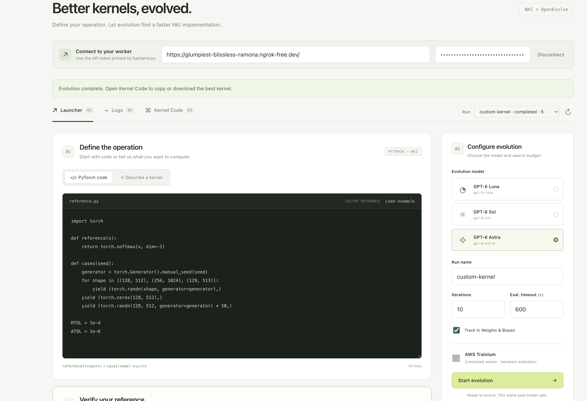
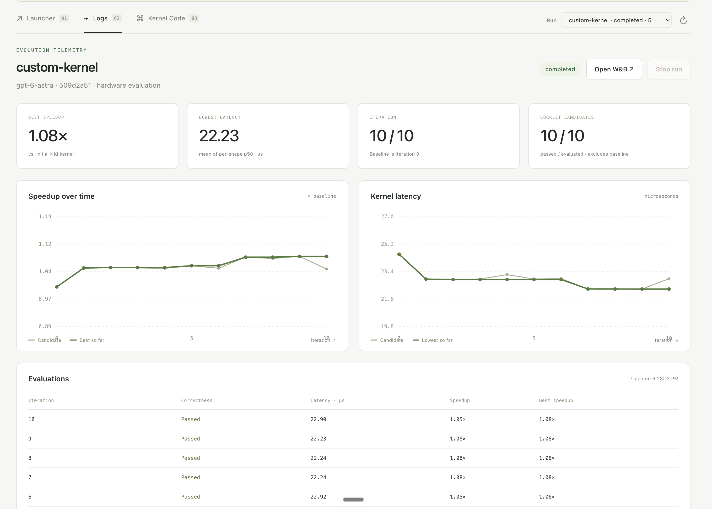
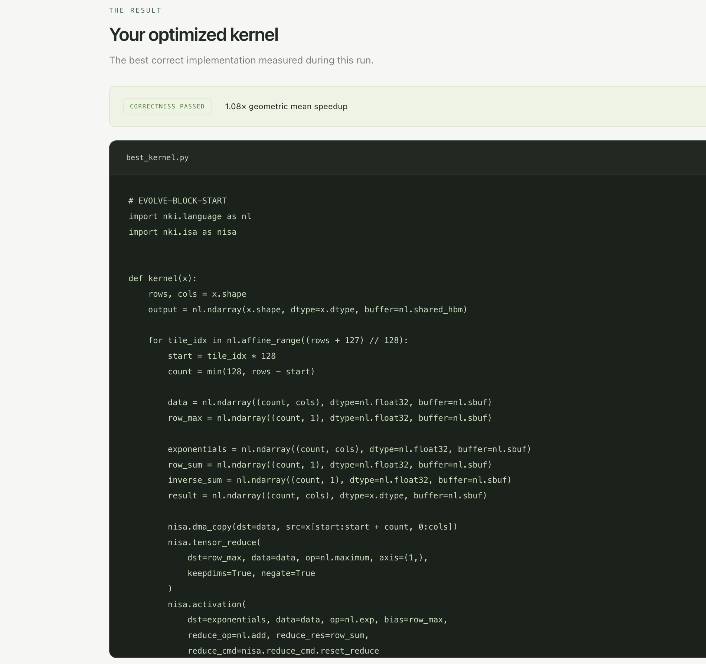

# Softmax run evidence

User-provided screenshots from October 10, 2026 show a completed hardware-mode
softmax search using `gpt-6-astra`. The PyTorch reference computes softmax over
the last dimension. Cases include shapes `(128, 512)`, `(256, 1024)`, and
`(129, 513)`, plus zero inputs and random inputs scaled by 50. Tolerances are
`RTOL = 1e-4` and `ATOL = 1e-6`.

The dashboard reports 10/10 evaluated candidates passing correctness, a best
geometric mean speedup of 1.08× over the initial NKI kernel, and a lowest mean
of per-shape p50 latency of 22.23 µs. These measurements are specific to this
run and supplied cases; they do not compare against PyTorch performance.

## Launcher

## Logs

## Best kernel

