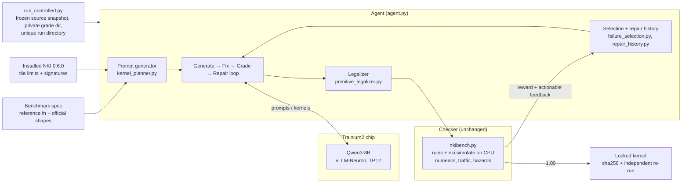
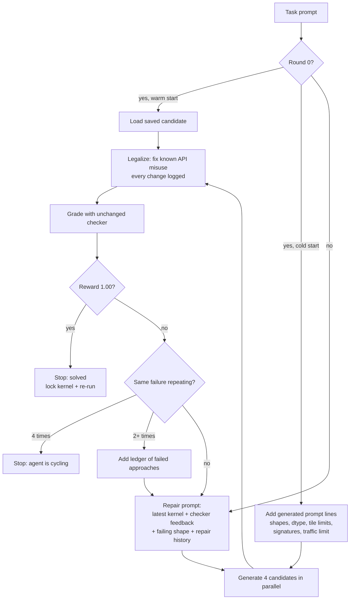

# Autonomous NKI Kernel Agent: Architecture and Workflow

An agent that writes NKI kernels for AWS Trainium2. Qwen3-8B writes the kernel, the NKI simulator
checks it against a NumPy reference, and the agent repairs it from the checker's feedback until every
official shape passes.

## The problem

Eight levels. Each level is one kernel that must match a NumPy reference on every official shape.

| Level | Kernel | Also checked |
|---|---|---|
| 1 | Average pooling 2D | Reductions, tensor layout |
| 2 | 2D transpose | Partition-axis movement |
| 3 | Single-tile matmul | SBUF/PSUM placement |
| 4 | Tiled matmul | M/N/K tiling, accumulation |
| 5 | Matmul, hoisted loads | HBM traffic ≤ 1.6× the minimum |
| 6 | Matmul, M/N blocking | HBM traffic ≤ 1.25× the minimum |
| 7 | Fully blocked matmul | HBM traffic ≤ 1.05× the minimum |
| 8 | Single-head attention | Fused matmul + stable softmax |

**Reward:** parses 0.1 + rules 0.2 + runs 0.2 + correct 0.5 = **1.00**. "Correct" means every
official shape:

- matches the reference within tolerance
- leaves its inputs unmodified
- stays within the level's HBM traffic limit
- triggers no simulator hardware-hazard warnings

The checker (`nkibench.py`) is the benchmark's own and is unchanged.

## Architecture



| Component | File | Role |
|---|---|---|
| Model server | vLLM-Neuron on Trainium2 | Serves Qwen3-8B (thinking off, 4 parallel requests) |
| Agent loop | `agent.py` | Runs rounds: generate, fix, grade, select, repair, stop |
| Prompt generator | `kernel_planner.py` | Generates the extra prompt lines from the benchmark spec and installed SDK |
| Legalizer | `primitive_legalizer.py` | Rewrites known NKI API misuse in the generated code |
| Checker | `nkibench.py` | Scores the kernel. Benchmark-owned, unchanged |
| Selection | `failure_selection.py`, `repair_history.py` | Picks which candidate to repair next |
| Runner | `run_controlled.py` | Makes reproducible, isolated runs |
| Fine-tuning | `training/` | LoRA on synthetic NKI data (separate experiment) |

## Workflow for one level



Up to 8 rounds per level, with 4 candidates per round.

## Strategy

**1. Generated prompt additions.**
Every extra line added to the model's prompt comes from the generator in `kernel_planner.py`. It
derives each line from the benchmark and the installed SDK:

- output shapes and dtypes, from running the reference on the official inputs
- tile limits, from `nl.tile_size`
- partition tiling counts for inputs over 128 rows
- the traffic limit
- the installed signatures of every API the task names

The generated text is capped at 240 tokens and contains no kernel code.

**2. Fix mechanical API mistakes in code, not with model rounds.**
The legalizer applies small AST rewrites that keep the operation the same:

| Rule | What it fixes |
|---|---|
| `instruction_namespace`, `opcode_namespace` | `nl.*` instructions and opcodes used where `nisa.*` is required |
| `hbm_scalar_staging` | A compute result written straight to HBM; it's routed through SBUF |
| `dst_result_binding` | The return value of a `dst=` instruction used as a tensor |
| `anonymous_tile_dataflow` | A result written into one unnamed tile and read from another |
| `psum_operand_staging` | A PSUM tile passed to `nc_matmul`; it's copied to SBUF first |

The checker still decides every score, and both the raw and the rewritten source are logged.

**3. Feedback tells the model what to do, not just that it failed.**
Errors name the failing shape and the exact fix. If the model calls an API that doesn't exist, the
feedback includes the real installed signature.

**4. Repair loop that doesn't get stuck.**

- It repairs the latest attempt, not the best one. Repairing the best one feeds the same prompt back,
  and the model returns the same answer.
- When candidates tie on reward, it prefers the one whose error is most specific (names the failing
  call and line) and isn't a repeat of an earlier failure.
- After 2 identical failures it adds a ledger of approaches that already failed.
- After 4 identical failures it stops.

**5. Warm start.**
`--warm-start FILE` grades a saved candidate as round 0, then repairs from it. The seed's path and
sha256 are logged. This is the main approach for Level 1.

**6. Trust nothing without a re-run.**
Every 1.00 kernel is saved read-only with its sha256 and re-run separately with the unchanged
checker. Each run directory also holds a frozen copy of the source that produced it.

## Results

All results come from the CPU simulator (NKI 0.6.0) on one seat. Device latency was not measured. The
original baseline agent solved no level in any of its 5 repeats.

| Level | Best score | How | Run |
|---|---:|---|---|
| 1 | **1.00** | Warm start, round 0. The legalizer fixed 2 API errors. Best cold start is 0.50 | `controlled-20261010T214022-7d05zuet` (current commit) |
| 2 | **1.00** | Cold start, round 0, raw model output | `controlled-20261010T214002-44j993c1` (current commit) |
| 3 | **1.00** | Cold start, round 0, raw model output | `controlled-20261010T214002-44j993c1` (current commit) |
| 4 | **1.00** | Cold start, round 0, raw model output | `controlled-20261010T205651-l9444j4q` (earlier commit) |
| 5 | **1.00** | Cold start, round 0, raw model output | `controlled-20261010T205124-kcpiu5w7` (earlier commit) |
| 6 | **1.00** | Cold start, round 0, raw model output | `controlled-20261010T205124-kcpiu5w7` (earlier commit) |
| 7 | **1.00** | Cold start, round 0, raw model output | `controlled-20261010T205124-kcpiu5w7` (earlier commit) |
| 8 | 0.30 | Not solved: the kernel runs but no shape passes | in progress |

Levels 1–3 were scored on the current commit (`dd85856`). Levels 4–7 were scored on an earlier commit
of this branch.
The locked kernels are in `runs/verified-level{1,2,4,5,6,7}-locked-*`. Full evidence is in
`LEVEL_SCORECARD.md`.

**Fine-tuning (LoRA):** trained on CPU for 82 steps on verified synthetic NKI tasks, none of them
from the benchmark. Training and held-out task families are kept separate. Held-out loss fell from
0.995 to 0.127. To serve it on Trainium, the adapter was merged into the base weights, because
vLLM-Neuron can't load LoRA adapters. **It hasn't solved any benchmark level yet** (Level 3: 0.30 on
CPU; Level 8: 0.30 on Trainium). None of the scores above use it.

## Limits

- All correctness results come from simulation. Nothing has been verified on the device, and there
  are no latency numbers.
- Level 8 is unsolved, and Level 1 from a cold start reaches only 0.50.
- Each configuration was run once. These are not repeated, averaged measurements.

## Run it

```bash
python nkibench.py --selftest                              # prove the checker first

# One level, full agent
python agent.py --level 4 --rounds 8 --samples 4 --context 8192 --max-tokens 2500 \
  --planner-policy hardware --primitive-policy legalize \
  --candidate-policy diverse --selection-policy diagnostic --repair-policy grounded \
  --feedback-policy targeted --example-policy synthetic --adaptive-repair --instrument

# Isolated, reproducible runs, one level after another
# (frozen source, private grade dir, unique run dir; refuses to start if the model endpoint is down)
python run_controlled.py --full-agent-only --planner-policy hardware --primitive-policy legalize \
  --levels 1 2 3 4 5 6 7 8 --rounds 8 --samples 4 --repeat 1 --run

# Warm start (Level 1)
python run_controlled.py --full-agent-only --planner-policy hardware --primitive-policy legalize \
  --levels 1 --rounds 8 --samples 4 --warm-start SAVED_CANDIDATE.py --run

python -m pytest tests -q                                  # unit tests
```

Every new behavior is opt-in. With no flags, `agent.py` runs the original baseline loop, and its
scoring and stopping rules are unchanged.
