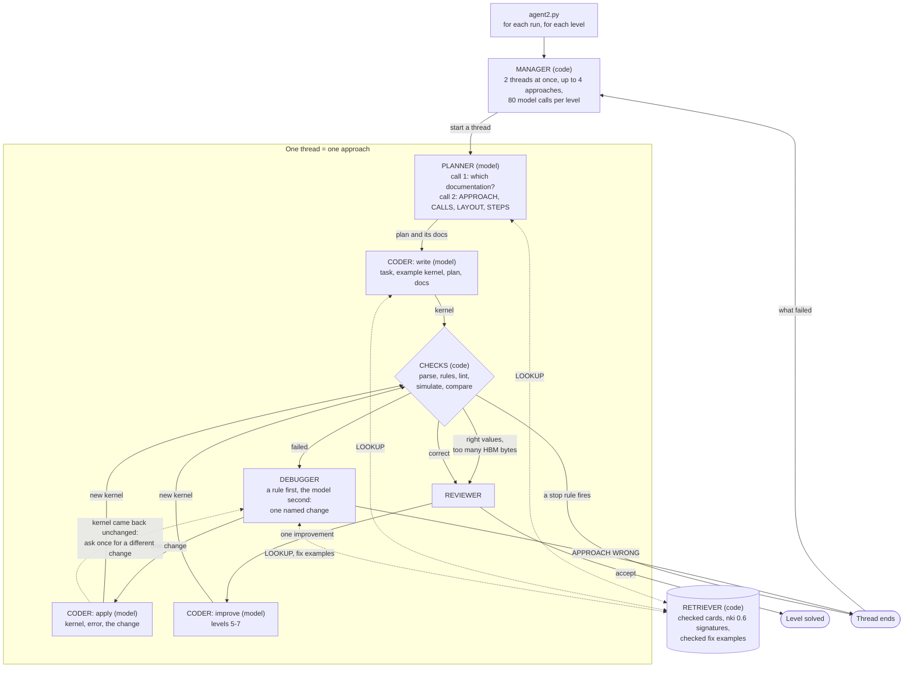
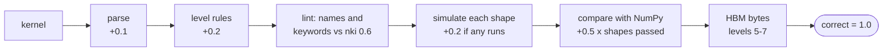

# Project 2 — The kernel agent

An agent writes NKI kernels for one Trainium2 NeuronCore. It checks each kernel in the simulator against
a NumPy reference, reads the failure, and tries again. This folder holds the organisers' harness and
their single-loop agent (`agent.py`), plus our second agent, **agent2** (`agent2.py`, `agents2/`), which
splits the work into six roles.

- **The task** as the organisers set it (the ladder, the harness, measured lessons, hints, adding your own
  operation): [README-task.md](README-task.md).
- **Why agent2 is built this way**, and its implementation status: [DESIGN.md](DESIGN.md).

## Status (2026-10-10 ~23:10 UTC)

- **agent2 solved levels 1 and 3, on Qwen3-8B and on Qwen3-32B.** `agent.py` solved none of
  levels 1–4 in any of its 3 runs on the 8B server.
- Each agent2 result is **one run**: a signal, not a solve rate. Report rates over `--repeat N`, with
  the spread.
- The 32B runs were stopped by request at ~23:07 UTC. Levels 1, 2, 3 and 5 finished, levels 4 and 6 were
  stopped partway, and levels 7 and 8 never ran.
- The 8B runs of levels 5–7 (seat-199) were stopped by request at ~23:08 UTC, partway through level 7.
  Level 8 never ran on either model.

## Results

agent2 at `e4edc8c` with default settings (2 threads, up to 4 approaches and 80 model calls per level),
one run per level, 8K context. Every check is `nki.simulate` on the CPU. The best kernel of each level is
in [`kernels/`](kernels/) (`_8b` in the name: Qwen3-8B), with its score and caveats in the header. They
are the agent's output, not reference kernels.

### Qwen3-8B (TP=2: levels 1–4 on seat-35, levels 5–7 on seat-199)

| Level | Operation | agent2 (1 run) | `agent.py` baseline (3 runs) |
|---|---|---|---|
| 1 | average pooling 2D | **solved**: 5 checks, 83 s | 0.30 in every run |
| 2 | 2D transpose | 0.30: 14 checks, 196 s | 0.30 in every run |
| 3 | matmul, single tile | **solved**: 3 checks, 120 s | 0.30 in every run |
| 4 | matmul, tiled | 0.62: 23 checks, 592 s | 0.62 at best |
| 5 | matmul, loads hoisted | 0.62 (1 of 4 shapes): 30 checks, 61 calls, 790 s | not run |
| 6 | matmul, M and N blocked | 0.62 (1 of 4 shapes): 21 checks, 47 calls, 564 s | not run |
| 7 | matmul, M, N and K blocked | 0.62 (1 of 4 shapes) after 6 checks, then stopped by request | not run |
| 8 | single-head attention | not run | not run |
| | levels 1–4 in all | 16.5 min | about 22 min per run |

- Runs: `agent2-v5-all-1010-2230`, and `baseline-1010-1700` (`agent.py` defaults: 8 rounds × 4 samples).
- **Level 1:** the kernel copies the input into SBUF, reshapes it to `(C, H/p, p, W/p, p)`, permutes the
  window axes last and takes `nl.mean` over them. **Caveat:** it returns that SBUF tile, with no HBM
  output and no `dma_copy` out. The simulator and `nkibench` accept this; the device is untested.
- **Level 2:** every plan tried to transpose within a partition (`nl.transpose`, `t.ap`). The name index
  offers no transpose instruction at level 2: `nc_transpose` is listed from level 3, and `t.permute` and
  `dma_transpose` are withheld.
- **Level 3:** clean (an HBM output, exactly the minimum bytes), but hard-codes the one test shape.
- **Level 4:** mostly copy-size and output-shape errors.
- **Levels 5–7** (runs `agent2-e4e-l{5,6,7}-1010-2241`): each best kernel passes only the one test shape
  that fits a single tile (K=128, M=128, N=512). At level 5 it puts a 256-row operand in one tile. At
  levels 6 and 7 it hard-codes that first shape's tile and output sizes.
  - 20 of the 57 checks hit errors no debugger rule recognises.
  - The most common of those (11) come from views that move or resize the partition axis: "Partition dim
    must stay at position 0", "Partition dim size must be preserved".

### Qwen3-32B (seat-198, TP=4, the whole chip)

| Level | Operation | agent2 (1 run) | Planner-only test: names-only index → described index |
|---|---|---|---|
| 1 | average pooling 2D | **solved**: 5 checks, 171 s | right names 48% → **100%**; plans with a wrong name 6/8 → **0/8**; wrong-axis reduce 5/8 → **1/8** |
| 2 | 2D transpose | 0.50 (it runs, the values are wrong): 27 checks, 891 s, all 4 approaches used up | not tested |
| 3 | matmul, single tile | **solved**: 1 check, 103 s | not tested |
| 4 | matmul, tiled | 0.62 after 2 checks, then stopped by request | right names 55% → **91%**; plans with a wrong name 8/8 → **2/8**; wrong-axis reduce 4/8 → **0/8** |
| 5 | matmul, loads hoisted | 0.62 (1 of 4 shapes): 28 checks, 52 calls, 14 min | not tested |
| 6 | matmul, M and N blocked | 0.62: 31 checks, 54 calls, then stopped by request | not tested |
| 7 | matmul, M, N and K blocked | not run | not tested |
| 8 | single-head attention | not run | not tested |

- **The planner-only test** made 8 single-plan calls per arm and level with LOOKUP off. It measures plans,
  not kernels: a right name is not yet a right kernel. "Wrong-axis reduce" is a plan choosing
  `nisa.tensor_partition_reduce`, which reduces across partitions. The described index also cut the
  planner prompt from ~1,166 to ~818 tokens at level 1, and from ~1,199 to ~905 at level 4.
  - Level 1: every described plan reshapes the tile, most also permute, then `nl.mean` or `nl.sum`, the
    route that solved level 1 on both models.
  - Level 4: 7 of 8 described plans added `t.reshape` / `t.permute`, which a tiled matmul doesn't need.
- **Levels 1 and 3 on the 32B:** level 1 is the same reshape → permute → `nl.mean` route, and it writes
  its result to an HBM output with `dma_copy`. Level 3 is clean but hard-codes the one test shape
  (`K, M = 128, 64`), like the 8B's.
- **Level 5 hit `agent.py`'s level-4 wall:** every approach ran one `nc_matmul` on whole-input tiles. That
  passes the one test shape that fits a single tile and fails once a dimension passes 128 (`dma_copy dst
  partition dimension 256 exceeds maximum 128`). No plan tiled M, N and K.
- **Level 6 (stopped partway):** it loops over K and accumulates in PSUM, so the values are right on 2 of 4 shapes. But
  one of those moves 1.5× the minimum bytes (the limit is 1.25×), and it never tiles M.

## The ladder

| Level | Operation | Passes when |
|---|---|---|
| 1 | average pooling 2D | correct on every test shape |
| 2 | 2D transpose | correct |
| 3 | matmul, single tile | correct |
| 4 | matmul, tiled | correct |
| 5 | matmul, loads hoisted | correct, and HBM traffic ≤ 1.6× the minimum |
| 6 | matmul, M and N blocked | correct, and ≤ 1.25× |
| 7 | matmul, M, N and K blocked | correct, and ≤ 1.05× |
| 8 | single-head attention | correct |

Each level also bans some calls (`nkibench.check_rules`). All checking is done in `nki.simulate`, on the
CPU. Nothing here has timed a kernel on the device.

## Run it

In a seat pod, with the model server started (`cd /workspace && ./serve.sh`, wait for `READY`):

```bash
cd projects/02-kernel-agent

python agent2.py --level 1                  # one level: 2 threads, up to 4 approaches
python agent2.py --all --repeat 3           # levels 1-4, three runs each: a solve rate
python agent2.py --level 5                  # levels 5-8 one at a time (--all stops at 4)
python agent2.py --level 1 --role planner='http://seat-198.seat:8000/v1|Qwen/Qwen3-32B'   # one role elsewhere

python agent2.py --offline --all            # no model: the reference kernels go through every role
python agent2.py --dry-run --level 1        # print every first prompt with its token count; no calls
python agent2.py --classify runs/*/attempts.jsonl    # error kinds over old logs, and what lint would catch

python tests/test_agents2.py && python tests/test_index.py          # unit tests
PYTHONDONTWRITEBYTECODE=1 python agents2/cards_check.py              # every card, in nki.simulate
python nki_fix_examples.py                                           # every fix example, in nki.simulate

python agent.py --all --rounds 8 --samples 4 --repeat 3              # the baseline, for comparison
```

Switches for A/B runs: `--no-lookup`, `--no-docs-request`, `--no-skeleton`, `--index names`,
`--cards introspect`, `--hint` and `--aws-docs`. Each one is described in `python agent2.py --help`.
On the 8B server, levels 1–4 took 16.5 minutes in one run (level 4 alone took 10).

## How agent2 works

agent2 works on one level at a time. A **manager** runs a few **threads**, each following one approach:
it plans, writes a kernel, checks it, fixes it and checks again, until the kernel is correct or a stop
rule ends the thread. The manager then starts a new approach, telling the planner what has failed.

The manager and the retriever are plain code. The planner and coder always call the model. The
debugger and reviewer try a rule first, and call the model only when no rule fits.



Every prompt is built fresh from the **ledger** (`agents2/ledger.py`), the record of the plans, attempts and
calls so far. No role carries a growing conversation, which keeps every call inside an 8K context.

### The roles

**Manager** (`agents2/manager.py`, code). Runs 2 threads at once, because 2 concurrent requests is the
8B server's measured throughput peak. It allows up to 4 approaches and 80 model calls per level. It ends a
thread on the stop rules below. "Progress" means getting further through the checks, not only a higher
score: a kernel that moves from an invented name to a shape error has moved forward at the same 0.30.

**Planner** (`agents2/planner.py`, model, temperature 1.0). It sees the problem statement (the operation,
the entry point, the NumPy reference and the test shapes), the hardware limits, and an index of about 18
NKI names with one line each (`agents2/index.py`). Its first call only chooses documentation
(`LOOKUP: ...`). Its second call writes a four-line plan:

```
APPROACH: <the operation that does the main work, and on what view of the data>
CALLS: <the nisa / nl functions and tile methods it uses>
LAYOUT: <what goes on the partition axis, and the tile shapes>
STEPS: <3 to 6 numbered steps>
```

A real name written under the wrong module (`nl.reshape` for the tile method `t.reshape`) is corrected.
A plan with names that don't exist is sent back with the closest real names. A plan too close to another
thread's (a near-identical description, or the same functions and a similar one) is sent back with
"choose a different algorithm". The plan is the one place threads are made to differ.

**Retriever** (`agents2/retriever.py`, `agents2/lookup.py`, code). Answers each `LOOKUP: a, b, c`.
Sources, most trusted first:
1. 16 cards (`nki_cheatsheet.md`, `agents2/cards.md`), each backed by a check in `nki.simulate`;
2. the installed nki 0.6's own signatures and docstrings;
3. 8 checked fix examples (`nki_fix_examples.md`), matched to an error.

AWS's docs in `third_party/` are written for nki 0.4.0 and are off unless `--aws-docs` is set. Cards that
come close to a level's answer are withheld at that level. Lookup rounds: planner 2, coder 1, debugger 1.
The agents **pull** documentation. Beyond the problem statement, a first prompt carries only the name
index and, for the coder, the organisers' example kernel: an API card in every prompt once sent 100% of
level-1 attempts to `nc_matmul`.

**Coder** (`agents2/coder.py`, model, temperature 0.7). Three modes, each a fresh prompt:
- **write:** the task, the organisers' example kernel (a copy kernel that computes nothing), the plan, and
  the documentation the planner pulled;
- **apply:** the current kernel, the error and its line, and exactly one change from the debugger;
- **improve** (levels 5–7): a correct kernel, its byte counts, and one improvement from the reviewer.

If the coder returns the kernel unchanged (an *echo*), the debugger is asked for a different change and
the coder tries again, hotter. This happens once per distinct failure.

**Checks** (`agents2/checks.py`, code). Run in worker processes with a 180 s timeout, and stop at the first
failure. Each failure is given a kind (`agents2/errors.py`: invented name, wrong keyword, shape mismatch,
out of bounds, wrong values, ...), and the kind decides where it goes next.



The score uses `agent.py`'s weights, so the two agents compare: **0.30** means it crashed, **0.50** means it
ran with wrong output, **1.0** means correct. Lint scores like a crash; it only improves the message. At
levels 5–7, zero counted bytes is a failure: `nkibench` would pass it, and importing `dma_copy` directly
dodges the byte counter.

**Debugger** (`agents2/debugger.py`; rules first, model at temperature 0.3). For error kinds it
understands, a rule writes the change from the real signature, the closest real names and a checked
example, with no model call. The model is asked for wrong output (values, shape, NaN), for unknown errors,
and when the same failure comes back after a change; then it is told what was tried and asked for a
different change on a specific line. It replies `CAUSE / LINE / CHANGE`, or `APPROACH WRONG`, which
ends the thread (accepted only after 2 checks).

**Reviewer** (`agents2/reviewer.py`). At levels 1–4 and 8 a correct kernel is accepted at once. At
levels 5–7 a kernel with the right values but too many bytes comes here. The checker's own message names
the first improvement, and the model is asked only when that didn't reduce the bytes. It gives up after
2 improvements without fewer bytes. Every byte count is the simulator's, and is labelled so.

### When a thread ends

| Reason | When |
|---|---|
| `cycling` | the same failure (kind, line, message) 3 times in a row |
| `echo` | the coder returns the kernel unchanged, even after a second, different change |
| `no_gain` | 6 checks without progress |
| `max_attempts` | 10 checks in the thread |
| `approach_wrong` | the debugger says the plan can't work |
| `reviewer` | 2 improvements without fewer bytes (levels 5–7) |
| `empty_answers` | 3 replies in a row with no code |
| `budget`, `http_errors` | the level's 80 calls are used, or model calls keep failing |

A level ends when a kernel is accepted, or when 4 approaches have been tried.

### What a run writes

Each run writes `runs/<tag>/`:
- `config.json`: every setting, the model and context per role, the nki version;
- `events.jsonl`: every model call (with its full prompt and reply), plan, lookup, check, change, echo,
  verdict and thread end;
- `attempts.jsonl`: one line per kernel checked, in `agent.py`'s format, so the same scripts read both;
- `summary.json`: per level, solved or not, best score, why it stopped, calls, tokens and time.

## Files

| File | What it is |
|---|---|
| `agent2.py` | agent2's command line: runs, levels, switches, `--dry-run`, `--offline`, `--classify` |
| `agents2/manager.py` | threads, stop rules, the order of the roles |
| `agents2/planner.py`, `coder.py`, `debugger.py`, `reviewer.py` | the model roles and their prompts |
| `agents2/retriever.py`, `lookup.py`, `index.py` | documentation: sources, `LOOKUP`, the name index |
| `agents2/checks.py`, `lint.py`, `errors.py` | the checks, the pre-run lint, error kinds and rule-written changes |
| `agents2/ledger.py`, `events.py`, `llm.py`, `config.py` | memory, logs, the model client and prompt packer, settings |
| `agents2/cards.md`, `nki_cheatsheet.md` | documentation cards (checked by `cards_check.py`, `nki_cheatsheet_check.py`) |
| `nki_fix_examples.md`, `.py` | checked example kernels for common errors |
| `agent.py` | the organisers' agent, with our fixes on branch `31p`: the baseline |
| `nkibench.py` | the organisers' ladder and checker (layer 1, the simulator) |
| `reference_level1.py` … `reference_level4.py` | reference kernels for levels 1–4 |
| `kernels/` | the best kernel agent2 wrote at each level (`_8b`: Qwen3-8B; others: Qwen3-32B), with its score; not references |
| `tests/` | unit tests |

Never show `nki_cheatsheet_check.py` or `agents2/cards_check.py` to the agent: their test kernels are close
to answers.

## Where it falls short (from the logs, 2026-10-10)

- **Planner to coder:** plans name real functions under the wrong module. `fix_name()` now corrects
  these; not yet measured on the 8B.
- **Checks to debugger:** a rule matches the wording of an error, not its cause. On one level-1 thread,
  `nl.copy(tile, x)` (written in `nisa` style; `nl` calls return a tile) was read as "`dtype` given twice".
  The coder added an argument, then removed it, and the thread ended `cycling`.
- **Debugger to coder:** a change that only describes the failure was often echoed back unchanged:
  echoes ended 3 of 4 threads in one level-1 run. Since `bd24ef1` such failures go to the debugger's
  model, and the next level-1 run had 4 echoes instead of 12.
- **Where the data lives:** half the failures in one level-1 run computed on data still in HBM. The
  kernel allocated an SBUF tile, then reused the name for a reshaped view of the input.
- **The checker is lenient about the output:** the solved level-1 kernel returns an SBUF tile, and
  `nkibench` accepts it.
- **Unrecognised errors:** 24 of 100 agent2 attempts had errors no rule knows, such as `dma_transpose`
  axes and `nl.tile_size` used as a number.
- **The score:** 0.50 only means the kernel ran. One 0.50 kernel never read its input.
- **The API version is not the problem:** almost no attempt used pre-0.6 NKI forms. The model invents
  names and keywords instead (`nisa.multiply`, `nc_matmul(transpose_moving=)`).
