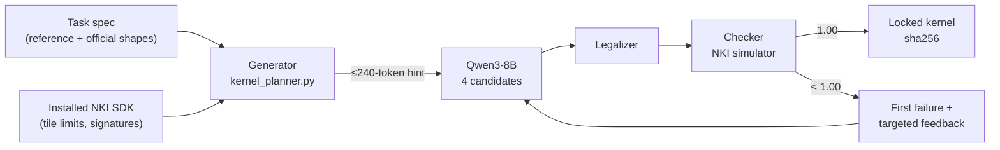

# ⚡ Autonomous NKI Kernel Agent

### Qwen3-8B writes Trainium2 kernels from automatically generated hints, then repairs them against an unchanged checker

This project builds an agent around **Qwen3-8B** that writes AWS Neuron Kernel Interface (NKI)
kernels for Trainium2. A **generator** turns each task into a short, fact-only hint, Qwen writes
candidate kernels from that hint, a **legalizer** fixes narrow API mistakes, and an unchanged
**checker** runs every candidate in the NKI simulator. The checker's first failure becomes the next
repair prompt, until a kernel scores **1.00**.

> **What does the generator write?** Facts, not code. Every sentence in Qwen's hint is computed
> from the benchmark's own reference outputs and the installed NKI SDK. No kernel code and no
> per-task text appears in any prompt. Qwen's weights stay frozen.

| Component | Responsibility |
| --- | --- |
| **Generator** · `kernel_planner.py` | Builds a ≤240-token hint from the task's reference outputs, the SDK's hardware limits and the real API signatures |
| **Qwen3-8B** · kernel writer | Writes four candidate NKI kernels per round, served by vLLM on Trainium2 |
| **Legalizer** · `primitive_legalizer.py` | Rewrites narrow NKI API mistakes without changing the computation |
| **Checker** · `nkibench.py` | Simulates each kernel and verifies numerics, input integrity, HBM traffic and hardware hazards |
| **Repair loop** · `agent.py` | Feeds the first failure back to Qwen for up to eight rounds |

**Jump to:** [Workflow](#agentic-workflow) · [Generator](#the-generator-how-qwens-prompt-is-built) ·
[Tools](#tools-and-feedback) · [Results](#results) · [Levels](#eight-levels) ·
[Quick start](#quick-start-on-your-trainium-seat) · [Files](#where-to-look-in-the-code)

## Agentic workflow

The approach is **generate → write → legalize → verify → repair**.



1. **Generate.** The generator reads the level's reference function and official test shapes,
   runs the reference to measure the exact outputs, and reads hardware limits and instruction
   signatures from the installed SDK. It turns these facts into a short hint.
2. **Write.** Qwen receives the task prompt plus the hint and writes four candidate kernels.
3. **Legalize.** Each candidate passes through the legalizer, which corrects known API-role
   mistakes. Both the raw and the transformed source are logged.
4. **Verify.** The checker compiles and simulates every candidate on every official shape.
5. **Repair.** The best candidate's first failure, with targeted feedback, goes back to Qwen.
   The loop stops at 1.00, and the winning kernel is saved read-only with its sha256.

The default budget is **eight rounds × four candidates**. Thinking mode is off, the context is
8,192 tokens and each answer has a 2,500-token budget.

## The generator: how Qwen's prompt is built

`kernel_planner.py` contains no per-operation text. It derives every sentence:

| Fact | Source | Example (Level 4) |
| --- | --- | --- |
| Partition tiling | Input shapes vs. `nl.tile_size.pmax`, tile counts by SymPy | `lhsT first dim 512 -> 4 tiles` |
| Traffic budget | The level's `max_waste` | `stay within 1.05x of reading each input once` |
| Hardware limits | `nl.tile_size` in the installed SDK | `PSUM free dim <= 512; moving free <= 512` |
| Real API signatures | `inspect.signature` of the instructions the task names | `nisa.nc_matmul(dst, stationary, moving)` |
| Output contract | Shapes and dtype measured from the reference | `output [512, 1024], float32, in nl.shared_hbm` |

Sentences go in that priority order, binding constraints first. The generator adds them one at a
time while they fit in `min(240, context − answer budget − prompt length)` tokens, counted with
Qwen's own tokenizer. Example hint for Level 4:

```text
Inputs exceed the 128-row partition limit, so load and process them in partition tiles:
lhsT first dim 256 -> 2 tiles, lhsT first dim 512 -> 4 tiles, rhs first dim 256 -> 2 tiles,
rhs first dim 512 -> 4 tiles. Installed limits: partition dim <= 128; PSUM free dim <= 512;
nc_matmul contracts over the partition dim, stationary free <= 128, moving free <= 512.
Installed signatures: ... nisa.nc_matmul(dst, stationary, moving); nisa.tensor_copy(dst, src) ...
Calls with a dst parameter write into dst; their return value is not a tensor.
```

On repair rounds, a semantic gate adds a note only when a candidate is provably invalid: it
returns nothing, or it returns its input unchanged. Otherwise it records operation-neutral
evidence and leaves scoring entirely to the checker.

## Tools and feedback

### Checker: tell the agent what failed

Every candidate runs through `agent.grade` and the unchanged benchmark checker, each in a
private grading directory.

| Part | Question | Weight |
| --- | --- | :---: |
| Parses | Is it one valid Python/NKI code block? | 0.1 |
| Rules | Does it define the required entry function and avoid banned calls (`matmul`, `einsum`, `softmax`, …)? | 0.2 |
| Runs | Does it compile and run in the NKI simulator? | 0.2 |
| Correct | Does every official shape pass? | 0.5 |

**Success requires exactly 1.00.** For a shape to pass, the output must match the reference within
an RMS-normalized tolerance of 0.02, the inputs must be left untouched, HBM traffic must stay within
the level's budget, and no hardware hazard can be flagged. Results come from CPU simulation of
Trainium2 and are not device latency measurements.

### Legalizer: fix the API, keep the math

The legalizer (`--primitive-policy legalize`) applies only generic, semantics-preserving rewrites.
Unknown buffers or shapes are left for the checker to report.

| Rule | What it fixes |
| --- | --- |
| `instruction_namespace` / `opcode_namespace` | `nl.tensor_scalar` → `nisa.tensor_scalar`; `nisa.multiply` → `nl.multiply` |
| `hbm_scalar_staging` | A scalar op writing straight to HBM is staged through SBUF, then DMA'd |
| `dst_result_binding` | `x = nisa.op(dst=E)` → `x = E; nisa.op(dst=x)`, because instructions return no tensor |
| `anonymous_tile_dataflow` | Writing to one unnamed tile and reading an identical unnamed tile becomes one named tile |
| `psum_operand_staging` | A PSUM `nc_matmul` operand is copied into SBUF first, as the API requires |

### Repair feedback

Candidates are ranked by reward and diagnosis (`--selection-policy diagnostic`). Feedback names
the earliest failing operation (`--feedback-policy targeted`) and adds at most two short,
SDK-verified API cards (`--repair-policy grounded`). Repeated failures escalate the repair scope
(`--adaptive-repair`).

### Warm start

`--warm-start FILE` grades a saved candidate as round 0 instead of generating one. Later rounds
repair from it exactly as from a generated candidate. The seed's path and sha256 are logged.

## Results

All eight levels use the same agent: generator + Qwen3-8B + legalizer + checker.

| Level | Task | Score | Shapes passed |
| --- | --- | :---: | :---: |
| 1 | Average pooling 2D (warm start) | **1.00** | 4/4 |
| 2 | 2D transpose | **1.00** | 4/4 |
| 3 | Matmul, single tile | **1.00** | 1/1 |
| 4 | Matmul, tiled | **1.00**| 4/4 |
| 5 | Matmul, hoisted loads | **1.00** | 4/4 |
| 6 | Matmul, M/N blocked | **1.00**| 4/4 |
| 7 | Matmul, M/N/K blocked | **1.00** | 4/4 |
| 8 | Single-head attention | running |

Every 1.00 kernel is saved read-only with its sha256 and checked again with the unchanged checker.
These are simulator results; device performance has not been measured.

## Eight levels

| Level | Operation | Official shapes | Traffic budget |
| --- | --- | --- | :---: |
| 1 | Average pooling 2D | `[C,H,W]` ∈ {32×32×32 p2, 128×16×16 p4, 8×24×24 p3, 64×8×8 p2} | – |
| 2 | Free-axis transpose within each partition | `[P,F]` ∈ {32×12 (3×4), 128×64 (8×8), 64×128 (4×32), 8×35 (5×7)} | – |
| 3 | Matmul, single tile | K=128, M=64, N=512 | – |
| 4 | Matmul, tiled | (K,M,N) ∈ {(128,128,512), (256,256,1024), (512,128,512), (256,512,1024)} | – |
| 5 | Matmul, loads hoisted | same as Level 4 | ≤ 1.6× |
| 6 | Matmul, M and N blocked | same as Level 4 | ≤ 1.25× |
| 7 | Matmul, M, N and K blocked | same as Level 4 | ≤ 1.05× |
| 8 | Single-head attention | (seq, dim) ∈ {(128,64), (64,128), (96,32)} | – |

The traffic budget is the maximum HBM traffic as a multiple of reading each input once and writing
the output once.

## Quick start on your Trainium seat

Run from this directory, in the pod that serves Qwen3-8B on `http://localhost:8000/v1`:

```bash
cd projects/02-kernel-agent
python -B nkibench.py --selftest
python -B -m pytest tests -q
```

Run the full agent on one level:

```bash
python -B agent.py --level 4 --rounds 8 --samples 4 \
  --planner-policy hardware --primitive-policy legalize \
  --candidate-policy diverse --selection-policy diagnostic --repair-policy grounded \
  --feedback-policy targeted --example-policy synthetic --adaptive-repair \
  --instrument --grade-dir /tmp/grade-l4 --log /tmp/level4-attempts.jsonl
```

Run several levels as isolated, reproducible experiments. Each run gets a unique directory, a
frozen copy of the source, private grading directories and a manifest:

```bash
python -B run_controlled.py --full-agent-only --planner-policy hardware --primitive-policy legalize \
  --levels 1 2 3 4 5 6 7 8 --rounds 8 --samples 4 --repeat 1 --run
```

Warm-start a level from a saved candidate:

```bash
python -B run_controlled.py --full-agent-only --planner-policy hardware --primitive-policy legalize \
  --levels 1 --rounds 8 --samples 4 --repeat 1 --warm-start path/to/candidate.py --run
```

`attempts.jsonl` records every prompt, raw and legalized kernel, per-shape checker result, token
count and timing.

## Where to look in the code

| File | Responsibility |
| --- | --- |
| [agent.py](agent.py) | Agent loop, Qwen HTTP calls, grading, selection, repair prompts, warm start |
| [kernel_planner.py](kernel_planner.py) | Generator: derives the hint from the task spec and installed SDK; semantic gate |
| [primitive_legalizer.py](primitive_legalizer.py) | Semantics-preserving NKI API rewrites |
| [nkibench.py](nkibench.py) | Benchmark levels, reference implementations and the checker |
| [run_controlled.py](run_controlled.py) | Isolated runs with frozen source, manifests and private grading |
| [failure_selection.py](failure_selection.py) | Failure classification and candidate selection |
| [nki_knowledge.py](nki_knowledge.py) | SDK-verified API cards for grounded repair |
| [symbolic_shapes.py](symbolic_shapes.py) | SymPy tile counts and shape analysis |
| [tests/](tests/) | Unit and simulator regressions |

To change **what Qwen is told**, start with `kernel_planner.py`. To change **how kernels are
fixed**, start with `primitive_legalizer.py` and the repair prompts in `agent.py`.
