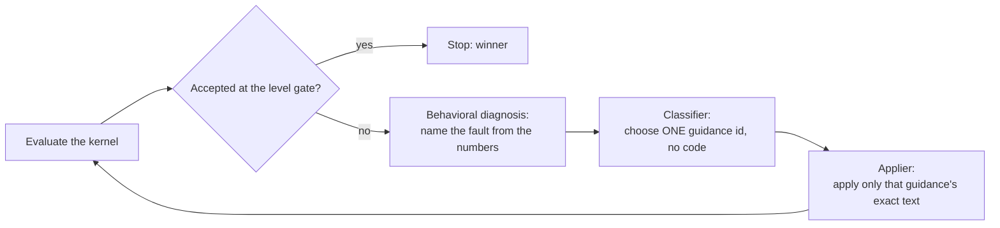
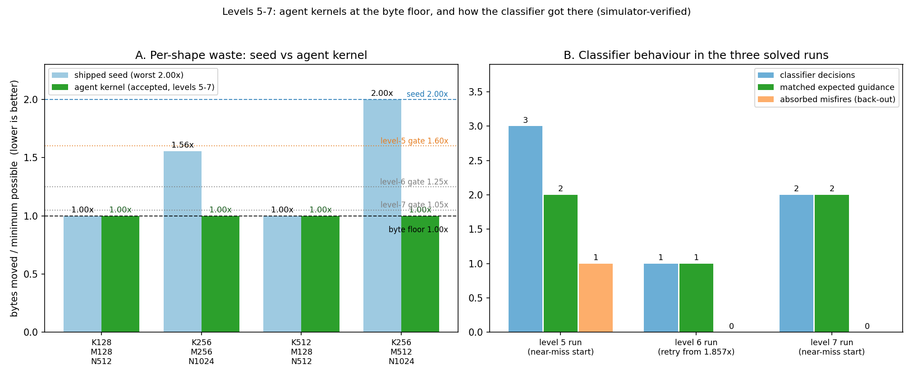
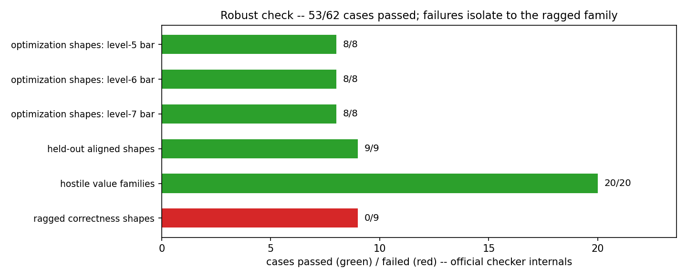

# Minimum-traffic agent — short report

*What we built, why it works, what failed, and the verified numbers. Everything is
simulator-verified; the full evidence trail is in [`evidence/`](evidence/).*

## The problem in three lines

We optimize NKI matmul kernels for **HBM traffic** — the bytes a kernel moves between the chip's
small on-chip memory and the large off-chip memory. The checker compares those bytes to the **byte
floor**: every input read once, the output written once. Moving exactly the floor is a ratio of
**1.00x**, the perfect score. The shipped seed kernel is correct but wastes up to **2.00x**.
Levels 5, 6 and 7 demand worst-case ratios of **≤1.60x, ≤1.25x and ≤1.05x** on the same four
shapes. A kernel is *accepted* only when it is numerically correct on every shape **and** under
the level's gate.

## The working approach

### 1. The checker carries the constraints

The prompt never carries a list of rules. The checker ([`nkibench.py`](nkibench.py) plus the
fail-closed gate in [`traffic_eval.py`](traffic_eval.py)) does: wrong numbers, mutated inputs,
unmeasured traffic, or a byte count *below* the floor all score zero, and a correct-but-over-the-
gate kernel reports exactly how far over it is. When the numbers are wrong, the checker runs
**behavioral diagnosis** — hypothesis tests on the produced numbers. Example: if the output equals
"left operand chunk 0 multiplied against every right chunk", the diagnosis says *"your stationary
operand never advanced past its first chunk"* — a named fault the model can act on, instead of
"core arithmetic or layout is wrong".

### 2. Repair the model's own near-miss — do not invent from scratch

The unguided loop's 90 failed attempts were not wasted. Several already **found the byte-saving
structure** (1.857x bytes) but computed wrong numbers. Repairing the model's own near-miss is much
easier than inventing the optimization from the correct-but-slow 2.00x seed — and every successful
run here started from one. This is the single biggest empirical finding of the project.

### 3. A menu of repairs, the model as classifier, then apply

The repair knowledge lives in a fixed menu, [`guidance_menu.py`](guidance_menu.py) — 15 options
(stack an operand into a reused cache, fix a cache's geometry, keep K on the partition axis, split
the K contraction, place tiles in the right memory region, and so on). Each option has a **when**
(the situation that should trigger it — the classifier's criteria) and an **exact** (the complete
change — the applier's instruction). Each round takes two short model calls:

Two details make this measurable rather than narrative:

- **Every choice is scored.** A deterministic rule maps the same state to the guidance we would
  pick by hand; the log records the model's choice, its reason and a self-reported confidence next
  to that expectation.
- **The loop logs everything** — [`guidance_repair.py`](guidance_repair.py) writes every state,
  choice, both raw replies and the evaluation of every produced kernel (`evidence/*_rounds.jsonl`).

The pattern mirrors TypeSafe's "System One" split (a classifier makes the bounded choice; a
generative model only executes the chosen action). A **back-out control** ("no match — reload the
best kernel") is one of the 15 options, so a bad choice costs one round, not the run.

## What failed — the short version

| attempt | result | why it matters |
|---|---|---|
| Unguided queue: pilot + 5 frozen repeats, 90 attempts | **0 valid improvements**; best correct kernel = the 2.00x seed | writing fast-but-wrong kernels is easy; repairing arithmetic is the hard part |
| Feeding the checker's verdict back verbatim | the model repeated the same violation | a verdict is not an instruction; the prompt needs a named change |
| Line-guided surgical repair | **1.857x then 1.00x** — but the exact lines were human-written each round | proof of the target; not yet an agent skill |
| Context slimming (remove the worked example from the applier prompt) | botched application, no solve — the check failed, the block was kept | "useless-looking" context is decided by a run, not by reading |
| From the clean 2.00x seed, all three levels | all failed: the applier broke the kernel; the classifier misread the broken state and repeated its choice | the seed → floor transformation is still beyond this applier |
| Seed retries with a precondition fix | both caches were added **inside the tile loops** → traffic got *worse* (2.67x / 4.00x, matching tile-count arithmetic exactly) | a real placement error, not a concept error; the clean-seed path stays open |

Two smaller failures are documented in [`evidence/GUIDANCE-CLASSIFIER.md`](evidence/GUIDANCE-CLASSIFIER.md):
one classifier misfire on a gate-only state (absorbed by the back-out control, one round lost), and
an applier that overshot a fix on a restacked kernel (worth recording because it shows selection
and application can fail independently).

## Results

### Levels 5, 6 and 7 — accepted at the byte floor

| level | kernel (native entry point) | worst waste | formal acceptance |
|---|---|---|---|
| 5 | [`evidence/agent_kernel_menu_guided_1p00x.py`](evidence/agent_kernel_menu_guided_1p00x.py) (`nki_matmul_hoist_load_`) | **1.00x** | accepted, seeds 0 + 1; `nkibench.py --check` exit 0 both |
| 6 | [`evidence/agent_kernel_l6_nearmiss_1p00x.py`](evidence/agent_kernel_l6_nearmiss_1p00x.py) (`nki_matmul_block_free_dimension_`) | **1.00x** | accepted, seeds 0 + 1; CLI exit 0 both |
| 7 | [`evidence/agent_kernel_l7_nearmiss_1p00x.py`](evidence/agent_kernel_l7_nearmiss_1p00x.py) (`nki_matmul_fully_optimized_`) | **1.00x** | accepted, seeds 0 + 1; CLI exit 0 both |

| shape (K, M, N) | shipped seed | agent kernel | floor bytes |
|---|---:|---:|---:|
| 128, 128, 512 | 589,824 (1.00x) | 589,824 (1.00x) | 589,824 |
| 256, 256, 1024 | 3,670,016 (1.56x) | 2,359,296 (1.00x) | 2,359,296 |
| 512, 128, 512 | 1,572,864 (1.00x) | 1,572,864 (1.00x) | 1,572,864 |
| 256, 512, 1024 | 7,340,032 (2.00x) | 3,670,016 (1.00x) | 3,670,016 |

Two verified intermediates below 2.00x: **1.857x**
([`agent_kernel_l6_best_1p86x.py`](evidence/agent_kernel_l6_best_1p86x.py),
[`agent_kernel_verified_1p86x.py`](evidence/agent_kernel_verified_1p86x.py)).

*Left: every shape starts at-or-above the seed and ends at the floor, under the three gates.
Right: the classifier's decisions in the three solved runs — one misfire, absorbed.*

### Robustness — the same checker, on cases never used for optimization

| case family | passed | note |
|---|---|---|
| optimization shapes, level-5/6/7 gates | **24/24** | 4 shapes × 2 seeds × 3 gates |
| held-out aligned shapes | **9/9** | seeds 17/29/43; never used for optimization |
| hostile value families | **20/20** | zeros, negatives, repeated rows, cancellation, large finite |
| ragged (non-divisible) shapes | **0/9** | the honest failure: partial final tiles are not handled |

## Limitations — read before quoting the numbers

- **The near-miss start is load-bearing.** From the clean 2.00x seed the loop has not yet produced
  even a below-2.00x result.
- **Ragged shapes fail.** The challenge's "handle shapes that don't divide evenly" trap is open.
- **Disclosed authorship:** the menu texts, the demo example and the expected-choice rules are
  the team's; selection and application are the model's. The logs show every choice.
- **Simulator only**, single runs per configuration; the applier is near-deterministic, not
  deterministic — the level-6 floor landed on a disclosed retry. Self-reported confidences are
  uncalibrated.

## Where the evidence lives

[`evidence/FORMAL-CHECK.md`](evidence/FORMAL-CHECK.md) (formal verdicts, robust matrix, failure
story) · [`evidence/GUIDANCE-CLASSIFIER.md`](evidence/GUIDANCE-CLASSIFIER.md) (the classifier
experiment) · [`evidence/ERROR-CATALOG.md`](evidence/ERROR-CATALOG.md) (23 curated failure→fix
families) · [`README.md`](README.md) ("Our run" section) · figures regenerable via
[`evidence/make_results_plots.py`](evidence/make_results_plots.py).
