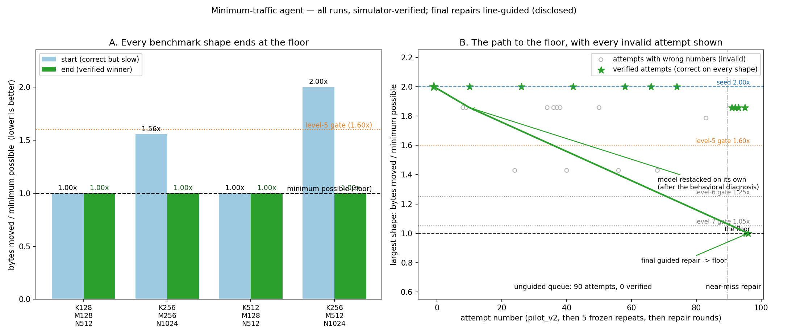

# The near-miss repair — what we did, what worked, what it does not prove

**One-line result.** The agent produced a kernel that moves *exactly the minimum possible* bytes
on every benchmark shape — 589,824 / 2,359,296 / 1,572,864 / 3,670,016 bytes, verified at two
evaluation seeds. That is called 1.00x the byte floor, and it meets the level 5, 6 and 7
thresholds. **The last two repairs were guided** — read the limitations before quoting this.

## What we did, in order

1. **The ordinary agent loop ran 90 times** (a pilot plus five frozen repeats, sampling on).
   It wrote many kernels that moved fewer bytes, but every one of them computed wrong numbers
   and scored zero. Its best *correct* kernel was still the starting seed at 2.00x. In the plot,
   those attempts are the gray circles.
2. **We started from the model's own closest attempt**: a kernel it had written that moved
   1.857x the floor but was wrong on three of four shapes.
3. **The checker diagnosed the fault from the numbers themselves.** Instead of saying "the core
   arithmetic or layout is wrong," it noticed the output equalled a computation in which the
   left operand never advanced past its first chunk — and said exactly that, plus the one
   structural change that fixes it.
4. **The model restacked the operand by itself.** Its very next attempt put two of the four
   shapes at exactly 1.00x. The wide shapes still failed, on one slice-shape mismatch.
5. **The model then repeated the same kernel three times.** So we wrote the three exact lines
   consistent with its own cache structure and asked for only those changes — the model applied
   them. Valid at 1.857x.
6. **We gave the second operand the same treatment** (three more exact lines). The model applied
   them — 1.00x on all four shapes.

## What worked

- **Starting from the model's own near-miss.** The byte-saving idea was already found; only the
  arithmetic was broken. Repairing is much easier than inventing.
- **Naming the fault from behavior.** "Your numbers equal chunk 0 against the sum of every rhs
  chunk" is a diagnosis the model could act on immediately.
- **The model's own restructure.** Its first unaided response to that diagnosis took two shapes
  to the floor on its own.
- **Line-precise repair.** Once the exact inconsistency was named, each repair landed on the
  first try.
- **The checker as a hard gate.** Every fast-but-wrong kernel scored zero. Nothing misleading
  was ever counted as progress.

## What did not work

- **The ordinary loop**: 90 attempts, zero correct-and-faster kernels. Five frozen runs, 0 of 5
  reached the floor.
- **Repeating the same prompt**: the model returned the same kernel, round after round.
- **Earlier stack instructions in prose**: many attempts got below 2.00x on bytes (the gray
  cloud) but stayed wrong — the model read the instruction and misapplied it.
- **Our own driver**: its first stop condition called the valid 1.857x kernel "no improvement"
  (it required the level gate too; fixed).

## Limitations — read before quoting the number

- **The final two repairs were line-guided**: three exact lines each, written by us. The
  unguided rate for the day stands at **0 of 90 attempts**. Report both numbers together.
- **Simulator only.** No device execution. Everything is `simulator_verified`.
- **Only the four benchmark shapes were tested.** Judges' held-back shapes were never run
  against this kernel.
- **One kernel, one run.** This is a demonstration, not a solve rate. It does not mean "the
  agent always solves this."
- **Levels 5–7 are threshold achievements** on one operation and shape set, not three separate
  capabilities.

## The numbers

| shape (K,M,N) | seed bytes | winner bytes | winner ÷ floor | level-5 gate (≤1.60x) |
|---|---:|---:|---:|---|
| 128,128,512 | 589,824 | 589,824 | 1.00x | pass |
| 256,256,1024 | 3,670,016 | 2,359,296 | 1.00x | pass |
| 512,128,512 | 1,572,864 | 1,572,864 | 1.00x | pass |
| 256,512,1024 | 7,340,032 | 3,670,016 | 1.00x | pass |

Seed = the shipped reference kernel (correct but slow). Winner =
`agent_kernel_verified_1p00x.py`, correct on every shape, at the floor (a count below the
floor would have been rejected as an accounting error).

## Files

| file | what it is |
|---|---|
| `progress.png` | the figure (panel A: start vs end per shape; panel B: every attempt on the largest shape) |
| `make_progress_plot.py` | the script that draws it from the committed logs |
| `agent_kernel_verified_1p00x.py` | the floor kernel (model-authored; final repair line-guided) |
| `agent_kernel_verified_1p86x.py` | the 1.857x intermediate (model restacked on its own; one guided repair) |
| `agent_kernel_verified_1p00x_seed0.json` / `_seed1.json` | independent re-evaluations at two seeds |
| `agent_kernel_repair_rounds.jsonl`, `agent_kernel_surgical2_rounds.jsonl` | every repair round: evaluation, diagnosis, tokens, outcome |
| `AGENT-IMPROVEMENT.md` | the full lineage and disclosure statement |
| `data/` | the raw unguided attempt logs the figure is drawn from |
