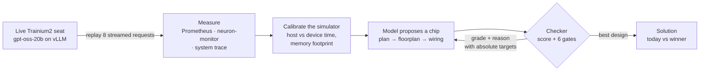
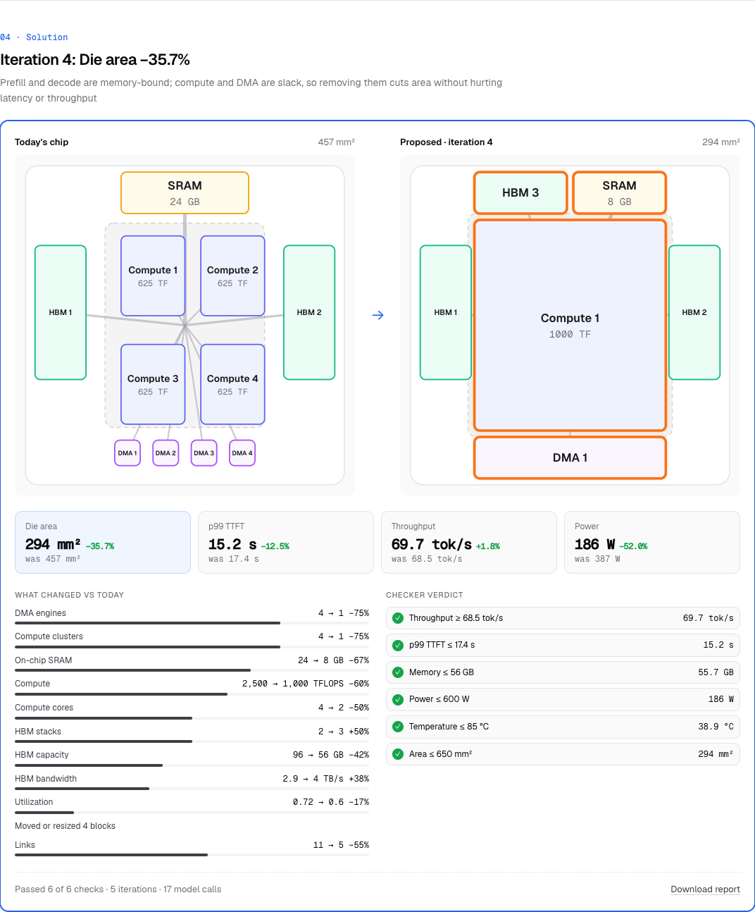
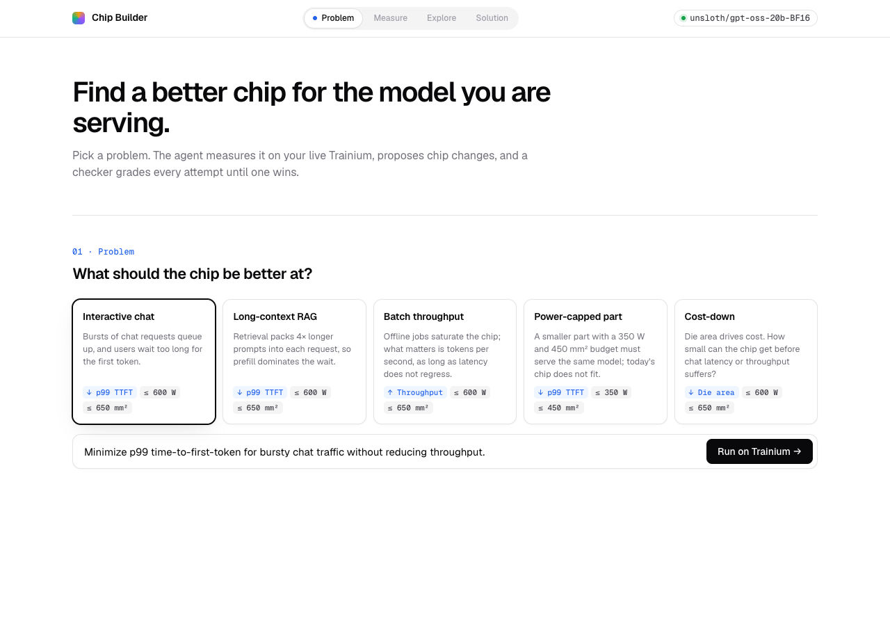
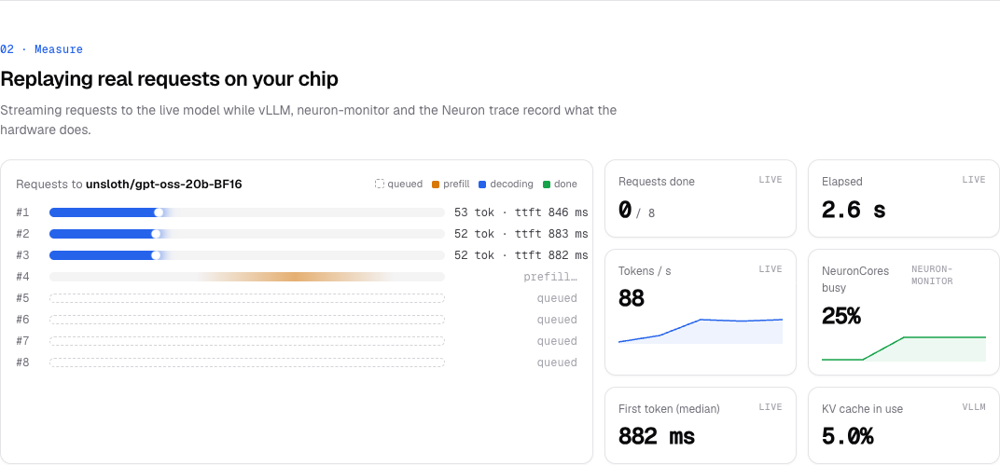
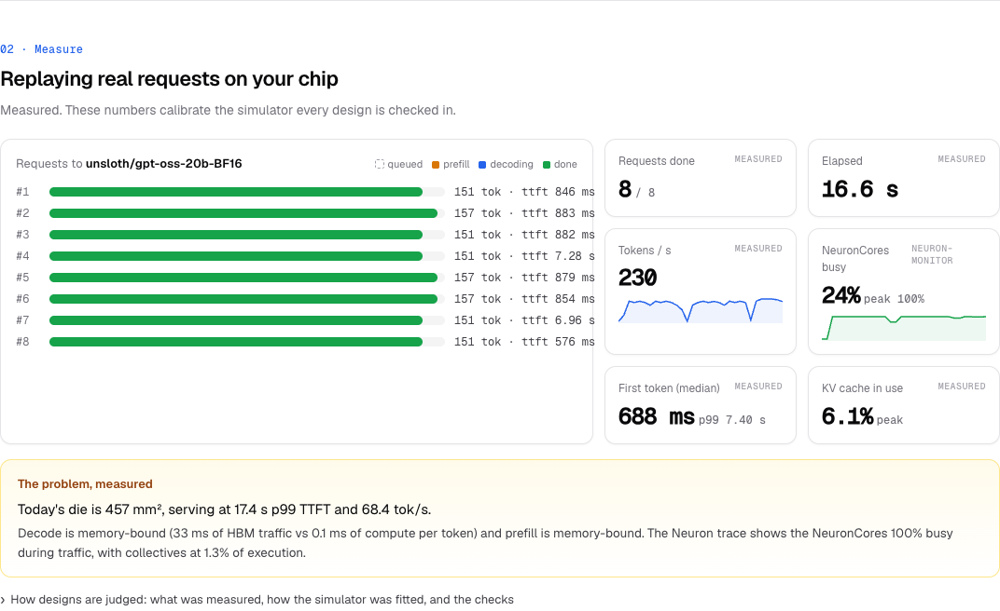
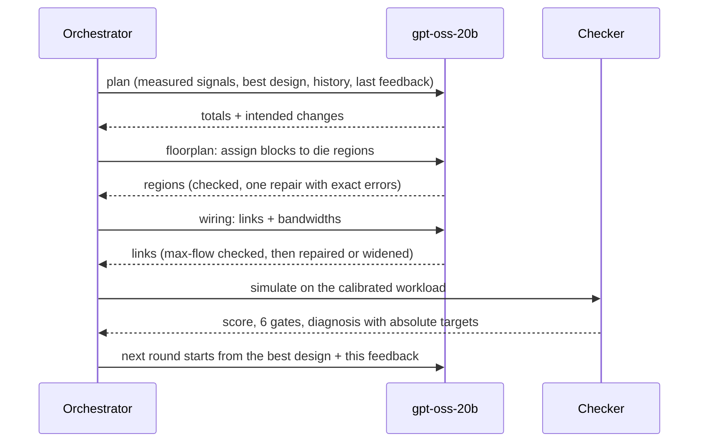
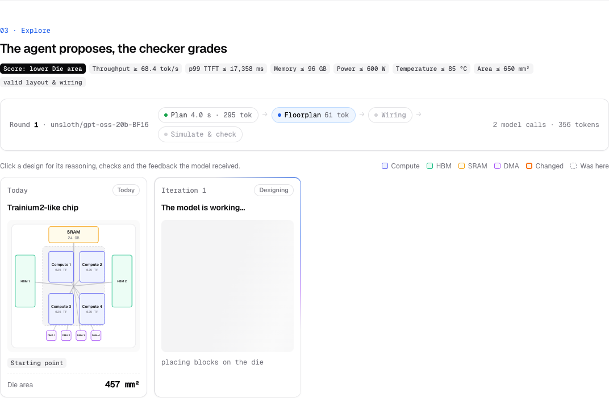

# Chip Builder (AccelTwin)

An agent loop on one Trainium2 seat: **gpt-oss-20b, served on the chip, redesigns
the chip it runs on** for a serving problem you pick. Each attempt is graded by a
checker built from measurements of that same chip, and the grade plus the reason
feed the next attempt.




<sub>A real cost-down run on seat-32: the die shrinks 457 → 294 mm² while p99 latency and throughput hold. Orange outlines mark blocks the agent changed.</sub>

It follows the hackathon's brief (*a model attempts something, a checker grades
it, and the grade plus the reason feed the next attempt*) and ships the three
deliverables it asks for:

1. **[The checker](#1-the-checker)**: what it accepts and rejects, and why.
2. **[The attempt log](#2-the-attempt-log)**: every attempt with its score, viewable live and exportable.
3. **[The one-page note](#3-one-page-note-what-we-ran-on-what-what-came-out)**: what we ran, on what hardware, what came out, and how many runs.

---

## The problem

Pick one of five serving problems (`app/scenarios.py`). Each one sets what
"better" means (the objective), a hard budget, and how the measured workload is
reshaped:

| Scenario | Objective | Hard budget and guards | Workload (from the live replay) |
| --- | --- | --- | --- |
| Interactive chat | lower p99 time-to-first-token | 600 W, 85 °C, 650 mm²; throughput ≥ today | as measured, bursts at 80% load |
| Long-context RAG | lower p99 TTFT | same | 4× longer prompts, ½ outputs |
| Batch throughput | higher tokens/s | same; p99 TTFT ≤ today | 2× outputs, saturated |
| Power-capped part | lower p99 TTFT | 350 W, 75 °C, 450 mm²; ≥ 70% of today's throughput | 60% load |
| Cost-down | smaller die | same as chat; p99 TTFT ≤ today and throughput ≥ today | as measured |



"Today's chip" is a Trainium2-like reference: 4 compute clusters, 96 GB of HBM at
2.9 TB/s, and 24 GB of SRAM. If it already breaks a scenario's budget (the
power-capped part), the first design that passes every check wins, and later
designs must beat that one.

## Why not just an if-else rule?

A rule like "if decode is memory-bound, raise HBM bandwidth" is right about
*direction* and silent about everything else. That rule exists here: it is the
checker's diagnosis. What it can't do is the part the model does:

- **The knobs interact, so one rule can't be applied in isolation.** Eleven
  architecture knobs, plus block placement and a wiring graph. More HBM bandwidth
  only helps if the links carry it (a max-flow problem). More TFLOPS raises power,
  which can throttle the whole chip. More HBM capacity costs area. Every change is
  a trade, and the right trade depends on the budget.
- **The objective changes which rule is right.** A real run showed this. On
  Cost-down, the latency rule ("raise HBM bandwidth") grew the die from 457 to
  640 mm², so neither attempt beat today's chip. With objective-aware guidance,
  the model removed compute it didn't need, cut SRAM, and resized HBM to just
  above the measured footprint. Area fell 36% while latency and throughput held.
  A fixed rule table would need a branch for every objective × bottleneck ×
  budget combination.
- **It reacts to "why it failed", not just "it failed".** "Area 654 mm² is 4 over;
  fits at compute_cores ≤ 7" and "links carry only 2.1 of 4 TB/s" are each a
  different repair. The model combines several such findings into one coherent
  next design.
- **We measured the rule-based alternative.** The repo keeps a deterministic
  proposer (`ACCELTWIN_MOCK_LLM=true`, `LLMClient._rule_proposal`) that cycles
  through fixed edits. On the chat scenario it finished in about a second. Only its
  first edit (a fixed +20% HBM bandwidth) helped; the next two just nudged block
  positions, changed nothing, and the run stopped for lack of progress. It never
  reads the checker's reason, so it can't act on it.
- **Where a rule *would* be enough:** one objective, one bottleneck, no budget
  pressure. The interesting scenarios here are the ones where those collide.

The point of the project is the checker. The model is replaceable; the checker
decides whether the loop converges, which is the hackathon's thesis.

---

## 1. The checker

Code: `app/orchestrator.py` (gates, diagnosis, feedback), `app/simulator.py` (the
simulator), `app/telemetry.py` (measurements).

### What it grades against

Every candidate is evaluated in a simulator that is **fitted to measurements of
the live chip** before the first attempt:

| Source (live, on the seat) | What we take from it |
| --- | --- |
| vLLM Prometheus `/metrics`, change across an 8-request streamed replay | TTFT p50/p99, queue, prefill and per-token time, tokens per request, KV-cache peak, model weight size (47.4 GB) |
| `neuron-monitor` (1 s samples during the replay) | NeuronCore utilization, device memory in use |
| Neuron Explorer **system trace** | NeuronCores busy during traffic (99.7%), on-device prefill (244 ms) and decode step (35.6 ms), collectives (1.3% of execution), host copies, HBM in use (49.7 GB) |


<sub>The measure phase, live: each lane is one request to gpt-oss-20b (amber = prefill, blue = decoding), with tokens/s and NeuronCore utilization streaming in.</sub>


<sub>When the replay finishes, the tiles switch to measured values and the problem is stated in numbers, with the bottleneck behind it.</sub>

Calibration (`CampaignOrchestrator._calibrate`):

- **Host vs device time.** Each measured time is split into on-device time (from
  the trace) and host overhead (end-to-end minus on-device). Only the device part
  scales with hardware changes. On seat-32, prefill is about 100 ms host plus
  about 250 ms device, so a faster design can't claim to remove software overhead.
- **Fitted scales.** Roofline times are scaled so the simulator reproduces today's
  measured prefill and decode. On a live check: prefill 347.5 ms measured vs
  348.0 ms simulated; per-token time 33.2 ms measured vs 33.3 ms simulated.
- **Memory fit** uses the measured HBM footprint instead of an estimate.
- **Collectives** are a measured share of device time that shrinks with wider
  compute links.

### How a design is scored

The simulator is deterministic. It uses a roofline per request,
`max(FLOPs ÷ (TFLOPS × utilization), bytes ÷ usable HBM bandwidth)`, where usable
bandwidth is the max flow from the HBM stacks to compute through the proposed
links. It then runs a first-come-first-served queue over 32 requests arriving in
bursts, plus proxy models for power (with throttling), area and temperature. The
exact formulas are in `app/simulator.py`.

### What it accepts and rejects

| Gate | Rejects when | Why it's a gate |
| --- | --- | --- |
| Valid layout and wiring | blocks overlap or leave the die, a compute cluster can't reach HBM, block totals don't match the chip's totals | an invalid chip has no meaningful performance |
| Throughput ≥ floor | below today's (or 70% of today's for the power-capped part) | a latency win that serves fewer tokens isn't a win |
| Memory fit | weights + KV + buffers exceed HBM | the model must still load |
| Power, temperature, area | over the scenario's budget | the budget defines the problem |
| Latency guard | p99 TTFT worse than today (throughput and cost-down scenarios) | stops trading latency away silently |
| Real improvement | the objective improves by less than 1% | simulator noise must never count as progress |

### What it says back (the reason)

Following the hackathon's lesson that *"Wrong, off by 341 percent" is true and
useless*, every failure names the limiting resource and an **absolute target**:

```text
Area 654 mm² is 4 mm² over the 650 mm² cap; compute cores use 336 mm², HBM 139 mm²,
SRAM 31 mm²: with everything else unchanged it fits at compute_cores <= 7 or hbm_gb <= 93.

Decode is memory-bound (10.92 ms of HBM traffic vs 0.03 ms of compute per token):
extra TFLOPS will not speed it up; raise HBM bandwidth, HBM-to-compute link capacity,
or SRAM to cut spills.

The links deliver only 2.10 of the 4 TB/s the HBM stacks provide: widen the
HBM-to-compute links so the extra bandwidth reaches compute.
```

The targets are absolute because the next round edits the *best* design, not the
rejected one. A relative "drop 1 core" was once misapplied: the model went from
6 to 12 cores. Guidance is also objective-aware: area searches never get "raise
bandwidth" advice.

### One iteration, end to end



Checks also run **inside** each attempt. The floorplan and wiring stages are
validated as soon as the model answers; each gets one repair with the exact
errors (e.g. `hbm-1 is an HBM stack and must sit on a die edge`), then a
deterministic fallback that is recorded in the log.

---

## 2. The attempt log

Every attempt is recorded with its design, score, every gate (value against
limit), the exact feedback sent to the model, and every model call:


<sub>The explore phase: the score and limits as chips, each model call streaming its token count, and one card per iteration (today's chip on the left, the next design in progress).</sub>

| Where | What |
| --- | --- |
| The web UI, *Explore* step | one card per iteration (diagram with changed blocks highlighted and ghost outlines of moved blocks, key changes, score vs today); click for the reasoning, checks and feedback; a chart of the objective per iteration |
| `GET /api/campaigns/{id}` | the full run as JSON: attempts, metrics, gates, feedback, model calls (stage, tokens, duration), calibration, telemetry |
| `GET /api/reports/{id}` | a Markdown report of the run (also via *Download report*) |
| `data/events.jsonl` | append-only audit trail of every simulation |
| `data/acceltwin.db` | SQLite copy of the same |

The model also sees a log: each round's prompt carries the previous rounds'
names, changes and outcomes, so it does not repeat a rejected idea. gpt-oss runs
nearly greedy here, and the hackathon notes found a retry that resends the same
prompt is a no-op; the history is what changes the prompt.

---

## 3. One-page note: what we ran, on what, what came out

**Hardware.** One seat pod (`seat-32`): `trn2.48xlarge`, 1 Trainium2 device,
4 logical NeuronCores (LNC=2), 96 GB HBM.

**Model.** `unsloth/gpt-oss-20b-BF16` on vLLM-Neuron 0.24, tensor-parallel 4,
8192-token context. It does both jobs: it is the workload being measured, and it
is the agent proposing designs.

**Runs** (each is one run; see the caveat below):

| Scenario | Iterations (model calls) | Outcome |
| --- | --- | --- |
| Interactive chat | 4 | p99 TTFT **16.1 s → 7.8 s (−52%)**; 2 new bests, 1 rejected (area 654 > 650 mm²), 1 rejected (area 810 mm²) |
| Cost-down, latency-only guidance | 2 | **no winner**: both passed but grew the die (457 → 640 mm²). This led to objective-aware guidance |
| Cost-down, objective-aware | 5 (17) | die **457 → 294 mm² (−36%)**, p99 17.4 → 15.2 s, throughput 68.5 → 69.7 tok/s, power 387 → 186 W; 1 rejected (throughput 67.8 < 68.5), 1 duplicate |

**Bugs found by real runs, each fixed in the checker or the loop rather than the
model:**

- Free-form coordinates always overlapped, so every floorplan fell back to the
  default. Fix: the model picks a *region* per block and code packs it.
- A design added HBM bandwidth its links couldn't carry. Fix: a max-flow check
  in the wiring stage.
- The test workload sat on an overload cliff: one change cut p99 by 98%, and
  later iterations meant nothing. Fix: bursty arrivals at 80% load.
- A 0.02% gain counted as "new best". Fix: require at least 1%.
- Relative checker targets were misapplied. Fix: absolute targets.
- Latency advice derailed the area search. Fix: objective-aware guidance.

**Honest caveats:**

- **One run per configuration, so no spread is reported.** The simulator is
  deterministic, but the model samples (temperature 0.3), so outcomes vary run to
  run. Per the hackathon's own guidance, the next step is N repeats per scenario,
  reporting the rate and spread.
- **The numbers above predate the host/device calibration split.** That split
  makes predicted gains more conservative, so rerunning would give smaller
  improvements.
- **This is architecture exploration in a calibrated simulator, not new silicon.**
  The baseline specs are assumptions (only the 96 GB and 4 cores are observed on
  the seat). The simulator serves one request at a time (no batched decode) and
  does not model mixture-of-experts sparsity. Treat rankings between designs as
  more trustworthy than absolute milliseconds.

---

## How we served and used the LLM for this

**Getting onto the chip.**
- Our role could `exec` into the seat but not `port-forward`. We reached the web
  UI through a `socat` listener on the laptop that pipes each connection over
  `kubectl exec` into a tiny Python relay in the pod.
- The Neuron tools live in `/opt/aws/neuron/bin`, which isn't on `PATH`. That's
  why `neuron-monitor` first looked "not found".

**Serving gpt-oss-20b.**
- `serve.sh` defaults to Qwen3-8B. `MODEL=openai/gpt-oss-20b` fails on Neuron with
  `gpt_oss_mxfp4 quantization is currently not supported in neuron`: the official
  weights are MXFP4-only. The BF16 re-release works:
  ```bash
  MODEL=unsloth/gpt-oss-20b-BF16 TP=4 MAX_MODEL_LEN=8192 ./serve.sh
  ```
  It takes about 4 minutes on first compile and about 2 minutes on a cached
  restart.
- TP=4 spreads the 47 GB of BF16 weights plus the KV cache across all four
  logical cores (about 12.4 GB of tensors per core's HBM).
- The app refuses to start if the configured model name isn't the one being
  served. An earlier version silently fell back to the deterministic proposer and
  produced fake iterations in one second; failing loudly fixed that.

**Shaping the agent around the model's limits** (consistent with the hackathon's
measured findings):

- **8k context → staged calls, not one big prompt.** Each round is 3 short calls:
  1. *plan* the architecture totals
  2. *floorplan*: assign blocks to die regions
  3. *wire* the interconnect

  Each prompt is compact (no full JSON graph). Code derives per-block resources
  from the plan, so the graph always matches the totals.
- **Reasoning eats the budget.** `reasoning_effort=low`, 3,000-token budget per
  call, JSON extracted even when wrapped in reasoning text. An empty answer fails
  loudly with the advice to raise the budget or lower the effort.
- **Small models are bad at geometry and good at intent.** Raw coordinates failed
  every time; region choice ("HBM on the left and top, compute in the centre")
  works. Unchanged regions keep their exact boxes, so only real changes are
  highlighted.
- **Streaming everywhere.** The replay and every agent call stream, so the UI
  shows requests filling token by token and live token counts per model call.
- **Measuring the model as a workload.**
  - vllm-neuron leaves its FLOPs/bytes counters at zero, so arithmetic intensity
    can't come from Prometheus.
  - The Neuron system profile is written only when vLLM's workers shut down, so a
    trace is a one-off capture (below).
  - `neuron-explorer view --output-format summary-json` has nothing useful for a
    system-only profile, so we export the full JSON (1.2 GB, 1.86 M events) and
    summarize the traffic window ourselves. Prefill and decode are told apart by
    duration (executions over 3× the median are prefill).

**Capturing the system trace** (once; the summary is cached next to it):

```bash
/workspace/serve.sh --stop
VLLM_NEURON_WORKER_TERMINATION_TIMEOUT=60 NEURON_RT_INSPECT_ENABLE=1 \
NEURON_RT_INSPECT_OUTPUT_DIR=/workspace/neuron-trace \
MODEL=unsloth/gpt-oss-20b-BF16 TP=4 MAX_MODEL_LEN=8192 /workspace/serve.sh
# send some traffic, then stop vLLM so the profile is written:
/workspace/serve.sh --stop
MODEL=unsloth/gpt-oss-20b-BF16 TP=4 MAX_MODEL_LEN=8192 /workspace/serve.sh   # back to normal
```

---

## Run it

**In the seat pod** (the model server must be serving gpt-oss):

```bash
# shell 1
cd /workspace && MODEL=unsloth/gpt-oss-20b-BF16 TP=4 MAX_MODEL_LEN=8192 ./serve.sh

# shell 2
cd /workspace/projects/03-chip-builder
python -m venv .venv && source .venv/bin/activate && pip install -r requirements.txt
cp .env.example .env
sed -i 's|^ACCELTWIN_LLM_MODEL=.*|ACCELTWIN_LLM_MODEL=unsloth/gpt-oss-20b-BF16|' .env
nohup uvicorn app.api:app --host 0.0.0.0 --port 8080 > uvicorn.log 2>&1 < /dev/null &
```

**On the laptop** (port-forward is blocked for seat roles, so tunnel over `exec`):

```bash
# one-time: a tiny stdin <-> 127.0.0.1:8080 relay inside the pod
kubectl exec -i seat-32 -c app -- sh -c 'cat > /workspace/relay.py' <<'PY'
import socket, sys, threading
s = socket.create_connection(("127.0.0.1", 8080))
def up():
    while (d := sys.stdin.buffer.read1(65536)):
        s.sendall(d)
    s.shutdown(socket.SHUT_WR)
threading.Thread(target=up, daemon=True).start()
while (d := s.recv(65536)):
    sys.stdout.buffer.write(d); sys.stdout.buffer.flush()
PY
# every browser connection opens its own exec into the relay
socat TCP-LISTEN:8080,reuseaddr,fork EXEC:"kubectl exec -i seat-32 -c app -- python3 /workspace/relay.py"
```

Then open http://localhost:8080, pick a problem, and click **Run on Trainium**.
A run takes about 20 s of measurement, then 1–3 minutes per iteration. The run ID
is kept in the URL, so a refresh reopens it.

**Offline** (no chip): `ACCELTWIN_MOCK_LLM=true ACCELTWIN_MOCK_TELEMETRY=true`
uses the deterministic proposer and default calibration, and the UI labels it.

**Tests:** `pytest`. 36 tests cover the checker gates and diagnosis, calibration
(including the host/device split), Prometheus and trace parsing, the staged agent
(repairs, fallbacks, region packing, link widening), scenarios, and the API.

## Configuration

| Variable | Default | Purpose |
| --- | --- | --- |
| `ACCELTWIN_LLM_BASE_URL` | `http://127.0.0.1:8000/v1` | OpenAI-compatible vLLM endpoint |
| `ACCELTWIN_LLM_MODEL` | `openai/gpt-oss-20b` | served model name; on a seat use `unsloth/gpt-oss-20b-BF16` |
| `ACCELTWIN_LLM_TIMEOUT` | `240` | seconds per model call |
| `ACCELTWIN_LLM_MAX_TOKENS` | `3000` | output budget per call, reasoning included |
| `ACCELTWIN_LLM_REASONING_EFFORT` | `low` | gpt-oss reasoning effort; empty to omit |
| `ACCELTWIN_LLM_JSON_MODE` | `false` | send `response_format: json_object` |
| `ACCELTWIN_LLM_STREAM` | `true` | stream model calls (live token counts) |
| `ACCELTWIN_VLLM_METRICS_URL` | `http://127.0.0.1:8000/metrics` | Prometheus endpoint |
| `ACCELTWIN_REPLAY_REQUESTS` / `_CONCURRENCY` | `8` / `4` | measurement replay size |
| `ACCELTWIN_NEURON_TRACE_DIR` | `/workspace/neuron-trace` | Neuron Explorer capture to summarize |
| `ACCELTWIN_MOCK_LLM` / `ACCELTWIN_MOCK_TELEMETRY` | `false` | offline mode |
| `ACCELTWIN_DB_PATH` / `ACCELTWIN_EVENT_LOG` | `./data/…` | SQLite and JSONL logs |

## Project map

```text
app/
  scenarios.py     the five problems: objective, budget, workload shape
  telemetry.py     replay, Prometheus deltas, neuron-monitor sampling, system-trace summary
  orchestrator.py  measure → calibrate → loop; gates, diagnosis and feedback (the checker)
  simulator.py     roofline + link max-flow + queue + power/area/thermal proxies
  agent.py         staged model calls: plan → floorplan (regions) → wiring, each validated
  llm_client.py    streaming OpenAI-compatible client, model check, JSON extraction
  api.py           FastAPI: scenarios, runs, reports, static UI
  report.py        Markdown run report
  static/          the Problem → Measure → Explore → Solution page
tests/             36 deterministic tests
docs/DESIGN.md     original design notes
```
