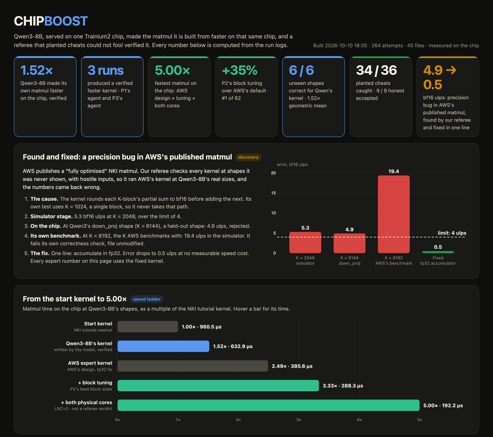
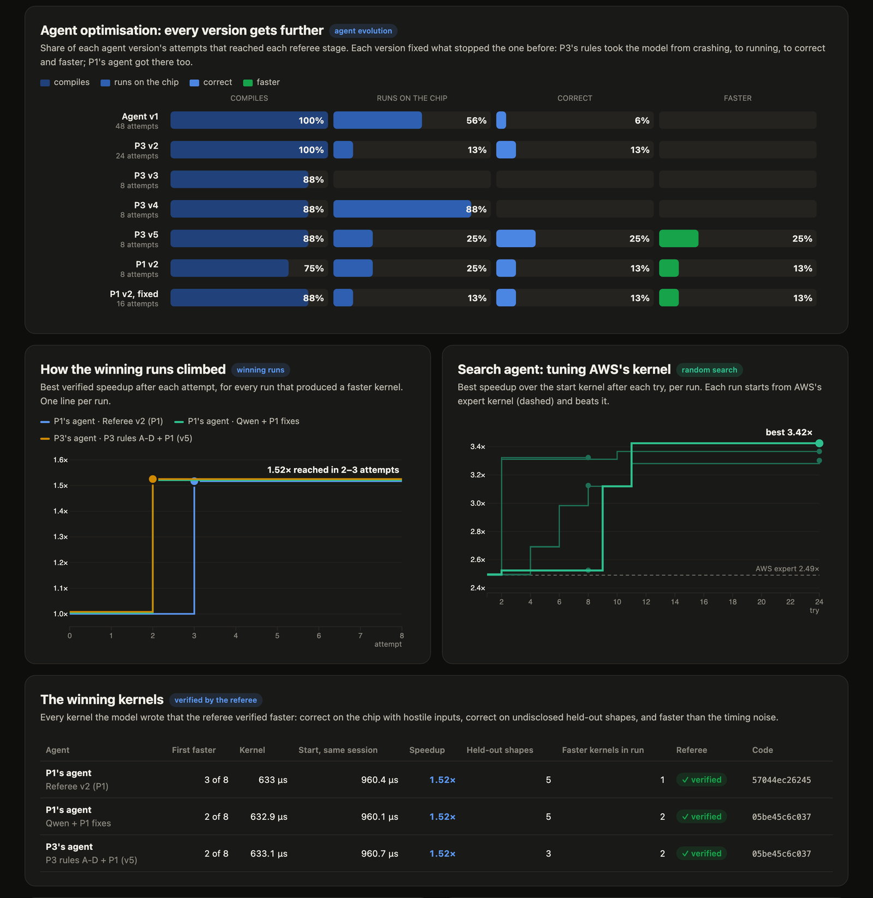
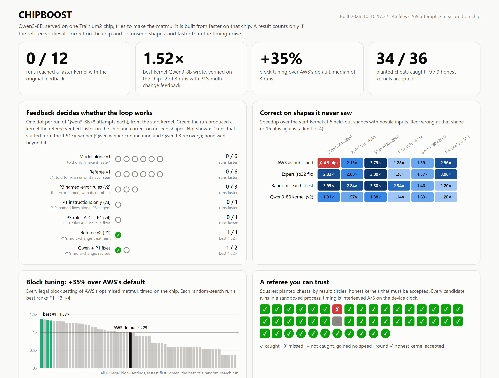

# CHIPBOOST

**Can Qwen3-8B, served on one Trainium2 chip, make the matmul it is built from faster on that same chip,
under a referee strict enough that no speedup can be faked?**

Yes, once the feedback was right. Qwen3-8B rewrote the plain NKI tutorial matmul into a kernel **1.517×
faster** (960 µs to 633 µs). The referee accepted it only after the kernel was correct in the simulator,
correct on the chip with hostile inputs, faster in interleaved A/B timing, and correct on shapes it had never
seen. It happened on two independent agent loops, P1's and P3's.

Built at Hack the Chip (NYU × Annapurna Labs), 10 October 2026, by a team of five. Every number below is
measured on the chip unless marked [sim]. Nothing is projected. The one-page note is [`NOTE.md`](NOTE.md).



## Results at a glance

Qwen3-8B per-core matmuls at tensor parallelism 2 and 256 tokens: gate_up (4096×256×6144) plus q_proj
(4096×256×2048). The score is their summed time. Hardware: one Trainium2 chip per seat (seats 100, 101,
102), Neuron SDK 2.32, NKI 0.6.0.

| Kernel | Time | vs start | Who | Evidence |
|---|---|---|---|---|
| NKI tutorial tiled matmul (start) | 960 µs | 1.00× | baseline | `kernels/matmul_start.py` |
| **Qwen3-8B's own kernel** | **633 µs** | **1.517×** | the model, via P1's and P3's loops | `kernels/qwen_v2_best.py`, `results_p3/qwen_matmul_1p52x.py` |
| AWS's "fully optimised" matmul, fixed | 385 µs | 2.49× | AWS's design, P2's precision fix | `kernels/matmul_expert.py` |
| + block sizes found by random search | 280 µs | 3.43× | P2 | `logs/seat-102/` |
| Tuned expert on both physical cores | 192 µs | 5.0× | P2, not a referee verdict | `tools/lnc2_probe.py` |

**Best results**
- **5.0× faster** than the start kernel: the tuned expert on both physical cores of a NeuronCore (192 µs).
- **3.43× faster** with block sizes found by random search (280 µs), **1.375× faster than AWS's own "fully
  optimised" kernel**.
- **1.517× faster**, written by Qwen3-8B itself: 5 verified kernels across 3 runs (P1's and P3's loops).
- **Correct on every unseen shape tested:** Qwen's kernel is correct on 6 of 6 (1.52× geometric mean).

**Bugs and gaps we found**
- **A precision bug in AWS's official NKI matmul tutorial.** It rounds its running sum to bf16 once per
  K-block, so at K=8192, the K of AWS's own benchmark, it fails AWS's own correctness check (19.4 bf16 ulps).
  It is also wrong on a Qwen3 shape on the chip. Our one-line fix: an fp32 accumulator, at no speed cost.
- **AWS's kernel refuses Qwen3's 256-token shapes** (it asserts M % 2048 == 0). We made it run at any shape.
- **AWS's default block sizes rank 29th of 62.** The best setting is 1.375× faster.
- **Half of every NeuronCore sits idle** under a plain NKI launch at LNC=2. Using both cores gives 1.50×.
- **Referee escapes found and closed by red-teaming:** a forged result record, a candidate patching the
  referee, and a shell from inside a kernel. The referee then caught 34 of 36 planted cheats and accepted
  9 of 9 honest kernels.

## How the loop works

```
Qwen3-8B (served by vLLM on the same chip)
      |  writes a kernel
      v
REFEREE (speedcheck.py), stops at the first failure:
  1. Rules         static scan: banned calls and imports; candidates run in a sandboxed child process
  2. Simulator     correct against NumPy on dev shapes
  3. Chip          correct at Qwen3's real sizes, with hostile and normal inputs
  4. Timing        interleaved A/B against the start kernel on the device clock; under 1% is "no gain"
  5. Held-out      a would-be "faster" kernel must pass 3 random shapes it has never seen
  6. Feedback      one instruction back to the model
      |
      +--> next attempt
```

## What each of us did



### P1: the referee, its feedback, and the model comparison ([likhith2366](https://github.com/likhith2366))

**Built the checker.** `speedcheck.py` is the referee above. `timing.py` is a device-clock timer for NKI
0.6.0, which has no public timing API.
- The timer was validated on the chip:
  - 45 checks of the start kernel against itself never reported "faster" (spread 0.011%);
  - a deliberately slowed copy measured 2.949× in all 18 runs (spread 0.04%);
  - vLLM load moved timings by at most 0.04%;
  - time scales linearly with work (R² = 0.9999998).
- Red-teamed it with 33 adversarial fixtures (`tests/historical_p1/`): kernels that write the input, inject
  code, monkeypatch, forge output and more.
- Red-teaming found and closed real escapes: a forged result record, a candidate patching the referee, and a
  shell from inside a kernel.

**Optimised the feedback.** The original loop told the model, after a crash, to "fix the error named in the
referee message", a message the model never saw. P1 rewrote the instructions so that each one names the
exact change. For example: use one `nl.ndarray` of shape `(TILE_K, K // TILE_K, TILE_N)` instead of a Python
list of tiles, and use a fresh accumulator per output tile.

**Ran the three-arm comparison** on seat 100: 72 attempts, 3 runs × 8 per arm, pinned to one referee
process.

- **Random search over the expert's block sizes:** faster in 22 of 24 attempts, median best 3.13×.
- **The model with the rewritten feedback:** verified 1.517× kernels (below).

**Then the feedback that names the change:**
- **v2:** one run, verified 1.517× at attempt 3. Two unchanged-source replays both gave 1.517×.
- **Two repeat runs with more fixes:** 2 more verified 1.517× kernels, both in run r0.

Files:
- [`speedcheck.py`](speedcheck.py), [`timing.py`](timing.py)
- [`REFEREE.md`](REFEREE.md): how the referee decides
- [`STATUS.md`](STATUS.md), [`RESULTS-SUMMARY.md`](RESULTS-SUMMARY.md)
- [`run_comparison.py`](run_comparison.py), [`experimental_agent.py`](experimental_agent.py),
  [`run_improvement_pilot.py`](run_improvement_pilot.py)
- [`experiments/`](experiments/): every run's records, state and reports
- [`p1_acceptance.json`](p1_acceptance.json), [`results_p1_throughput.json`](results_p1_throughput.json)

### P2: kernels, search, and what the chip leaves on the table ([jithendra1798](https://github.com/jithendra1798))

**Benchmark.** Qwen3-8B's real per-core shapes, with timing shapes and held-out samplers in `shapes.py`. The
matching benchmark levels (matmul, RMSNorm, copy, SwiGLU in bf16) are in
[`nkibench.py`](nkibench.py). Also: the start kernel, and an RMSNorm start kernel with a measured
bandwidth floor. RMSNorm has 3.68× of room; packing narrow rows makes the copy 6.7× faster.

**Found a precision bug in AWS's official NKI matmul tutorial.** AWS's "fully optimised" kernel rounds its
running sum to bf16 once per K-block. Its own test uses one block, so it never takes that path.
- Measured on AWS's unmodified file [sim]: 19.4 bf16 ulps at K=8192, the K of AWS's own benchmark. It fails
  AWS's own correctness check.
- On the chip: wrong on a held-out Qwen3 shape (4.9 ulps).
- An fp32 accumulator fixes it in one line, at no measurable speed cost. The same pattern is in nki-samples.
- The fixed kernel is the expert ceiling: 385 µs, 2.49×.

**Optimised the kernel's block sizes**, measured rather than guessed:
- **Random search:** 3 runs × 24 referee evaluations. It reaches 1.325×, 1.352× and 1.372× over AWS's
  defaults.
- **Exhaustive sweep:** all 62 legal settings timed. AWS's default ranks 29th, and the ceiling is 1.375×.
  One search run found the best outright.
- **Bayesian optimisation** (replayed on the measured table): it would find the optimum in every run,
  against 1 in 3 for random search.

**Checked everything on unseen shapes.** The held-out grid covers 6 shapes × 5 kernels, with hostile inputs:
- Qwen's 1.517× kernel is correct on all 6 and 1.52× faster on average.
- The search's best is correct on all 6, and up to 84% faster than AWS's defaults (gate_up at 128 tokens).

**Found the idle half of the chip.** At LNC=2, a plain NKI launch uses one of the two physical cores of each
NeuronCore. Splitting the work across both gives 1.50× (5.0× the start kernel, 97.7 TFLOP/s). This was
cross-checked on the device and host clocks, but it is not a referee verdict.

Files:
- [`P2_STATUS.md`](P2_STATUS.md), [`shapes.py`](shapes.py), [`search.py`](search.py),
  [`heldout_grid.py`](heldout_grid.py)
- [`kernels/`](kernels/)
- [`tools/aws_matmul_bf16_repro.py`](tools/aws_matmul_bf16_repro.py), [`tools/bo_replay.py`](tools/bo_replay.py),
  [`tools/lnc2_probe.py`](tools/lnc2_probe.py)
- [`logs/seat-102/`](logs/seat-102/)
- [`results_p2.json`](results_p2.json), [`results_heldout_matmul.json`](results_heldout_matmul.json)

### P3: the agent loop, the red team, and the rules for repeated mistakes ([Sivabalan21](https://github.com/Sivabalan21))

**Built the agent loop** that runs Qwen3-8B against the referee on seat 101, with both model arms.
- **Built a red team of 11 cheating kernels** in `redteam/`: zeros, NumPy, obfuscated NumPy, cached
  results, compile-time tricks, low precision, held-out-only, special inputs, an unhooked DMA, writes to the
  input, and noise.
- On the chip, the referee caught **10 of 10** real cheats and accepted the honest kernel.
- **Classified every failure** in a taxonomy, by arm, with one example each.

**Optimised the agent.** P3 wrote rules A to D: each catches one mistake the model kept repeating and names
the fix in one sentence. The model's code is parsed only, never run. Version by version, on seat 101:

| Version | What the model was told | Outcome |
|---|---|---|
| v1 | the referee's original instruction | the baseline loop |
| v2 | + Rule A: the crash named exactly | applied the named fix, then hit a misleading hint |
| v3 | P1's improved feedback | the right restructure, one axis order wrong |
| v4 | + Rules B and C | two bugs fixed in a row; one load away from correct |
| **v5** | **P1's feedback + Rules A to D** | **verified 1.517× at attempt 2, again at attempt 3** |

The v5 kernel: q_proj 1.463×, gate_up 1.540×, 27.1 TFLOP/s. A standalone re-check of the saved kernel gave
`VERDICT: FASTER`, 1.517×, correct on 3 held-out shapes.

Files:
- [`P3_HEADLINE.md`](P3_HEADLINE.md), [`P3_STATUS.md`](P3_STATUS.md)
- [`agent_p3.py`](agent_p3.py): the loop that ran v5. [`agent.py`](agent.py) is the integrated version.
- [`redteam/`](redteam/), [`logs/seat-101/`](logs/seat-101/), [`results_p3/`](results_p3/)

### P4: the dashboard and the note ([manikanta-sandeep](https://github.com/manikanta-sandeep))

- **Dashboard.** `dashboard/collect.py` pulls every seat's logs out of the pods and every branch's results
  out of git. `dashboard/build.py` turns them into one page: every attempt, each treatment as its own
  series, the red-team tables, the held-out grid, and the tuning study.
- **The one-page note**, with runs and spread for every claim.

Files: [`dashboard/index.html`](dashboard/index.html), [`dashboard/results.html`](dashboard/results.html),
[`NOTE.md`](NOTE.md).



### Review and integration ([anihal](https://github.com/anihal))

- Reviewed all four branches against the shared contracts and fixed bottlenecks per owner.
- Fixes: the referee launcher's hash pins on LF checkouts, and the agent loop's retries.

## What we learned

1. **A referee for AI-written kernels must be attacked, not just trusted.** Red-teaming found real escapes,
   and closing them is why the 1.517× can be believed.
2. **Feedback has to name the change, not the error.** After generic instructions, Qwen kept returning the
   same kernel. When an instruction named the exact change, it applied it on the next attempt.
3. **Even AWS's reference kernels need a strict checker.** The tutorial's precision bug hides behind a
   test with a single K-block.
4. **Tune per shape.** Shape-specific block sizes gain up to 84% over AWS's defaults.
5. **Check the hardware's defaults.** Half of every NeuronCore idles under a plain launch.

## Notes

- **Kernel level:** all speedups are measured on the chip.
- **The 5.0× two-core number** is measured with P1's timer and checked for correctness; it is not a full
  referee verdict.

## Run it (in a seat pod)

```bash
cd projects/03-chipboost && export CHIPBOOST_SEAT=102
python speedcheck.py --op matmul --check kernels/qwen_v2_best.py    # one referee verdict
python agent.py --arm referee --budget 8                            # the model loop (needs the vLLM server)
python agent_p3.py --arm referee --budget 8 --tag v5                # P3's loop, as in the v5 run
python run_comparison.py --help                                     # P1's three-arm comparison (--p1/--p2/--p3 trees, --core)
python search.py --budget 24 --seed 0                               # random search over block sizes
python heldout_grid.py --op matmul                                  # every arm's best on unseen shapes
python tools/aws_matmul_bf16_repro.py --sim                         # the AWS bug, CPU only
python dashboard/build.py                                           # rebuild the dashboard from the logs
```

## Team

| Role | |
|---|---|
| P1: referee, timing, feedback, comparison | [likhith2366](https://github.com/likhith2366) |
| P2: kernels, search, held-out grid, AWS bug | Jithendra Puppala ([jithendra1798](https://github.com/jithendra1798)) |
| P3: agent loop, red team, rules | Siva Balan ([Sivabalan21](https://github.com/Sivabalan21)) |
| P4: dashboard and note | Bala Sai Manikanta Sandeep Puppala ([manikanta-sandeep](https://github.com/manikanta-sandeep)) |
| Review and integration | Nihal Ajayakumar ([anihal](https://github.com/anihal)) |

**Resumes:** every team member's resume is in [`resumes/`](resumes/), one PDF per person, named by GitHub
handle.
