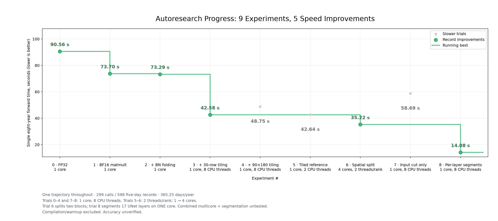
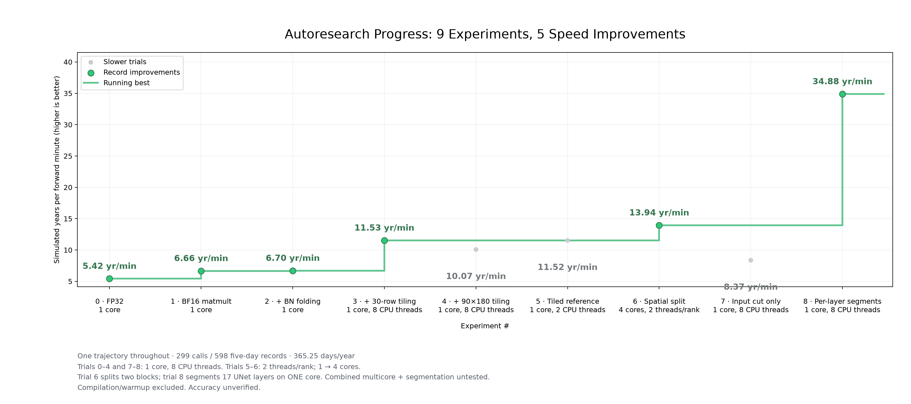
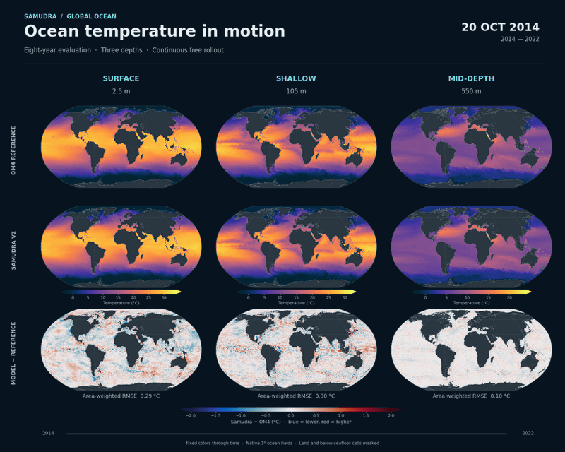
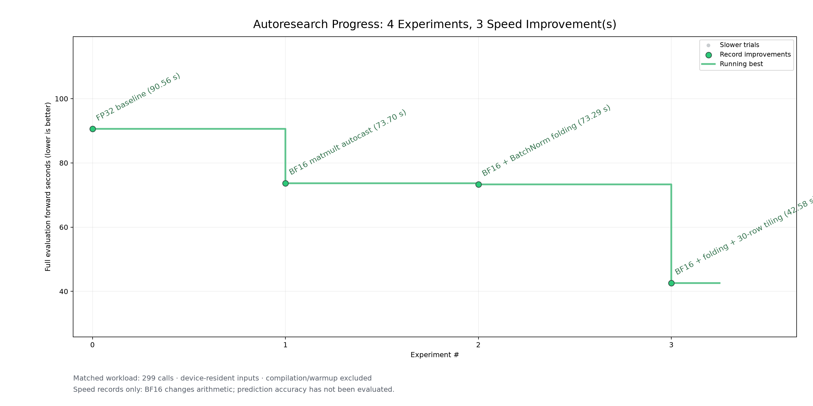
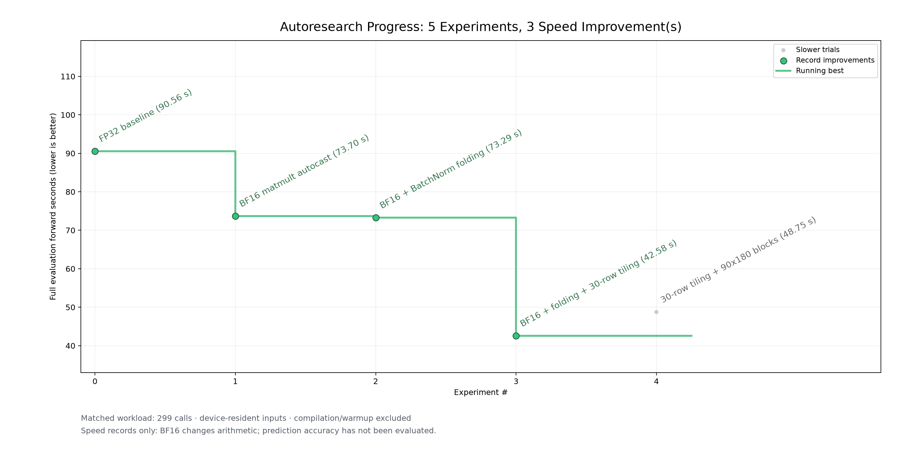

# Project 03: Mechanical Sympathy





This project checks Samudra inference against a CPU reference and then improves
the same workload on AWS Trainium.

New to the project? [HARNESS.md](HARNESS.md) explains step by step how an attempt is
run, checked and recorded, and how the separate kernel-agent loop works.

### Temperature



### Current speed


## Experiment contract

The CPU implementation defines correctness. The first correct Trainium result
defines Trainium v0. Later Trainium results compare with Trainium v0.

```text
CPU reference output
        |
        v
correctness checker <----- Trainium candidate
        |                         |
        | fail                    | pass
        v                         v
fix correctness           measure performance
                                  |
                                  +-- primary: rollout throughput
                                  +-- fallback: single-step latency
```

The checker does not expose performance results for an incorrect candidate.

## Repository roles

The hackathon fork is the primary team repository:

```text
https://github.com/pranoyghosh/trainium-agent-labs
```

It contains runners, the checker, attempt records, fixtures, and reports. The
Samudra fork contains only reusable Samudra changes:

```text
https://github.com/pranoyghosh/Samudra
```

`samudra-source.json` pins the exact Samudra commit. Run this command after the
fork exists:

```bash
./bootstrap_samudra.sh
```

See `GIT_WORKFLOW.md` for branch and remote commands.

## CPU reference

The released Samudra 2 one-degree EMA checkpoint and the one-degree OM4 source
are the reference inputs. First create one repeatable real-data fixture:

```bash
cd .scratch/Samudra
source .venv/bin/activate
python ../../runners/data_smoke.py \
  --samudra-root "$PWD" \
  --checkpoint ../../checkpoints/Samudra2/onedeg/ema_ckpt.pt \
  --data-root ../../data/om4-smoke \
  --reference-output ../../fixtures/cpu_reference.npz
```

Run this command twice. Compare the two CPU files. Then add these values to
`fixtures/manifest.json`:

- Checkpoint SHA-256.
- Reference file SHA-256.
- Numeric `atol` and `rtol`.
- `status: "frozen"`.

Do not freeze tolerances from a Trainium result. Use CPU repeatability and the
documented Trainium precision.

The full CPU rollout uses:

```bash
cd .scratch/Samudra
source .venv/bin/activate
python ../../runners/cpu_rollout.py \
  --samudra-root "$PWD" \
  --checkpoint ../../checkpoints/Samudra2/onedeg/ema_ckpt.pt \
  --predictions ../../rollouts/cpu_8_year/predictions.zarr \
  --report ../../results/cpu-baseline.md
```

The runner writes a small JSON manifest beside the Zarr store. Keep the Zarr
store outside Git.

## Correctness checker

The CPU and candidate files are compressed NumPy archives. Both files contain:

- `prediction`
- `time`
- `variables`

The CPU fixture also contains the model inputs and grid context. Run the
checker with:

```bash
python checker.py \
  --manifest fixtures/manifest.json \
  --candidate runs/trainium/candidate.npz \
  --precision bf16-autocast \
  --performance-json runs/trainium/metrics.json \
  --json-out runs/trainium/check.json
```

Use `--precision fp32` for the fp32 candidate. The checker selects the matching
entry in `precision_tolerances`. Keep the manifest in draft while the tolerances
are not set. To inspect numerical errors before tolerances are frozen, use:

```bash
python checker.py --manifest fixtures/manifest.json \
  --candidate runs/trainium/calibration/bf16-autocast/candidate.npz \
  --precision bf16-autocast --diagnostic-only
```

Diagnostic mode reports error values only. It does not give a correctness pass
or a performance result.

Exit status `0` means correct. Exit status `1` means a correctness failure.
Exit status `2` means the reference or checker configuration is not ready.

## Trainium runner contract

`runners/trainium_runner.py` loads an adapter file. The adapter implements:

```python
def prepare(inputs, context):
    return prepared_candidate
```

The prepared candidate implements:

```python
def run():
    return prediction

def synchronize():
    ...
```

Compilation must happen in `prepare`. `synchronize` must wait for all device
work. This separation keeps compilation and warm-up out of steady-state timing.

Use `agent.py` to run and record one graded attempt:

```bash
python agent.py \
  --experiment trainium-v0 \
  --adapter trainium/candidate_adapter.py \
  --fixture fixtures/cpu_reference.npz \
  --precision bf16-autocast \
  --workload single-step
```

Use `fp32` for the comparison attempt. The first correctly checked
`bf16-autocast` attempt is Trainium v0.

The controller appends the result to `results/attempts.csv`. It adds timing
only when correctness passes.

To see where an attempt spends its time, on the host and on the NeuronCore,
see `PROFILING.md`. Profiling is opt-in and does not change the timed run.

## Performance rule

The primary metric is completed forecast steps per steady-state second. Keep
input data, checkpoint, shape, precision, and rollout length fixed.

Use single-step median and p95 latency only when:

1. One-step Trainium inference passes correctness.
2. Two full-rollout attempts are recorded.
3. Both fail because of an unsupported operation, repeated compilation, graph
   growth, or device memory.

Do not report CPU speed as the Trainium baseline.

## Files that stay outside Git

- `.scratch/`
- Checkpoints
- Datasets
- Full Zarr predictions
- Rollouts
- Neuron compiler caches
- Environment files and credentials
- `pod-remote/`

## Eight-year baseline evaluation

These animations compare the saved NVIDIA Samudra v2 baseline rollout
(epoch 70, raw checkpoint) with OM4 from **20 October 2014 to 24 December 2022**.
The columns show **surface (2.5 m), shallow (105 m), and mid-depth (550 m)**.
The rows show the OM4 reference, Samudra v2, and the model minus the reference,
with an area-weighted RMSE for each depth.

Temperature is in °C; current speed is `sqrt(uo² + vo²)` in m/s. Colors stay
fixed through time. Current speed uses square-root colors to make weak currents
visible; both difference maps use linear colors, with blue meaning lower and
red meaning higher. Land and below-seafloor cells are masked.

The GIFs sample approximately every 60 days, include the final state, and loop
through the evaluation in about 14 seconds. See the [animation metadata](results/eight-year-evaluation-2026-10-10/manifest.json)
for the checkpoint hash, exact displayed dates, color limits, and file hashes.
The Trainium trials below measured forward-pass speed only; these animations
show the separate NVIDIA baseline evaluation.

## Forward-only speed experiment report

See the [three-trial report and hill-climb graph](results/forward-only-2026-10-10/README.md)
for the CPU timing reference, Trainium FP32, BF16 autocast, and BatchNorm-folding
measurements. These speed-only results have not passed the project’s forecast
correctness acceptance workflow.

### Latitude tiling result

Adding 30-row latitude tiling to BF16 matmult autocast and BatchNorm folding
reduced the eight-year, 299-call forward time from **73.29 s to 42.58 s**
(**1.72× faster**, 41.9% less forward time). The two full-resolution blocks
are tiled. Compilation and warmup are excluded; no accuracy checks or
forecast metrics ran for this trial.



See the [tiling report and raw timing](results/tiling-forward-2026-10-10/README.md)
for the workload and plot reproduction command.

### Tiling follow-up and throughput

Also tiling the two 90×180 blocks was slower: **48.75 s** against 42.58 s for
full-resolution tiling only. Their dilation-2 convolutions add halo work to every band.
Keep tiling to the full-resolution blocks.



The same trials as throughput. Each run simulates 8.19 years (598 five-day
steps), so the best result runs **11.53 simulated years per minute**, up from
5.42 for the FP32 baseline.


See the [follow-up report](results/easy-wins-2026-10-10/README.md) for the
device-only check and plot reproduction commands.

### Single-rollout spatial parallelism

Partitioning the two full-resolution ConvNeXt blocks across four logical
Trainium cores reduced one eight-year rollout from **42.84 s to 35.43 s**
(**1.21× faster**, 17.3% less rollout wall time). The ranks cooperate on one
trajectory; remaining layers compute replicated tensors.

The Karpathy-style plots use forward-only sums to match the preceding trials:
**42.64 s → 35.22 s**, reaching **13.94 simulated years per forward minute**.
Compilation and warmup are excluded. This is an experimental timing result;
forecast accuracy has not been evaluated.

See the [spatial-parallel report](results/spatial-parallel-2026-10-10/README.md)
for raw timing, hardware allocation, and reproduction commands.

### Graph-cut follow-up

The single-trajectory progress plots now include nine trials. Adding only an
input-concat cut took **58.69 s**; adding the input cut and per-layer UNet
segmentation took **14.08 s** on one logical core, or **34.88 simulated years
per forward minute**. The earlier four-core spatial split took **35.22 s**.

These are forward-only timings, with compilation and warmup excluded. Core
counts and CPU-thread settings are labeled in both plots above. No completed
trial combines segmentation with four-core spatial splitting; accuracy remains
unverified. See the [updated reports and trial ledger](results/spatial-parallel-2026-10-10/README.md).
