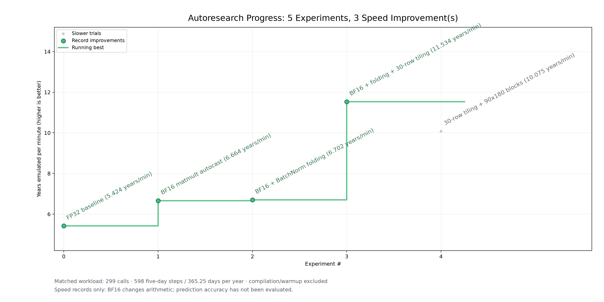

<!-- SPDX-FileCopyrightText: 2026 Samudra Authors -->
<!-- SPDX-License-Identifier: CC-BY-4.0 -->

# Samudra forward progress: follow-up tiling trials

Continues the hill climb from [tiling-forward-2026-10-10](../tiling-forward-2026-10-10/README.md).
Same workload as before: real one-degree checkpoint, prepared eight-year inputs,
299 autoregressive calls, eight CPU threads pinned to 48–55, visible Neuron core 0,
LNC2, BF16 matmult autocast, BatchNorm folding. Timing only; no forecast accuracy check.


| # | Experiment | Forward sum | Median call | Result |
| ---: | --- | ---: | ---: | --- |
| 3 | BF16 + folding + 30-row tiling (full-res blocks only) | 42.584 s | 142.2 ms | Running best |
| 4 | 30-row tiling + also the 90×180 blocks (`layers.2`, `layers.14`) | 48.752 s | 163.0 ms | **Slower** (+14.5%) |

Experiment 4 used `--tile-rows 30 --tile-min-pixels 16200`. The 90×180 blocks use
dilation 2. The two convolutions require four halo rows per side (eight total),
so a 30-row band starts with 38 rows. This adds computation; the measured run was
slower overall, without a per-layer attribution of that slowdown. Keep tiling to
the full-resolution blocks only.

## Simulated years per minute

The same trials expressed as throughput. Each run simulates 598 five-day steps,
598 × 5 / 365.25 = 8.186 years, so years per minute = simulated years /
(forward seconds / 60). Higher is better.



| # | Experiment | Simulated years per minute |
| ---: | --- | ---: |
| 0 | FP32 baseline | 5.42 |
| 1 | BF16 matmult autocast | 6.66 |
| 2 | BF16 + BatchNorm folding | 6.70 |
| 3 | BF16 + folding + 30-row tiling | **11.53** |
| 4 | 30-row tiling + 90×180 blocks | 10.07 (slower) |

## Stopped without results

Two band-height trials on the full-resolution blocks (15-row and 45-row bands) were
stopped during compilation at the team's request. They have no measurements and are
not plotted.

## Device-only check

`neuron-bench` on the experiment 3 binary (device-resident, 40 runs) gave a median of
135.8 ms per call against 142.2 ms wall time. Host dispatch overhead is about 6 ms
(4%), so the remaining time is on the device.

## Reproduce the plot

```bash
python projects/03-mechanical-sympathy/runners/plot_forward_progress.py \
  projects/03-mechanical-sympathy/results/easy-wins-2026-10-10/experiments.json \
  --output projects/03-mechanical-sympathy/results/easy-wins-2026-10-10/progress

python projects/03-mechanical-sympathy/runners/plot_forward_progress.py \
  projects/03-mechanical-sympathy/results/easy-wins-2026-10-10/experiments.json \
  --metric years-per-minute \
  --output projects/03-mechanical-sympathy/results/easy-wins-2026-10-10/years_per_minute
```
