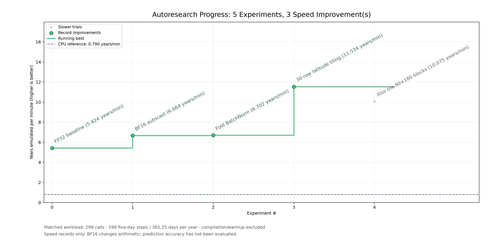

<!-- SPDX-FileCopyrightText: 2026 Samudra Authors -->
<!-- SPDX-License-Identifier: CC-BY-4.0 -->

# Samudra one-degree forward-speed experiments

Five complete Trainium trials show how the measured forward time changed as
we enabled BF16 matrix-engine autocast and then folded BatchNorm into Conv2d.
The plot follows [Karpathy’s autoresearch progress presentation](https://github.com/karpathy/autoresearch/blob/master/progress.png),
using an experiment axis, annotated green speed records, and a running-best staircase.



| Update | Forward seconds (299 calls) | Years emulated per minute |
| --- | ---: | ---: |
| CPU reference | 622.0864 | 0.790 |
| Trainium FP32 | 90.5580 | 5.424 |
| BF16 autocast | 73.6998 | 6.664 |
| Fold BatchNorm | 73.2887 | 6.702 |
| 30-row latitude tiling | **42.5839** | **11.534** |
| Also tile 90×180 blocks | 48.7519 | 10.075 |

The latest best is **11.534 years/min**, 2.127x the FP32 Trainium baseline.
The extra 90×180 tiling trial is slower and does not raise the running-best line.
Rates use 598 forecast steps × 5 days / 365.25 days/year, divided by measured
forward minutes. CPU is separate timing context. Only completed full-range
reports are included; pending 15-row and 45-row experiments have no plotted score.
All plotted reports pass the same workload/allocation checks. Forecast accuracy
was not evaluated for these timing experiments.

[Original three-trial forward-seconds plot](progress.png).

| Backend / experiment | Single median | Full-range forward sum | Change versus preceding Trainium trial |
| --- | ---: | ---: | ---: |
| CPU reference timing | 2028.162 ms | 622.0864 s | — |
| Trainium FP32 baseline | 302.496 ms | 90.5580 s | — |
| Trainium BF16 matmult autocast | 245.936 ms | 73.6998 s | 18.616% less wall time |
| Trainium BF16 + BatchNorm folding | 244.584 ms | 73.2887 s | 0.558% less wall time |

The final trial is 1.236x faster than the FP32 Trainium baseline. The small
BatchNorm difference is one observed run, and may be run-to-run variation.
These are speed-only experiments, not correctness-accepted attempts in the
project’s checker. They do not modify `attempts.csv`, `trainium-v0.md`, or the
frozen fixture. BF16 changes arithmetic; forecast accuracy was not evaluated.
The CPU row is timing context, not the Trainium optimization baseline.

## Timing and workload

Each report contains 20 independent warmed single-call samples and a full
299-call autoregressive pass, covering 598 five-day forecast timesteps from
2014-10-20 through 2022-12-24. All share the same checkpoint, cached real-data
inputs, float32 tensor interface, PyTorch 2.9.1, eight CPU threads, and three
warmup calls. Internal precision differs as recorded in compiler flags.

Weights, input history, and all forcing windows reside on the execution device
before timing. Each timed call includes model forward/residual assembly,
Python dispatch, and completion synchronization. Loading, preprocessing,
transfers, compilation, history assembly, logging, forecast metrics, and output
writing are excluded. This is synchronized forward wall time, not kernel-only
profiling. Each Trainium run compiled once during warmup; no measured call
compiled or triggered CPU fallback. Raw reports include every sample, host CPU
time, process-lifetime peak RSS, and setup/warmup durations.

Trainium hardware: trn2.48xlarge, visible core 0, logical NC configuration 2.
This measures one allocation, not full-instance throughput. Missing heat-flux
anomalies were computed over the supplied 2014–2022 source span, which differs
from the complete training climatology.

## Folding verification

The folding trial replaced 18 eval-mode Conv2d/BatchNorm2d pairs with fused
convolutions, retaining convolution positions and geographic padding.
One FP32 CPU forward against the unfused model gave maximum absolute difference
1.1921e-5 and relative RMSE 3.2180e-7. This is an implementation check without
forecast targets, outside performance timing, not a forecast-quality assessment.
Four folding tests plus ten timing/preparation tests passed in the Samudra
checkout. The complete 299-call folding trial then finished successfully.

## Reproduce the plot

From the repository root, using an environment with NumPy and Matplotlib:

```bash
python projects/03-mechanical-sympathy/runners/plot_forward_progress.py \
  projects/03-mechanical-sympathy/results/forward-only-2026-10-10/experiments.json \
  --output projects/03-mechanical-sympathy/results/forward-only-2026-10-10/progress
```

The script writes PNG, SVG, PDF and a TSV ledger. `experiments.json` lists reports
in experiment order, relative to the manifest. It checks complete forward-only
runs and matching workloads/hardware allocation; precision flags may differ
intentionally and are retained in the ledger. Missing reports remain pending.
No autonomous research loop is launched.

## Provenance

Official checkpoint: `M2LInES/Samudra2/onedeg/ema_ckpt.pt`, epoch 70, SHA-256
`ff6160cb7e2a2b5b8ee2c5731c16bd114a1bb5a267245cc5ed766fb00c7f797a`.
Prepared-case SHA-256:
`7251e96fe08c1d3c794522020ab10d579c97d1bcd6ce98ab951efd9c0746198b`.
Samudra upstream base: `6b88f2c0204828ef77d41b3ab2733679615f53e8`.
Report `source_commit` fields identify the local experiment code commits;
those commits are not claimed to be published upstream. Large checkpoints,
source data, prepared inputs, compiler outputs, and predictions are excluded.

Raw reports: [CPU](cpu.json), [FP32](neuron.json), [BF16](neuron_bf16.json),
[BF16 + folding](neuron_bf16_folded.json). [Trial ledger](progress.tsv).

## Regenerate the throughput view

```bash
python projects/03-mechanical-sympathy/runners/plot_forward_progress.py \
  projects/03-mechanical-sympathy/results/forward-only-2026-10-10/experiments.json \
  --metric years-per-minute \
  --cpu-reference projects/03-mechanical-sympathy/results/forward-only-2026-10-10/cpu.json \
  --output projects/03-mechanical-sympathy/results/forward-only-2026-10-10/years-per-minute
```

The tiling report comes from the separately recorded
[30-row experiment](../tiling-forward-2026-10-10/README.md).
The additional 90×180 tiling report is retained as `tiled30_lvl1.json`.
