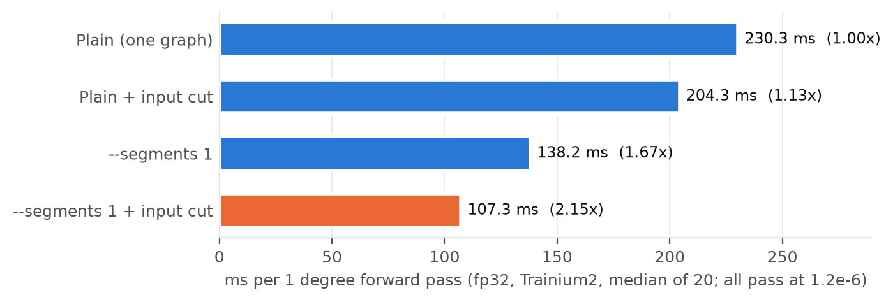
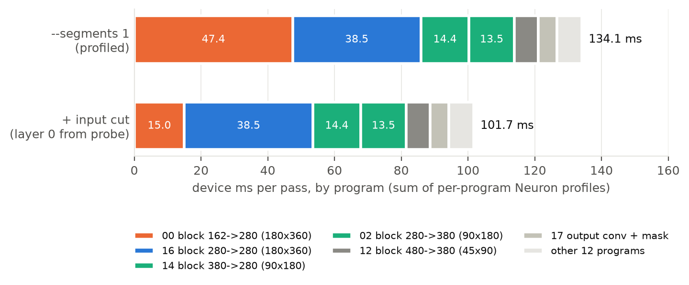
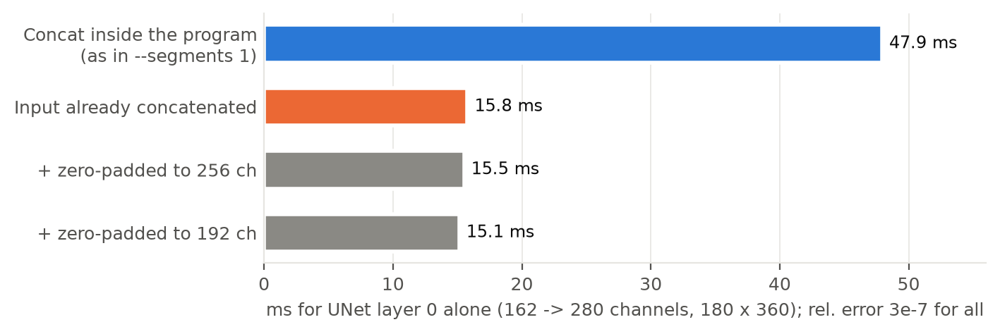
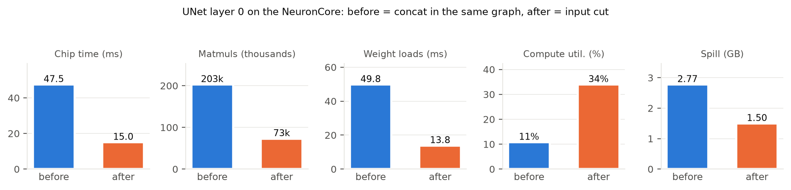
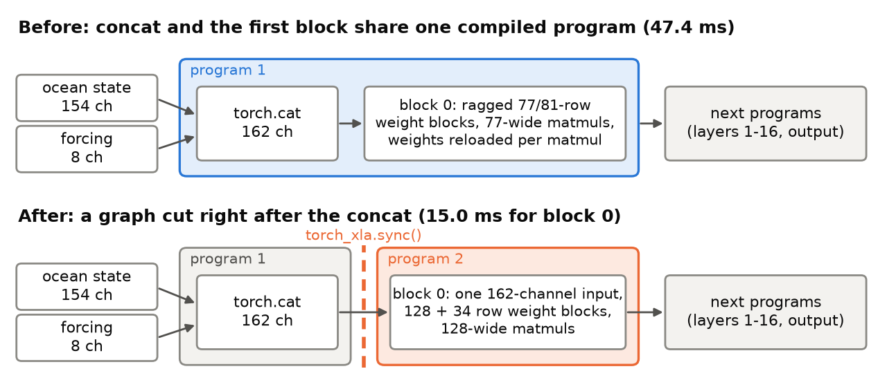

<!-- SPDX-FileCopyrightText: 2026 Samudra Authors -->
<!-- SPDX-License-Identifier: CC-BY-4.0 -->

# Input cut: 138.2 ms to 107.3 ms per Samudra forward pass

One graph boundary right after the model joins its two inputs makes the segmented 1 degree
forward pass on Trainium2 1.29x faster (138.2 ms to 107.3 ms), and 2.15x faster than the
unsegmented baseline (230.3 ms). The math is unchanged: every run below passes the check against
the fp32 CPU reference at 1.2e-6 relative RMS error, with land exactly zero.



## The change

`trainium/samudra_core.py`, `SamudraNet.forward`:

```python
fts = torch.cat((prognostic, boundary), dim=1)
input_cut = input_cut or cut
if input_cut is not None:
    input_cut()   # torch_xla.sync(): the concat becomes its own small program
```

- With `--segments 1` (`cut=torch_xla.sync`) the input cut is on automatically.
- `bench.py --input-cut 1` adds only this cut, without per-layer segments.
- On the CPU, `cut` and `input_cut` are `None`, so nothing changes.

`trainium/candidate_adapter.py` and `runners/benchmark_forward.py` do not pass `cut`, so their
behavior is unchanged.

## Why

### 1. The profile pointed at the first block

In the `--segments 1` run, each UNet layer is its own compiled program, so `runners/profiling.py`
gives a time per layer. UNet layer 0 (162 to 280 channels on the full 180 x 360 grid) took 47.4 ms,
35% of the pass, at 11% compute utilization. The last block on the same grid does 2.8x more
arithmetic in 38.5 ms at 37% utilization.



The lower row replaces layer 0 with its fixed time from the probe below. The measured full pass
is 107.3 ms: the device sum, plus the separate concat program and launch overhead.

### 2. The instruction trace showed small, inefficient matmuls

`neuron-explorer view --output-format json` on the layer 0 program showed:

- 202,621 matmul instructions, each paired with its own weight load (202,621 `LDWEIGHTS`).
  Weight loading took 49.8 ms of engine time against 82.8 ms of matmul.
- Ragged weight blocks (`77*128`, `81*12`) and 77-wide matmuls.

The efficient last block uses full `128*128` weight blocks and 360-wide matmuls. Layer 0's 162
input channels are 154 ocean channels (2 x 77) and 8 forcing channels, joined by `torch.cat` at
the start of the same program. The ragged 77 and 81 blocks suggest the compiler convolved the
joined pieces separately instead of one 162-channel tensor.

### 3. A probe isolated the cause

`trainium/probe_block0.py` runs only UNet layer 0, in exact variants, on one NeuronCore:



| Variant | Layer 0 time | Relative error vs CPU |
| --- | ---: | ---: |
| Concat inside the program (as in `--segments 1`) | 47.9 ms | 3.0e-7 |
| Input already concatenated | **15.8 ms** | 3.1e-7 |
| Input zero-padded to 256 channels | 15.5 ms | 3.1e-7 |
| Input zero-padded to 192 channels | 15.1 ms | 3.1e-7 |

Joining the inputs in a separate program gives a 3.0x faster first block. Padding the channel
count to a multiple of 64 or 128 adds almost nothing, so the channel count was not the problem.

### 4. The fixed program behaves like the efficient blocks

Profile of the fixed layer 0 program (probe variant B), compared with the original:



| Layer 0 | Before | After |
| --- | ---: | ---: |
| Device time | 47.4 ms | 15.0 ms |
| Matmul instructions | 202,621 | 72,957 |
| Weight blocks | `77*128`, `81*12` | `128*128`, `34*128` (162 = 128 + 34) |
| Weight-load engine time | 49.8 ms | 13.8 ms |
| Compute utilization (MFU) | 11% | 34% |
| Spill | 2.77 GB | 1.50 GB |



## Results

`trainium/bench.py --grid 1deg --ckpt <onedeg ema_ckpt.pt>`, fp32, batch 1, random inputs with a
fixed seed, median of 20 passes after 3 warm-up passes, seat-211.

| Configuration | Median ms | Min to max ms | Speedup vs plain | Relative error | Core |
| --- | ---: | ---: | ---: | ---: | ---: |
| Plain | 230.3 | 230.0 to 231.0 | 1.00x | 1.22e-6 | 2 |
| Plain + `--input-cut 1` | 204.3 | 203.7 to 205.6 | 1.13x | 1.22e-6 | 3 |
| `--segments 1` | 138.2 | 138.0 to 138.7 | 1.67x | 1.22e-6 | 2 |
| `--segments 1` + input cut | **107.3** | 106.8 to 108.1 | **2.15x** | 1.22e-6 | 3 |

Commands:

```bash
CK=/workspace/samudra/onedeg/ema_ckpt.pt
export PYTHONPATH=/workspace/xla_plugin
python trainium/bench.py --device cpu --grid 1deg --ckpt $CK                 # CPU reference
python trainium/bench.py --device neuron --grid 1deg --ckpt $CK --cores 2 --segments 1
python trainium/bench.py --device neuron --grid 1deg --ckpt $CK --cores 2 --input-cut 1
PJRT_DEVICE=NEURON NEURON_RT_VISIBLE_CORES=2 python trainium/probe_block0.py --ckpt $CK
```

## Limits

- One timed run per configuration. The two input-cut runs used core 3 while a profiling job
  compiled on the pod's CPUs; a quiet rerun may be slightly faster.
- Random inputs and a single forward pass. A rollout feeds new forcing each step; it should join
  prognostic and boundary tensors in a separate step before the model, which is this change.
- The explanation of the ragged blocks is inferred from instruction shapes. The neff carries no
  HLO names, so instructions cannot be mapped to operations directly.

## Files

| File | Contents |
| --- | --- |
| `measurements.json` | Raw `bench.py` records, probe results and instruction counts used by the figures |
| `layer0_before_summary.json`, `layer0_after_summary.json` | `neuron-explorer` summaries of the two layer 0 programs |
| `make_figures.py` | Draws every figure from `measurements.json`: `python make_figures.py` |
| `fig*.png`, `fig*.svg` | Figures |
