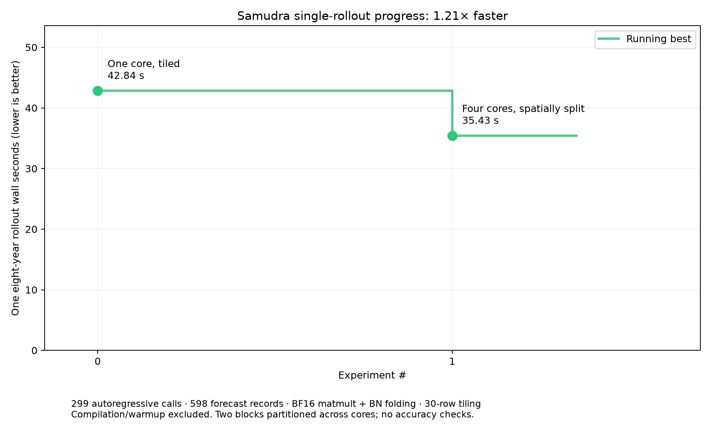

<!-- SPDX-FileCopyrightText: 2026 Samudra Authors -->
<!-- SPDX-License-Identifier: CC-BY-4.0 -->

# Samudra single-rollout spatial parallelism



| Implementation | One eight-year rollout | Forward-only sum |
| --- | ---: | ---: |
| One logical core, 30-row tiling | 42.84 s | 42.64 s |
| Four logical cores, two blocks spatially split | 35.43 s | 35.22 s |

The single trajectory runs **1.21× faster**, using
**17.3% less rollout wall time**.
These are single measurements, not confidence intervals.

Both runs use the same real checkpoint and cached eight-year OM4 inputs,
299 model calls, 598 forecast records, BF16 matmult autocast, BatchNorm folding,
30-row bands and two CPU threads per process. Both report no compilation or
CPU fallback in measured calls. The four-core run uses four cooperating ranks,
not four independent trajectories. Each rank computes one 45-row latitude
partition of the first and last full-resolution ConvNeXt blocks, with
neighboring halo rows and pole masking. A device all-gather assembles each
block's global output; remaining layers compute replicated tensors.

The comparison uses complete synchronized rollout-loop wall time, including
history updates and logging, after warmup. The parallel value is the slowest
rank's loop duration; the forward-only sum is reported separately. Setup,
compilation, warmup and output writes are excluded. Compilation and warmup for
the new full graph took 475.70 s.
This improves latency on one exposed Trainium2 chip's four LNC2 logical cores,
not the entire trn2.48xlarge host.

No forecast metrics or numerical comparisons ran; geographic boundary handling
is implemented but forecast correctness remains unverified. No prediction
store was saved, and this experimental path is not enabled in the main runner.

Before the full run, an isolated real-checkpoint first-block benchmark on
seeded random inputs measured approximately 6.92 to 6.03 ms with two cores and
7.0 to 4.01 ms with four cores, including all-gather. Those isolated results
are separate from the full real-data rollout result.

Files: [summary](summary.json), [single-core reference](single-core-reference.json),
[parallel rank 0](rollout-4-cores/rank0.json), and the other rank reports in the
same folder. Prototype code is in `../../experiments/spatial_parallel/`.

## Reproduce

From the Samudra checkout (with the cached inputs and checkpoint present):

```bash
env NEURON_RT_VISIBLE_CORES=0-3 NEURON_LOGICAL_NC_CONFIG=2 \
  NEURON_CC_FLAGS='--target=trn2 --auto-cast=matmult --auto-cast-type=bf16 --logical-nc-config=2' \
  OMP_NUM_THREADS=2 taskset -c 48-55 .venv-neuron/bin/python \
  -m torch.distributed.run --standalone --nproc_per_node=4 \
  /amogh/trainium-agent-labs/projects/03-mechanical-sympathy/experiments/spatial_parallel/benchmark_rollout.py \
  --samudra-root "$PWD" samudra_om4_v2/eval.yaml \
  --data data/om4_onedeg/data.local.yaml \
  --checkpoint checkpoints/onedeg/ema_ckpt.pt \
  --case outputs/forward_benchmark/eval_case.pt \
  --backend neuron --threads 2 --tile-rows 30 --fold-batch-norm \
  --output /tmp/spatial-rollout/report.json
```

The experiment uses `no_grad()` because the installed distributed XLA stack
failed with an inference tensor version-counter error under `inference_mode()`.
Rank reports describe one shared trajectory and must not be summed as four
independent forecasts.

## Karpathy-style experiment history


The plots include the earlier FP32, BF16, folding and tiling trials, the slower
90×180 tiling trial, the fresh one-core reference, the four-core spatial split,
and the newer input-cut-only and per-layer segmentation trials.
They use forward-only sums for consistency with the earlier graphs: **35.22 s**
for spatial parallelism versus **42.64 s** for the paired one-core reference
(**1.21× faster**). The complete rollout loop still takes **35.43 s**, as reported
above. Spatial-split throughput is **13.94 simulated years per forward minute**.

The newest one-core results are **58.69 s** with the input cut alone and
**14.08 s** with the input cut plus cuts after all 17 UNet layers. The latter
is the new measured speed record (about **34.88 simulated years per forward
minute**). These runs use eight CPU threads and the same checkpoint/prepared
case. They have not been combined with four-core spatial parallelism; no
combined speedup is inferred. The reports were copied from the local
`tal-easy-wins` segmented-rollout experiment. No new model execution ran.

Hardware allocation and CPU-thread changes are marked on the plots. The four
cooperating ranks represent one trajectory, so their timings are not summed.
[Trial ledger](karpathy_trials.tsv) · [Plot manifest](karpathy_experiments.json).

Reproduce from the trainium-agent-labs repository root:

```bash
python projects/03-mechanical-sympathy/runners/plot_spatial_progress.py \
  projects/03-mechanical-sympathy/results/spatial-parallel-2026-10-10/karpathy_experiments.json \
  --output-directory projects/03-mechanical-sympathy/results/spatial-parallel-2026-10-10
```

Prerequisites: the Samudra environment must expose the inference-fusion helper
`samudra.utils.inference_fusion.fold_batch_norm`, in addition to the checkpoint,
prepared case, and Neuron runtime used in the original experiment.
