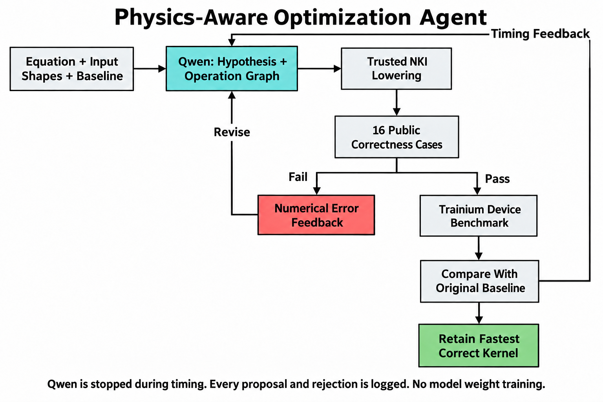
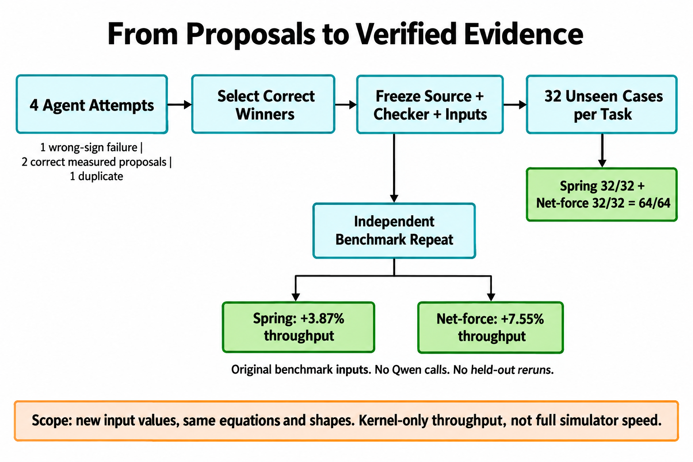

# NKI-Phys: A Physics-Aware Optimization Agent for Trainium

**AWS Hackathon Submission | October 10, 2026**

**Team Ultratech | Team 52 | Seats 260-263**

**Members: Vedant, Devesh, Dev, Khushboo**

## 1. Project Definition

We built a bounded, checker-guided agent that uses Qwen3-8B to propose faster physics computations for AWS Trainium. The agent receives a mathematical equation, input shapes, an original NKI baseline and feedback from previous attempts. It proposes an optimization hypothesis and an operation graph; trusted code validates the graph and lowers it to NKI. An independent checker rejects incorrect outputs, and device benchmarks determine whether a correct proposal actually improves throughput.

**The deliverable is the agent and its checker, not a newly trained model.** Qwen's weights remain unchanged. Improvement happens through inference-time proposals, measured feedback and revisions. The checker is deterministic code, not an LLM judging its own answers.

The practical problem is that a generated accelerator kernel can be mathematically wrong, physically invalid, or correct but slower than the original. Our workflow tests those possibilities separately and retains the fastest verified implementation rather than assuming that an optimization name guarantees a gain.

### Narrow Proof And Broader Direction

| Track | What We Built | Evidence Boundary |
| --- | --- | --- |
| Verified optimization agent | Spring-damper force and net-force accumulation, with model-selected proposals, independent checks and device throughput feedback | Raw attempts, inputs/outputs, source hashes, repeated benchmarks and a frozen held-out assessment are bundled |
| Physics-engine extension | Our prototype with integration, spring-chain forces, ground contact and fused rollouts | Results are reported in our attached engine document; its underlying code/logs were not independently audited in this package |

The narrow track demonstrates that the feedback loop can produce correct, repeatably faster kernels. The broader track explores how physics-aware checking and kernel fusion can extend toward a simulation engine. We do not claim that the agent generated a complete working engine or that these primitives replace MuJoCo.

### Concrete Example From Our Saved Data

**What are the physics questions?** Our final submission contains two force-calculation tasks. The data supplied to a kernel is numerical arrays, not a written story. Qwen receives the equation and array shapes, and writes a reusable implementation that must solve every input in that task.

**Question 1: spring-damper force.** "A spring-damper system has displacement `x = 2.0409190655` and velocity `v = 0.2716225684`. Its stiffness is `k = 84.6561889648` and damping coefficient is `c = 8.9611492157`. What force does the spring-damper exert?"

Using consistent SI units for interpretation, these quantities correspond to metres, metres/second, newtons/metre and newton-seconds/metre. The saved arrays themselves do not carry unit metadata. The required answer is approximately **-175.2104804343 N**: the negative sign follows the specified restoring-force equation. This is a force calculation at one state, not a prediction of a complete trajectory.

**Question 2: net force.** "Eight forces act along the same axis on a body. Their signed components are `[2.040919, -2.555665, 0.418099, -0.567770, -0.452649, -0.215597, -2.019986, -0.231932]`. What is the total force along that axis?"

The required answer from the exact stored values is approximately **-3.5845816880 N**, if the inputs are interpreted in newtons. This task adds force contributions; it does not solve contact impulses or simulate motion. The rounded numbers displayed here are illustrative; the checker uses the exact saved input bytes.

**What counts as one data case?** A spring case contains displacement and velocity arrays of shape `64 x 8`, plus stiffness and damping arrays of shape `64 x 1`, and requires `64 x 8` force outputs. A net-force case contains `64 x 8` contributions and requires `64 x 1` totals. Thus, one test case checks an entire array, not just the single scalar example shown here.

For each task, the agent sees **16 public cases**, and the frozen winner is assessed on **32 unique unseen cases**. Spring cases include zero displacement, zero velocity, zero damping and general inputs. Net-force cases include all-zero forces, cancelling forces, mixed magnitudes and general inputs. These are generated tests of the stated equations, not a recorded robotics dataset or a MuJoCo rollout benchmark.

**Task: compute a spring-damper restoring force.** The equation is:

```text
F = -(k*x + c*v)
```

Here `x` is displacement, `v` velocity, `k` stiffness and `c` damping. In our saved public input, seed 3, row 0, column 0:

| Quantity | Saved Value, Rounded |
| --- | ---: |
| Displacement x | 2.0409190655 |
| Velocity v | 0.2716225684 |
| Stiffness k | 84.6561889648 |
| Damping c | 8.9611492157 |
| FP64 reference force | -175.2104804343 |
| Selected Trainium kernel output | -175.2104797363 |

These are synthetic input values, not recorded robot measurements. The reference uses the exact stored FP32 inputs promoted to FP64; displayed values are rounded. The output error is approximately 0.000000698, within the unchanged numerical gate.

This example is retained in `development/attempt-002/device/spring/agent-proposal/case-03.npz` in the submission archive. The same kernel processes a tile of 64 x 8 independent evaluations; stiffness and damping have shape 64 x 1.

**A different mathematical task: accumulate forces.** For one scalar body-force component, add eight contributions:

```text
F_net = sum(F_i)
```

Public seed 3, row 0 has contributions approximately `[2.040919, -2.555665, 0.418099, -0.567770, -0.452649, -0.215597, -2.019986, -0.231932]`. The FP64 reference sum is `-3.5845816880`; the selected kernel returns `-3.5845816135`. This example is saved in `development/attempt-001/device/net-force/agent-proposal/case-03.npz`.

The force equation is elementwise arithmetic; force accumulation is a reduction. They are different mathematical/computational structures, not merely different coefficients of one contact solver. The tests within each task vary its input values, not its equation.

## 2. Agent And Evaluation Flow



1. Qwen inspects the equation, shapes and baseline, and states a hypothesis.
2. Trusted lowering accepts a bounded operation graph and emits NKI; generated Python is not executed directly.
3. The checker evaluates all 16 public cases for that task. Incorrect proposals receive numerical feedback, not a timing reward.
4. Correct proposals run on Trainium. Qwen is stopped during timing to avoid device interference.
5. The controller compares candidate throughput with the paired original baseline and retains the best verified result.
6. Each task receives its own previous proposal and feedback for the next revision. Every failure and duplicate remains logged.

Supported graph operations include arithmetic, sign fusion, copies, native or serial reductions, and selected engine placement. This is a finite code-generation language, not arbitrary kernel generation or a proof of general algorithm discovery. The controller does not prescribe an exact target template in this experiment.



**Freezing and held-out checking are separate from optimization.** We pin the selected sources, checker and input bytes, then evaluate 32 unique unseen cases per task once. Those results are not fed to Qwen. Independent speed measurements repeat the original benchmark workload, not the held-out evaluation.

## 3. Good Results

### Verified Agent Results

| Task | Initial Device Throughput Ratio | Independent Repeat | Frozen Unseen Correctness |
| --- | ---: | ---: | ---: |
| Spring-damper force | 1.039810x (+3.981%) | 1.038735x (+3.873%) | 32/32 |
| Net-force accumulation | 1.070428x (+7.043%) | 1.075468x (+7.547%) | 32/32 |

**Both throughput gains replicated, and all 64 held-out cases passed.** Ratios are candidate throughput divided by that task's paired original-baseline throughput; they are not pooled across tasks or equal-percentage latency reductions.

- **Spring:** the first proposal reversed the required force sign. After receiving failure feedback and its previous proposal, Qwen produced the correct equation with explicit Vector Engine placement. It passed all public checks and beat the original baseline. This is a recorded failure-to-correct revision, not a new physics algorithm. The winning kernel retains four arithmetic steps; an isolated ablation/profile would be needed to attribute its gain specifically to engine placement.
- **Net-force:** Qwen proposed replacing serial additions with a native sum. Trusted lowering emitted `nisa.tensor_reduce`. The proposal passed correctness and improved measured throughput. Native reduction was an available operation in the bounded language; we do not claim Qwen invented the instruction or an unknown optimization technique.
- **Final assessment:** 32 unique unseen inputs per task passed on the exact frozen kernels. Development used seeds 0..15; holdout generation began at 10000 and excluded exact duplicates. This supports correctness on new values in the same distributions, equations and shapes, not unseen-task or out-of-distribution generalization.

### Hardware, Runs And Spread

The verified agent ran on `seat-260`, a Trainium2 `trn2.48xlarge` environment, with confirmed visible cores `0,1`, Python 3.13.7 and NKI 0.6.0. The final assessment used the same seat and cores. Qwen was stopped for device timing.

Each successful comparison used five candidate timing repeats, 20 warmups and 200 device samples per repeat, with original-baseline measurements before and after the candidate. Only development seed 3 was timed; all 16 public cases were checked. Correctness was required before/after timing, including an all-case post-timing suite. More than 10% baseline drift invalidates the performance reward.

| Task | Initial Candidate Repeat Means: Min / Median / Max (ms) | Independent Repeat Means: Min / Median / Max (ms) |
| --- | --- | --- |
| Spring | 0.01555320 / 0.01555898 / 0.01556944 | 0.015456995 / 0.015461330 / 0.015469085 |
| Net-force | 0.01731500 / 0.01736040 / 0.01738581 | 0.017342015 / 0.017345200 / 0.017361155 |

Independent baseline drift was 0.01799% for spring and 0.06042% for net-force. Raw samples, checks and source hashes are included. Device-only timings exclude compilation, model loading, host transfers and readback. The gains are observed and repeated, but statistical significance and end-to-end simulator speedups are not established.

### Earlier Contact-Kernel Result

Earlier work on frictionless contact snapshots found that removing a redundant PSUM-to-SBUF copy improved observed throughput by approximately 1.35%, with an independent repeat. It established our original checking/benchmarking pipeline. Those proposals used explicitly supplied reviewed templates, so this is not evidence of autonomous technique discovery. Detailed earlier history is documented in `source/AWS_PROGRESS.md`; its full raw archive is separate from the four-attempt math-agent evidence package.

### Broader Engine Prototype: Reported Results

The attached [physics-engine report](submission-assets/teammate-engine-report.pdf) describes a simplified engine with semi-implicit integration, spring-chain forces, floor-contact projection and a fused 32-step rollout. Its spring chain is coupled across neighbors, unlike our independent spring-damper evaluations. Reported evidence includes:

- Four SciPy reference certifications, four accepted reference kernels and 12 correctly diagnosed planted simulator bugs.
- A 128-world, 16-mass, 64-step scenario checked against a float64 discrete reference, including floor penetration and energy behavior.
- Approximately 51x less simulation-counted DMA traffic with fused rollouts.
- Correct device outputs on seat-263, NeuronCore 2, and approximately 52x host-to-host speedup for the reported 32-step rollout comparison.

These figures are **reported in our engine document, not independently verified by our narrow-track package**. The 52x primarily measures reduced launch overhead in that SDK's standalone path; device-only execution time was not isolated. The 51x is transfer accounting from simulation, not a hardware bandwidth measurement. These results must not be combined with our 3.87% and 7.55% kernel-throughput gains.

## 4. Where We Failed

### Complete Four-Attempt Math-Agent History

| Attempt | Task | Outcome | Correctness | Performance Reward |
| --- | --- | --- | ---: | --- |
| 0 | Spring | Wrong-sign proposal; rejected | 0/16 | Not measured |
| 1 | Net-force | Correct native-reduction proposal | 16/16 | 1.070428x observed |
| 2 | Spring | Correct revision after feedback | 16/16 | 1.039810x observed |
| 3 | Net-force | Duplicate executable graph; rejected | Unmeasured for this attempt | Not measured |

The original spring proposal computed `v0=-(k*x)`, `v1=-(c*v)`, `v2=v0+v1`, then `v3=-v2`. The final negation reversed an already correct result. This was a mathematical sign error, not a small floating-point or platform discrepancy. The checker rejected every case and withheld timing. The revision instead multiplied the two terms without negating them, added them, and applied the final negative sign once.

Attempt 3 returned the same net-force program as attempt 1. Duplicate rejection prevented redundant execution; it is not a new failed equation test or independent replication. The four proposals yielded two correct measured candidates, one mathematical failure and one duplicate. We do not hide the failures or describe all attempts as successful.

### Earlier Failures And Scope Changes

The earlier gripping track now has a dedicated [failure record](GRIPPING_FAILURES.md), its [six-attempt log](gripping-evidence/ATTEMPTS.jsonl), and saved per-case diagnostic reports in `gripping-evidence/`. The parallel engine track is summarized in [BROADER_DEVELOPMENT.md](BROADER_DEVELOPMENT.md) and the attached PDF; its source/logs remain outside this package.

- **Correct but slower:** an earlier contact fused-subtraction candidate passed physics yet measured 0.80905x original throughput, approximately 19.10% lower. A named optimization was not automatically an improvement.
- **Fusion lost to a simpler change:** contact scaling/update fusion beat its original baseline by about 1.06%, but measured 0.99703x the paired copy-removal implementation. The controller retained copy removal rather than adopting the newer technique.
- **Gripping did not reach full FP32 correctness:** a six-setting fixed-momentum search at 1024 updates scored 10, 10, 10, 6, 6 and 4 out of 16. A human-written adaptive-restart CPU reference still reached only 10/16 in FP32 at the tested budgets. Higher-precision working arithmetic passed 16/16 on the same exported inputs, implicating numerical precision without proving that an FP32 solution is impossible. We shifted to simpler primitives because of the hackathon time limit, not by loosening checker gates.
- **Broad-track agent remained incomplete:** our engine report states that Qwen3-8B did not fully solve its physics levels in the reported search. The working reference engine therefore does not demonstrate fully agent-generated engine success. Its reported feedback revisions advanced partial results, but the remaining issues were not solved.
- **Broad-track accounting needs clarification:** the report lists a 1.5x traffic-floor acceptance bound for the fused level and a 2.0x floor in a rollout result. Different rollout lengths or denominators may explain this; they must be reconciled before asserting that particular performance gate passed.

### What We Have Not Established

We have not demonstrated unrestricted kernel optimization, an advantage over a fixed-template script under a matched search budget, statistically significant gains, cross-shape or unseen-equation generalization, or a complete embodied simulator. The bounded language and documented operation choices give the agent a finite search space. The current evidence demonstrates model-selected proposals, feedback-driven correction, independent verification and repeatable gains within that space.

## 5. Checker And Hand-In Artifacts

Our trusted checker compares candidate outputs with independent FP64 evaluations of each equation on the exact saved FP32 inputs. It accepts only finite FP32 outputs of the required shape, unchanged inputs, and elementwise error within:

```text
error_limit = 1e-6 + 2e-6 * sum_of_absolute_contributing_terms
```

Scaling by contributing terms accounts for cancellation without scaling tolerance by a nearly zero result. The thresholds were fixed before optimization and unchanged for final evaluation. Wrong signs, incorrect values, input mutations, invalid shapes/dtypes and nonfinite outputs are rejected. Generation, lowering or compilation errors remain unmeasured; duplicates get no new score. No model self-assessment determines correctness.

The main submission archive contains:

1. **Checker and acceptance reasoning:** `source/math_tasks.py`, `source/math_harness.py`, `source/frozen_math_eval.py`, `source/DISTINCT_MATH.md`, and tests.
2. **Complete attempt log:** `development/attempts.jsonl`, all four requests/replies, hypotheses, graph proposals, lowered sources, numerical reports and available outputs/timings.
3. **One-page results note:** `RUN_NOTE.md`, with hardware, run counts, correctness outcomes, throughput ratios, timing spread and limitations.
4. **Frozen final evaluation:** source/checker/input manifest, hashes, outputs and local grade under `final-evaluation/`; 64/64 cases passed with no feedback to Qwen.
5. **Independent benchmark repeat:** raw timing samples, checks and `independent-repeat/summary.json` for both selected sources.
6. **Broad-track appendix:** our engine report, explicitly labeled as reported prototype evidence. Its underlying code and full logs must be provided separately if that track is submitted as an independently reproducible deliverable.

The package includes file checksums. Compiled NEFFs are omitted; reproduction requires the recorded sources and compatible installed Neuron environment. The complete-history claim covers the four-attempt distinct-math experiment, not every earlier exploratory contact/gripping run.

**Final claim:** a bounded physics-aware agent corrected a mathematical failure through feedback, selected faster implementations for two distinct computations, reproduced their throughput gains, and retained correctness on 64 frozen unseen inputs. The broader engine prototype shows the intended integration direction without being presented as an already solved general-purpose agent.
