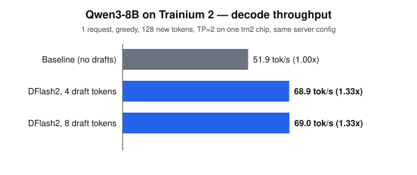
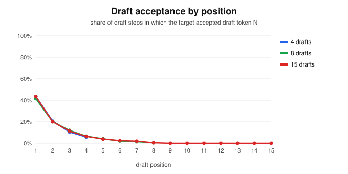

# Project 4 — DFlash2 speculative decoding on Trainium

**DFlash2 now runs on Trainium 2 through vLLM Neuron, and makes Qwen3-8B decode 1.33x faster.**

[DFlash](https://huggingface.co/z-lab/Qwen3-8B-DFlash-b16) is a speculative-decoding draft
model: a small 5-layer model reads hidden states from the target model and proposes several
next tokens in one pass, and the target model checks them all in a single forward pass. vLLM
supports it on GPU; the Neuron backend did not. Before this change, serving it failed with:

```
AttributeError: type object 'DFlashQwen3ForCausalLM' has no attribute 'from_configs'
```



## Results

Measured on one `trn2` chip (seat-40), TP=2, one request at a time, greedy decoding,
128 new tokens, 3 prompts x 2 runs. All servers use **the same config**
(`max_model_len=256`, `max_num_seqs=1`, `max_num_batched_tokens=256`); only the
`--speculative-config` flag differs.

| config | tokens/s | per-request median | speedup | draft acceptance | tokens per target step |
|---|---|---|---|---|---|
| Qwen3-8B (baseline) | 51.9 | 51.9 | 1.00x | n/a | 1.00 |
| Qwen3-8B + DFlash2, 4 draft tokens | 68.9 | 65.7 | **1.33x** | 20.1% (344/1708) | 1.81 |
| Qwen3-8B + DFlash2, 8 draft tokens | 69.0 | 68.2 | **1.33x** | 11.1% (362/3272) | 1.89 |
| Qwen3-8B + DFlash2, 15 draft tokens | 67.3 | 65.7 | 1.30x | 6.0% (365/6060) | 1.90 |



**4 draft tokens is the sweet spot for now.** Going from 4 to 8 to 15 drafts adds almost no
accepted tokens (344 → 362 → 365): positions 5–8 are rarely accepted (17, 9, 6 and 2 times
with 8 drafts) and positions 9–15 never were. Each extra draft still has to be verified by the
target (6 tokens per step with 4 drafts, 16 with 15), so throughput stays flat at 1.33x and drops
to 1.30x at 15. Raising acceptance at later positions (see
[Limitations](#limitations-and-next-steps)) is what would make longer drafts pay off.

Raw output: [`results/`](results/) (one file per run). Regenerate the table and charts with
`python3 make_charts.py`.

**Output check.** Both servers give the same greedy text for about the first 95 tokens of
prompt 1, then diverge on a near-tie (`"…which is then mapped to an index…"` vs
`"…which is then used to determine…"`). Both continuations are coherent. The likely cause is
bf16 rounding: the target scores 5 tokens per step when verifying instead of 1, a different
kernel shape. Speculative decoding on GPU in bf16 is also not bit-exact for the same reason.

## Demo

On a seat with the default image (`vllm-neuronx 0.24`, Neuron SDK 2.32):

```bash
cd /workspace/projects/04-dflash2-neuron
bash apply.sh                      # install the DFlash2 Neuron support (idempotent)
bash serve_dflash2.sh              # Qwen3-8B + DFlash2 on :8000 (DFLASH_NUM_SPEC=8 for 8 drafts)
bash tools/wait_log.sh             # returns when the server is ready or failed (max 60s per call)
bash run_bench.sh 4                # benchmark, saved to results/bench_dflash2_k4.txt

bash serve_baseline.sh             # same config, no speculation, for the comparison
bash tools/wait_log.sh /tmp/baseline.log
bash run_bench.sh 0                # saved to results/bench_baseline.txt

python3 make_charts.py             # rebuild results/*.svg and print the results table
```

The first start compiles every graph for the chip (about 5 minutes). Later starts
reuse the Neuron compile cache and come up in about 2 minutes.

Quick single request:

```bash
curl -s localhost:8000/v1/completions -H 'Content-Type: application/json' \
  -d '{"model":"Qwen/Qwen3-8B","prompt":"The capital of France is","max_tokens":40,"temperature":0}'
```

## What changed

Two new files (in `overlay/`) and a 300-line patch to three existing files
([`vllm_neuron-dflash2.patch`](vllm_neuron-dflash2.patch)). The DFlash2 code does not depend
on the Eagle3 implementation; the only shared pieces are the runner's existing
speculative-decoding plumbing and the target-side hidden-state capture interface.

| File | Change |
|---|---|
| `vllm_neuron/model/qwen3/dflash_draft.py` (new) | Neuron DFlash2 draft model: 5 Qwen3 layers + `fc` + `hidden_norm`, layers named 36–40 so their KV cache doesn't collide with the target's |
| `vllm_neuron/vllm/spec_decode/dflash2.py` (new) | `DFlash2Proposer`: loads the draft and its weights, loads `embed_tokens`/`lm_head` from the target (DFlash2 checkpoints don't ship them), feeds the draft 5 target hidden states |
| `vllm_neuron/model/qwen3/model.py` | Qwen3 target captures hidden states at the layers DFlash2 reads (`target_layer_ids` + 1 = 2, 10, 18, 26, 34) and returns them to the runner; weight loading accepts the DFlash2 checkpoint layout (bare keys, no embedding / LM head); KV cache names use each layer's own index |
| `vllm_neuron/model/registry.py` | registers `DFlashDraftModel` |
| `vllm_neuron/vllm/worker/neuron_model_runner.py` | routes `method: "dflash"` to `DFlash2Proposer` |

### One draft step

1. **Context:** `ctx = hidden_norm(fc(concat of 5 target hidden states))`. For each draft layer,
   K/V of `ctx` (K with `k_norm` + RoPE) are written straight into that layer's KV cache at the
   target tokens' slots.
2. **Query block:** `[next token, MASK, MASK, MASK, MASK]` at positions `p+1 … p+5` run through
   the 5 draft layers with the existing Neuron decode attention, which reads the context K/V.
3. **Drafts:** greedy tokens at the 4 MASK positions. The target verifies them with vLLM's
   rejection sampler, so wrong drafts are discarded and output quality is unaffected.

## Limitations and next steps

- **Attention inside the query block is causal**, not bidirectional as in the GPU reference.
  This reuses the existing Neuron decode kernel with no new attention code. Output stays
  correct because the target verifies every draft token, but acceptance is lower than DFlash2
  can reach. Adding a non-causal mask for the query block is the most direct way to raise
  acceptance above the current 20%.
- **Draft count.** The checkpoint was trained for blocks of 16 (`b16`), so up to 15 drafts
  per step are possible. Measured: 4 and 8 drafts both give 1.33x and 15 gives 1.30x, because
  acceptance falls off quickly after position 4 and is zero after position 8. Longer drafts only
  pay off once acceptance improves.
- **Tested config:** 1 request, `max_model_len=256`, async scheduling off, 4 / 8 / 15 draft
  tokens. Batching and longer context haven't been measured yet.
- If the query block reaches past the blocks allocated for a request, the block index is
  clamped to the last allocated block. That can corrupt the draft's own cache (lower acceptance),
  but never the target's.

## Dev tools

`tools/wait_log.sh` polls a vLLM log every second and returns as soon as the server is ready or
has failed, printing the root cause (60 s cap per call). `tools/progress.sh` shows how many graphs
have compiled. `tools/rootcause.sh` extracts the first worker traceback.
