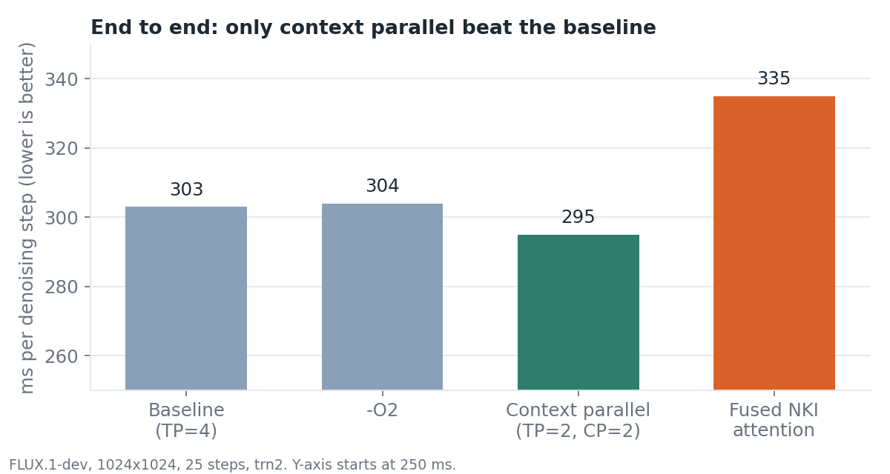
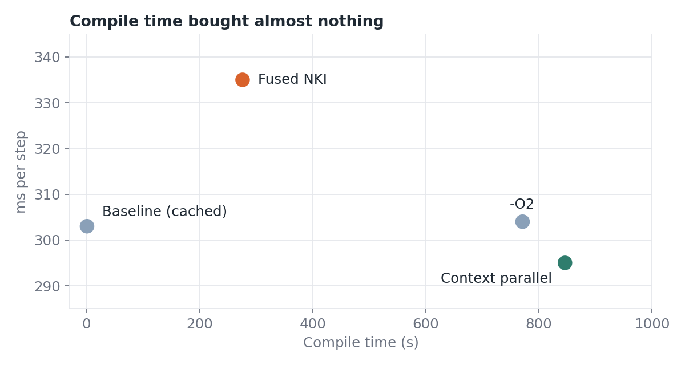
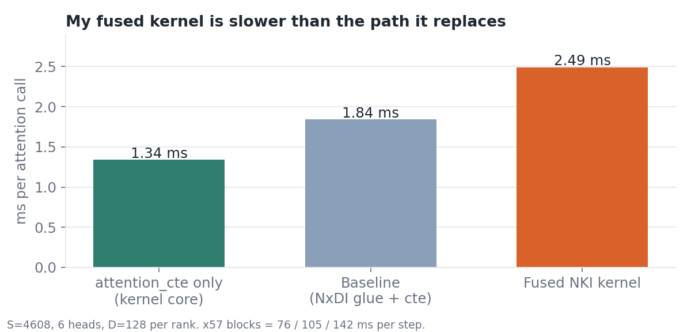
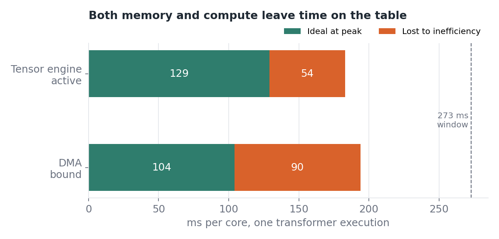
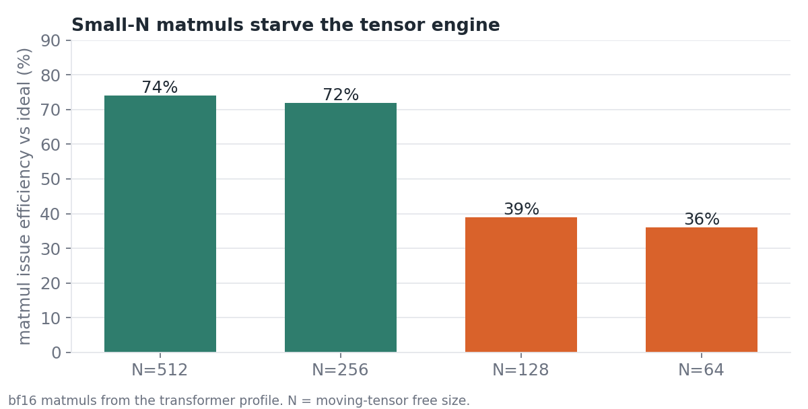

# 04 — FLUX.1-dev image generation on Trainium

I generate images with FLUX.1-dev (1024×1024, 25 steps) on one Trainium chip, using AWS's NxD Inference Flux code. Then I try to make it faster. This page has everything I measured and what I learned.

Short version: the stock setup is already close to the best of what I tried. Context parallel is 2.5% faster, `-O2` does nothing, and my own fused NKI attention kernel makes things 14% slower. The profile shows why.

## Run it

```
./run.sh --prompt "A robot named trn2" --num 4
```

`generate.py` prints latency, ms/step and images/s and writes `out/metrics.json`. While it runs, `neuron-monitor` records `out/neuron-monitor.jsonl`, and `neuron_summary.py` summarises it.

These flags define an experiment. Each one recompiles into its own folder under `/workspace/flux-compiled/`.

| Flag | What it does |
|---|---|
| `--tp` | NeuronCores for tensor parallel |
| `--cp` | Context parallel: shard the sequence over 2 groups of `--tp` cores |
| `--cc-opt` | neuronx-cc `-O` level for the transformer |
| `--nki` | My fused QK-RMSNorm + RoPE + flash-attention kernel, in [nki_kernels/](nki_kernels/) |
| `--warmup` | Untimed generations before the timed ones |

## Results

All runs use the same prompt, 1024×1024, 25 steps. Latency is steady state, so the first image is excluded unless I used `--warmup`.

| Run | Flags | Mean latency | ms/step | Images/min | Compile | Load |
|---|---|---|---|---|---|---|
| Baseline | `--tp 4` | 7.57 s | 303 | 7.93 | 1.1 s (cached) | 50.3 s |
| `-O2` | `--tp 4 --cc-opt 2` | 7.61 s | 304 | 7.88 | 771 s | 48.2 s |
| Context parallel | `--tp 2 --cp` | 7.38 s | 295 | 8.13 | 846 s | 91.3 s |
| Baseline, 3 images with warmup | `--tp 4 --warmup 1 --num 3` | 7.35 s | 294 | 8.16 | 1.0 s (cached) | 48.1 s |
| Fused NKI attention | `--tp 4 --nki --warmup 1 --num 3` | 8.38 s | 335 | 7.16 | 276 s | 45.3 s |

The fused NKI row compares against the warmup baseline right above it, not the first baseline. Same setup, so it's the fair comparison.





### What I learned from the end-to-end runs

- **`-O2` is not worth it.** It costs 13 minutes of compile and the latency is within noise (+0.6%).
- **Context parallel wins by a little.** It's 2.5% faster on a single 4-image run. I wouldn't call that settled without more runs. It also nearly doubles load time to 91 s.
- **My fused kernel loses.** It's 14% slower than the matched baseline (8.38 s vs 7.35 s, +41 ms per step). Utilisation and memory barely change, so the chip is not doing less work. It's doing the same work slower.

### Utilisation and memory

From neuron-monitor. The baseline column is the earlier 4-image run, not the matched warmup run. I only have monitor data for these two runs, because the `-O2` and context-parallel runs had the monitor off.

| Metric | Baseline | Fused NKI |
|---|---|---|
| NeuronCore utilisation, mean (4 cores) | 35.3% | 35.0% |
| Utilisation peak | 97.9% | 100.0% |
| Utilisation while busy (>0%) | 54.6% | 52.6% |
| Device memory, peak | 47.7 GiB | 46.8 GiB |
| Per-execution latency p50 | 210.1 ms | 230.5 ms |
| Per-execution latency p99 | 226.5 ms | 235.1 ms |

The cores sit idle about two thirds of the time on average. Some of that is the pipeline moving between stages (text encoders, transformer, VAE decoder), so I don't read the 35% as pure transformer inefficiency.

## Why the fused kernel is slower

I wrote `flux_qknorm_rope_attention` to fold QK-RMSNorm, RoPE and flash attention into one NKI kernel. The idea was to cut the fp32 glue ops around attention. I benchmarked it alone first, at the per-rank attention shape (S=4608, 6 heads, D=128, LNC=2). Each graph chains 8 calls so launch overhead washes out.

| Variant | ms per attention call | ms per step (×57 blocks) |
|---|---|---|
| `attention_cte` core only | 1.341 | 76.4 |
| Baseline (NxDI glue + `attention_cte`) | 1.840 | 104.9 |
| Fused NKI kernel | 2.491 | 142.0 |



Three things follow from this:

1. **The attention core is not the problem.** The nkilib kernel alone takes 1.34 ms. The stock glue around it adds 0.5 ms.
2. **My fusion adds 1.15 ms on top of the core, more than the glue it replaces.** The QK-norm and RoPE work inside my kernel costs more than the XLA ops it was meant to beat.
3. **The microbenchmark predicted the end-to-end result.** It said +37 ms per step and the real run said +41 ms. So the slowdown comes from the kernel, not from how I patched it into the model.

I haven't profiled the fused kernel on its own yet. My guess is that the norm and rotation run on the vector and scalar engines in a serial phase before the matmuls start, so the tensor engine waits. That's only a guess until I look at the engine timeline.

## Where the time goes on the baseline

I profiled the stock transformer with neuron-explorer and queried it with the scripts in `/workspace/analysis/` on seat-185. One execution on one logical NeuronCore (two physical cores) took 273 ms. Both cores behave the same, so the numbers are per core. Peaks come from the profile's metadata: 78.6 TFLOPS on the tensor engine, 435 GB/s for DMA.

| Metric | Value |
|---|---|
| Instructions traced | 6.33 M (tensor 4.66 M, vector 0.60 M, scalar 0.50 M, sync 0.42 M, gpsimd 0.15 M) |
| Tensor engine active | 183 ms of 273 ms (67%) |
| Achieved tensor throughput | 55.5 TFLOPS, 70.5% of peak |
| Transposes | 5% of tensor FLOPs, 6.6 ms |
| Matmul issue time | 221 ms measured vs 129 ms ideal |
| DMA bytes per core | 45.3 GB |
| DMA achieved bandwidth | 234 GB/s, 54% of peak |
| Spill traffic | about 10 GB saved, about 16 GB reloaded |



### What I learned from the profile

- **Matmul shape decides tensor engine efficiency.** N=512 matmuls run at about 74% of the ideal rate. N=128 runs at 39% and N=64 at 36%. Those two small sizes cost about 34 ms of the 92 ms of excess matmul time.

  

- **Attention's inner loop is the worst offender.** `attention_cte.py:3887` alone is 141 ms of tensor time, all N=128, at 41% efficiency. If I want to speed this model up, I'd start with a kernel that keeps the moving tensor at N=512 in that loop. More fusion around it won't help.
- **Weights are read from HBM several times.** 16.2 GB per core is loaded into SBUF, but the real tensor data is only 5.35 GB. The worst 50 inputs (18.9 MB each) are reloaded 16 times, about 15 GB.
- **Lots of small DMAs.** About 23.5 M hardware-dynamic packets are under 2 KB. They move 11.4 GB at 12 to 18 B/ns per engine, against 21 to 22 B/ns for 4 to 16 KB packets. Bigger transfers would help.
- **14.5 GB of traffic is SBUF-to-SBUF transpose DMA.** That's a lot of data shuffling just for layout changes.

### Caveats on the profile

- The profile has three warnings: DMA block notifications were dropped, the NEFF lacks compiler metrics, and HLO FLOP stats are missing, so HLO-based MFU isn't available.
- DMA packet coverage is 79% (71.6 of 91.1 GB), so treat the DMA numbers as lower bounds.
- Ingest logged "DGE packet count exceeds number of DMA trace entries" for several DMA engines.
- A separate profiling run in `prof/run.log` died with `NRT_EXEC_SW_NQ_OVERFLOW`.
- My spill and reload totals are sums from `s5.py`. They don't separate spills from ordinary intermediate traffic.

## What I'd do next

1. Profile the fused kernel alone and check whether the norm and RoPE phase blocks the tensor engine.
2. Rework the attention loop so matmuls run at N=512, not N=128.
3. Find out why weights get reloaded up to 16 times. That's roughly 10 GB of avoidable HBM traffic per core.
4. Repeat the context-parallel run a few times to see if the 2.5% gain holds.

## Where the data lives

All of it is on seat-185 under `/workspace/`.

| Data | Path |
|---|---|
| Baseline metrics and monitor | `04-flux-image/out/` |
| `-O2` and context-parallel runs | `04-flux-image/exp/` |
| Matched baseline and NKI runs | `projects/04-flux-image/out/{base,nki}/metrics.json` |
| Attention microbenchmark | `/tmp/nki_flux/bench.log` |
| Profile | `ne-profile/profiles/global/flux-transformer@latest` |
| Analysis scripts | `analysis/` |

The charts in [charts/](charts/) use the numbers on this page. The metrics from my very first 4-image run were overwritten, so there's nothing to report from it.
