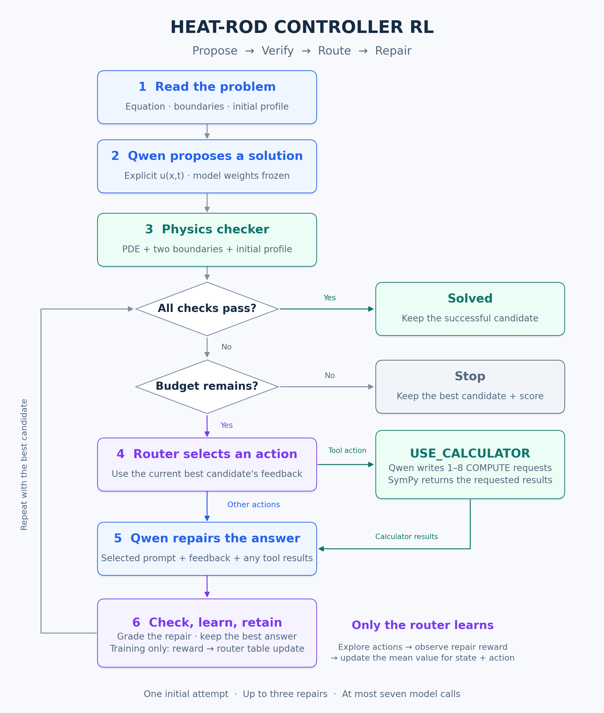

# 🌡️ Heat-Rod Controller RL

### A frozen LLM that solves, checks, and repairs—with a router that learns what to try next

This project builds an agent around **Qwen3-8B** to solve the one-dimensional heat
equation, `u_t = k*u_xx`. Qwen proposes a temperature expression, a physics checker
identifies failures, and a learned router chooses the next repair intervention.
When useful, Qwen asks a SymPy calculator to evaluate its mathematical expressions.

> **What learns?** A small table of repair-action values. Qwen's weights stay frozen.
> Training needs the existing inference server and lightweight Python dependencies;
> it does not need gradients, LoRA, or a Neuron training stack.

| Component | Responsibility |
| --- | --- |
| **Qwen · solver** | Choose eigenfunctions, derive coefficients, and write `u(x,t)` |
| **Checker · feedback** | Test the equation, both boundaries, and initial profile |
| **SymPy · calculator** | Evaluate expressions and integrals requested by Qwen |
| **Router · learner** | Choose which repair prompt or calculator intervention to try |

**Jump to:** [Workflow](#agentic-workflow) · [Tools](#tools-and-feedback) ·
[Router training](#how-the-router-is-trained) · [Quick start](#quick-start-on-your-trainium-seat) ·
[Problem levels](#five-levels) · [Files](#where-to-look-in-the-code)

## Agentic workflow

The high-level approach is **propose → verify → route → repair**. Each episode solves
one problem using its equation, boundary conditions, initial temperature profile, and
allowed approximation error.



[View the scalable SVG](assets/agent-workflow.svg) · [Diagram source](assets/generate_workflow.py)

<details>
<summary>Regenerate the diagram</summary>

With Matplotlib installed, run `python assets/generate_workflow.py` from this project
directory to regenerate both the PNG and SVG.

</details>

1. **Propose.** Qwen makes an initial attempt without calculator access.
2. **Verify.** The checker scores the expression and provides diagnostic feedback.
3. **Route.** The router summarizes the current best candidate's failures and selects
   one of six actions below.
4. **Repair.** Qwen receives the problem, best candidate, feedback, and action prompt.
   A calculator action adds a request/result exchange before the final expression.
5. **Learn and repeat.** Training rewards the actual repair outcome and updates the
   router. Keep the best answer, then stop on success or the episode budget.

The default budget is **one initial attempt + up to three repairs**, with at most
**seven model calls** including calculator follow-ups. Evaluation follows the same
loop with router updates disabled.

### What can the router choose?

| Action | Instruction to Qwen | Calculator access |
| --- | --- | :---: |
| `RETRY` | Try a fresh derivation and correct the reported failures | — |
| `FIX_PDE` | Recheck eigenvalues and time decay, including constant modes | — |
| `FIX_COEFF` | Recompute projection coefficients, signs, normalization, and term count | — |
| `USE_CALCULATOR` | Set up the needed integrals and request symbolic evaluation | ✓ |
| `CHANGE_BASIS` | Reconsider eigenfunctions and frequencies using both boundaries | — |
| `FIX_FORMAT` | Produce a finite explicit expression in valid Python arithmetic | — |

## Tools and feedback

### Physics checker: tell the agent what failed

The harness automatically checks every candidate through an isolated import of
Project 1's [pdecheck.py](../01-heat-rod-pde/pdecheck.py). Qwen receives its feedback
on repair turns; it does not issue checker calls itself.

| Check | Question | Score weight |
| --- | --- | :---: |
| Heat equation | Does `u_t = k*u_xx` hold at the sampled interior points? | 0.4 |
| Left boundary | Does the left endpoint satisfy its temperature or insulation condition? | 0.2 |
| Right boundary | Does the right endpoint satisfy its temperature or insulation condition? | 0.2 |
| Initial profile | Does `u(x,0)` match `f(x)` within the relative L2 tolerance? | 0.2 |

**Success requires a score of exactly `1.0`.** Feedback supplies failures, initial
error, and mathematical hints without revealing target coefficient values. A score
of `0.8`, for example, can mean the PDE and both boundaries pass but the initial
profile still needs work. Checks use finite numerical samples, so acceptance is
numerical evidence rather than a proof everywhere.

### SymPy calculator: compute what Qwen asks for

Only `USE_CALCULATOR` enables this tool. Qwen outputs **one to eight `COMPUTE:` lines**;
the harness evaluates them and returns the results in a follow-up prompt. Qwen then
uses those results to write its final `u(x,t)` expression.

For example, if Qwen chooses `sin(pi*x)` for a unit-length rod with initial profile
`f(x)=x`, it can request the normalized projection coefficient:

```text
Qwen's calculator turn:
COMPUTE: Integral(x*sin(pi*x), (x,0,1))/Integral(sin(pi*x)**2, (x,0,1))

Calculator result returned to Qwen:
= 2/pi

Qwen's next turn:
Use the result to construct an explicit candidate u(x,t).
```

This computes one coefficient; matching the whole initial profile may require more
modes. The calculator supports restricted SymPy arithmetic, integration, sums, and
simplification. **Qwen chooses the basis, integrals, normalization, and profile
factors.** The calculator evaluates the request; it does not select a correct solution
strategy or fill in missing mathematics. Piecewise profiles require Qwen to split
the integrals at the breakpoints.

Tool dispatch uses text requests in ordinary model completions. The parser validates
expressions through a restricted AST, and symbolic work runs in processes with
deadlines. Other actions cannot execute calculator requests.

## How the router is trained

The router is a **tabular contextual bandit**: for each diagnostic state, it remembers
how useful each of the six actions has been. Here, “context” means checker results.
It learns from the immediate outcome of a repair; there is no neural router or
long-horizon value model.

### 1. Turn checker feedback into a state

The state contains evaluation validity, four physics pass/fail flags, and an
initial-profile error bucket: **passed**, **near** (failed within 10× tolerance),
**far**, or **unavailable**. It does not include the problem text, level, or attempt
count. Problems with the same diagnostic state share the same action-value row.

```text
Example context: valid expression; PDE ✓; left ✓; right ✓; initial profile ✗, far
Decision: explore an action, or choose one with the highest observed mean reward
```

### 2. Explore repairs, then favor useful ones

Training visits shuffled training problems and chooses an action using
**epsilon-greedy exploration**. It starts with a 30% probability of choosing a random
action, falls linearly to 5% over the first 60 completed episodes, and stays at 5%.
Otherwise it picks an action with the highest stored mean reward. Unseen states start
with zero values, and ties are broken randomly.

### 3. Reward improvement and update one table entry

After Qwen repairs the candidate, the checker supplies the next score:

```text
repair reward = next_score - current_best_score
                + 0.5 × newly_solved
                - 0.01 × model_calls_for_this_repair
                - 0.002 × calculator_requests_for_this_repair
```

The router updates the chosen state/action entry to the **running average** of its
observed rewards. Better physics scores and completed solutions earn positive credit;
calls and calculator requests add small cost penalties. These costs are proxies,
not monetary charges.

For example, repairing a `0.8` candidate into a `1.0` solution with two model calls
and one calculator request earns `0.2 + 0.5 - 0.02 - 0.002 = 0.678`.
Reward is computed **before** keeping the best answer, so a worse repair earns a
negative reward even though the earlier answer remains available. Score ties prefer
lower initial-profile error.

### 4. Save the router and evaluate without updates

`policy.json` stores the action values, observation counts, completed episodes,
configuration, training-data identity, and local RNG state. Evaluation uses the
learned values with exploration disabled; tied actions are still selected randomly.
Compare it with fixed retries, random actions, and a hand-written rule controller on
the same held-out problems.

> **What would demonstrate learning?** Improved held-out solve rate under the same
> budgets, considered alongside model and calculator usage. Selftests and synthetic
> offline runs verify the pipeline; they do not establish improvement on real Qwen.

## Quick start on your Trainium seat

Run from this directory, in the same pod as your existing Qwen server:

```bash
cd /workspace/projects/04-heat-rod-controller-rl
python -m pip install -r requirements.txt
python run.py selftest
python run.py generate --output data
export HEATROD_BASE_URL=http://localhost:8000/v1
# HEATROD_MODEL defaults to Qwen/Qwen3-8B; set it to your server's served model name if different.
```

Smoke-test the server and one complete episode before the longer experiment:

```bash
python run.py train --episodes 1 --minutes 5 --output runs/train
```

The console prints score and model calls; `runs/train/metrics.jsonl` includes episode
elapsed time. `runs/train/attempts.jsonl` records prompts, model responses, available
token usage, scores, actions, and transition rewards. A transport failure exits with
code 2, reports `server_error`, and saves the policy; correct the endpoint or server
before resuming. TLS verification remains enabled.

Extend that checkpoint to 60 total episodes, with another 60-minute wall-time budget:

```bash
nohup python run.py train --episodes 60 --minutes 60 --output runs/train --resume runs/train/policy.json > runs/train.log 2>&1 < /dev/null &
tail -f runs/train.log
```

After training, run all four controllers on the same 15 held-out problems. The
35-minute budget is shared by the entire comparison, not assigned to each controller:

```bash
nohup python run.py evaluate --policy runs/train/policy.json --minutes 35 --output runs/evaluate > runs/evaluate.log 2>&1 < /dev/null &
tail -f runs/evaluate.log
python run.py report runs/evaluate/evaluation.json --output runs/comparison.md
```

Each problem is evaluated by fixed retry, random actions, a rule controller, and the
learned controller before advancing to the next problem. Reports compare only
problem/seed pairs completed by **all four**. If capped or interrupted, unmatched runs
are excluded and the report is marked incomplete. Partial results are written after
each completed controller run. With zero common pairs the report shows no results.

Use a new output directory for each evaluation. Existing datasets and completed
evaluation files are protected from overwrite. You can rerun `report` as results arrive.

To run **only the learned controller, once at each level 0–4**, use:

```bash
python run.py evaluate --policy runs/train/policy.json --controllers learned --one-per-level --seeds 10 --minutes 35 --output runs/learned-five-levels
python run.py report runs/learned-five-levels/evaluation.json --output runs/learned-five-levels.md
```

This selects the first problem at each level from the verified held-out dataset and
runs five episodes in level order, with no baseline runs or policy updates. Each
episode still permits the normal repairs and stops when solved. The JSON records the
selected problem IDs and controllers. Reporting supports a single controller and
retains its completed results if capped. One problem per level is a quick check,
not coverage of all three types at each level or evidence of improvement over baselines.
Omitting these flags preserves the full paired comparison. Multiple `--seeds` repeat
the five selected problems, so keep one seed for exactly five runs.

For a larger experiment:

```bash
python run.py train --episodes 180 --minutes 180 --output runs/train --resume runs/train/policy.json
python run.py evaluate --policy runs/train/policy.json --seeds 10 11 12 --minutes 180 --output runs/evaluate-multiseed
python run.py report runs/evaluate-multiseed/evaluation.json --output runs/comparison-multiseed.md
```

Optionally evaluate the validation split during development using
`--data data/validation.jsonl --split validation --output runs/validation`.
Evaluation never updates the policy. Do not tune prompts, rules, or policies on test
results; use validation for those decisions.

## Five levels

Every level has three seeded problem types. Only homogeneous one-dimensional heat
equations `u_t = k*u_xx` are included.

| Level | Type 1 | Type 2 | Type 3 |
|---|---|---|---|
| 0 | Original single sine | Original scaled single sine | Original sine mixture |
| 1 | Right-insulated single mode | Right-insulated mixture | Original parabola |
| 2 | Left-insulated single cosine | Two-mode cosine mixture | Three-mode cosine mixture |
| 3 | Constant temperature | Nonconstant insulated cosine | Constant plus cosine mixture |
| 4 | Asymmetric polynomial | Continuous triangular profile | Right-insulated polynomial |

Exact modes use relative L2 initial-profile tolerance `1e-6`; polynomials use `0.005`;
triangles use `0.02`. The default dataset has 60 training, 15 validation, and 15 test
instances balanced across levels and physically deduplicated across splits. SHA-256
physical IDs and manifest signatures detect modified inputs. The test split measures
unseen instances within these levels, rather than unseen physics families.

The original checker is imported into a private module instance, with the same
`0.4*equation + 0.2*left_boundary + 0.2*right_boundary + 0.2*initial_profile` score and
strict acceptance threshold `score == 1.0`. Local changes affect parsing and hints:
AST arithmetic rejects executable Python syntax; coefficient guidance uses the actual
mode norm, and decay guidance handles the NN constant mode correctly. Numeric
verification still uses the starter's seeded 24 interior points and 801-point IC grid;
passing is numerical evidence, not a proof everywhere.

Reference solutions are only used by selftests and explicit offline fixtures. Real
prompts contain the problem, candidate, diagnostic feedback, and action instructions.
Checker feedback never prints target coefficient values. Coefficients computed from
model-authored calculator requests may be returned; choosing the integral is Qwen's job.

## Runtime and checkpoint details

<details>
<summary><strong>Calculator protocol and migrating an older policy</strong></summary>

Intervention version 2 requests only calculator lines on the calculator turn, rather
than a derivation or final answer. The request parser accepts plain lines and bold or
backtick wrappers, preserving Python `**` powers. This fixes requests such as
`**COMPUTE: Integral(x*sin(pi*x), (x,0,1))**` being missed. The model still chooses
the integrals; the tool does not fill in a correct basis or missing profile factors.
The stricter prompt aims to avoid spending the token budget on prose before asking
for calculations; real-server compliance must still be measured.

Policies store `intervention_version`; older checkpoints are treated as version 1.
Resuming/evaluating a version-1 policy under version-2 prompts is rejected to avoid
mixing experiments. Keep a running version-1 experiment's code intact until it stops.
For the revised calculator protocol, use a separate run directory such as
`runs/train-calculator-v2`. Either start a new policy or explicitly warm-start:

```bash
python run.py train --data /path/to/original/data/train.jsonl --episodes 60 --minutes 60 --output runs/train-calculator-v2 --warm-start /path/to/old/policy.json
```

`--warm-start` supports only version 1 to 2 with identical dataset and generation
settings. It preserves other action values/counts, local RNG state, completed episode
count, and dataset position; only calculator values/counts reset to zero. Thus a source
checkpoint at episode 16 continues with episode 17; the 60-minute cap starts anew.
The source checkpoint is unchanged. New policy/training/evaluation files record its
SHA-256 identity, old configuration, and reset/retained observation counts. Treat this
as a warm-started experiment, not 60 episodes under the corrected protocol. Once
migrated, use ordinary `--resume` with the new checkpoint.

</details>

<details>
<summary><strong>Budgets, generation settings, and reproducibility</strong></summary>

The checker's reported initial-profile error is rounded to six decimals; its pass flag
decides the passed state bucket. Episode/attempt/tool counts are logged and enforce
budgets, but do not expand the router's table.

One initial tool-free completion is followed by at most three repairs. Maximum budget
is seven HTTP calls including calculator follow-ups; stop immediately on success.
Fixed retries may use only four calls because they never invoke the calculator. Actual
calls are reported alongside the equal maximum allowance. The rule controller prioritizes
format, boundary, PDE, then IC failures; an IC failure uses the calculator first and
coefficient repair after a calculator exchange has occurred.

Defaults: sequential generation, thinking off, temperature `0.6`, `top_p=0.95`, 1,200
completion tokens, 120-second HTTP deadline, 20-second symbolic deadline. CLI options
can change tokens and deadlines. Requests/checks/calculations run in killable spawned
workers. Invalid mathematics and symbolic timeouts produce feedback; server failures
stop the run without a bandit update. No automatic HTTP retries consume hidden budget.
Local request seeds are recorded, but are **not sent to the server by default**.
Some Neuron runtimes crash when per-request seeding creates an unsupported device RNG
(`PrivateUse1HooksInterface` / `getNewGenerator`). Use `--request-seeds` on both
training and evaluation only after verifying that your backend supports them. Local
bandit and dataset RNGs remain seeded; Qwen samples are not reproducibly paired when
server-side seeds are disabled.

</details>

<details>
<summary><strong>Saving and resuming experiments</strong></summary>

`policy.json` stores a version, values, counts, generation configuration, training data
identity, completed episode count, and Python RNG state. Writes use atomic replacement.
Resume requires identical data and generation configuration, including `--seed`, and
accepts a larger total `--episodes` and a new `--minutes` limit. Completed transitions
from an interrupted episode are retained; resume retries that episode's problem.
Hard process termination may lose the current episode's unsaved transitions, while the
last complete episode's checkpoint remains available.

Policies created before the request-seed option are treated as having server-side
seeds enabled. To switch a failed zero-episode experiment to the new default, start a
new output directory (for example `runs/train-noseed`) and use its checkpoint for
subsequent training/evaluation. This preserves the failed run's diagnostics.

</details>

## Local verification and three-hour workflow

```bash
python run.py selftest
python run.py generate --output /tmp/controller-demo-data
python run.py train --offline --data /tmp/controller-demo-data/train.jsonl --episodes 5 --minutes 5 --output /tmp/controller-demo-train
python run.py evaluate --offline --data /tmp/controller-demo-data/test.jsonl --policy /tmp/controller-demo-train/policy.json --minutes 5 --output /tmp/controller-demo-eval
python run.py report /tmp/controller-demo-eval/evaluation.json --output /tmp/controller-demo-comparison.md
```

Offline data is synthetic and explicitly labeled in logs/reports. Synthetic policies
cannot be used for real-model evaluation. Local tests cover references for all 15
types, physics failures, original-score parity, leakage hints, state/action learning,
RNG persistence, data separation, tool dispatch, call limits, timeouts, frozen
evaluation, and partial reporting.

| Elapsed time | Work |
|---|---|
| 0–60 minutes | Setup, selftests, generated data, inspect controller and curriculum |
| 60–75 minutes | One real-server episode and latency check |
| 75–135 minutes | Resume training up to 60 total episodes with a 60-minute cap |
| 135–170 minutes | Paired held-out comparison with a shared 35-minute cap |
| 170–180 minutes | Generate report and inspect a successful repair trace |

## Where to look in the code

| File | Responsibility |
| --- | --- |
| [run.py](run.py) | Standalone command-line entry point |
| [controllerlab/experiment.py](controllerlab/experiment.py) | Agent loop, repair prompts, calculator dispatch, and Qwen HTTP calls |
| [controllerlab/bandit.py](controllerlab/bandit.py) | Router states, action selection, reward, table updates, and policy persistence |
| [controllerlab/physics.py](controllerlab/physics.py) | Checker integration, restricted expression parser, SymPy calculator, and bounded workers |
| [controllerlab/problems.py](controllerlab/problems.py) | Five-level curriculum, dataset generation, and split integrity |
| [controllerlab/cli.py](controllerlab/cli.py) | Training, resume, evaluation, and comparison reports |
| [tests/](tests/) | Local physics and controller regressions |

To change **how the agent repairs**, start with `experiment.py`. To change **what the
router learns from**, start with `bandit.py`. Use `python run.py COMMAND --help` for
options. Projects 1 and 3 are preserved; Project 4 uses the existing Trainium inference
server.
