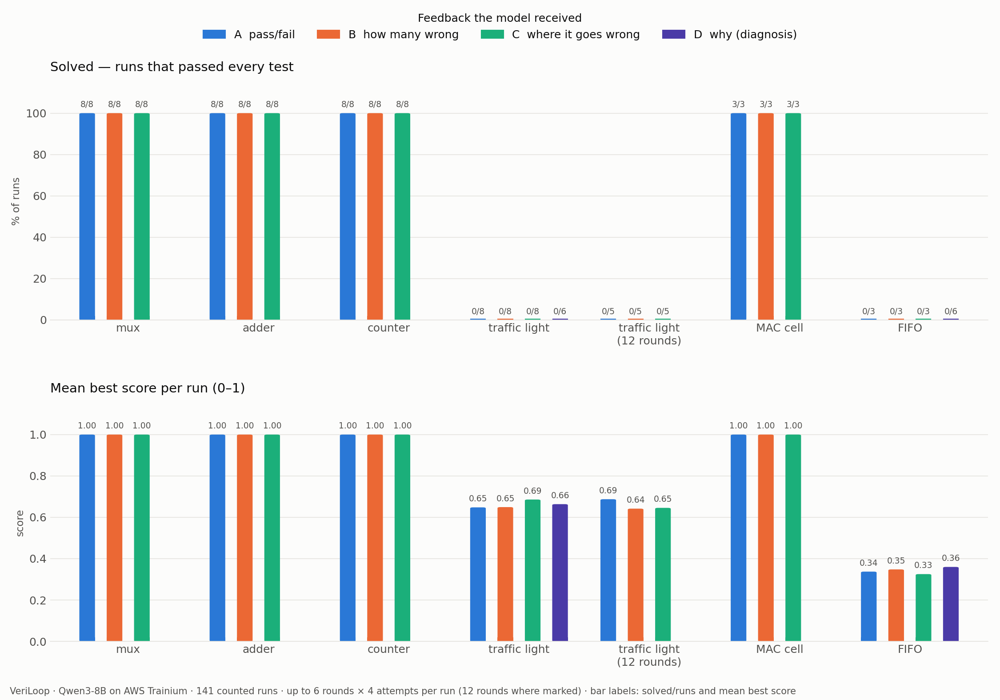

# VeriLoop — a small model on Trainium designs chip hardware, a simulator grades it

**Team Six Seven** · Hack the Chip, NYU × Annapurna Labs, 2026-10-10

Qwen3-8B, running on an AWS Trainium chip, writes digital hardware in Verilog. A simulator checks every
design against a reference on every test and sends feedback back; the model tries again. We measured
whether the **quality of that feedback** — A: only *pass/fail*, B: *how many tests fail*, C: *where it first
goes wrong*, D: *why* (the cause) — decides whether the loop succeeds. **141 counted runs.**

## What a run looks like (real output)

A level the model fixes — the MAC cell, feedback C, seat 31:
```
=== 05_mac   feedback C   6 rounds x 4 attempts   run s31-05_mac-C-r1-182546
round 0: scores [0.0, 0.0, 0.0, 0.0]  best so far 0.00  (30.1s)
  feedback sent: FAIL: the design does not compile.
                 - Port `b` is 9 bit(s) wide, but the spec says 8. Declare it as `[7:0] b`.
round 1: scores [1.0, 1.0, 1.0, 1.0]  best so far 1.00  (32.1s)
SOLVED -- verified by the checker on every test
```
A level it does not — the traffic light, feedback C, 12 rounds, seat 33:
```
round 0: scores [0.61, 0.68, 0.56, 0.61]  best so far 0.68  (100.6s)
  feedback sent: FAIL: 117 of 256 tests give a wrong output, on `light`, `walk`.
                   cycle 2: inputs reset=0 ped=0 -> light=RED (0) walk=1 (correct)
                   cycle 3: inputs reset=0 ped=0 -> `light` = RED (0), expected GREEN (1) ...  <-- first wrong cycle
...
COULD NOT VERIFY -- best design passes 0.68 of the score; not solved
```



## The result in four lines

- **Easy blocks need no feedback:** mux, adder and counter were solved on the first try in all 72 runs; the MAC
  cell was fixed on round 2 with A, B and C alike.
- **No feedback solved the hard blocks:** the traffic light and the FIFO were never solved — not with *where*
  (C), not with 12 rounds, not with *why* (D, 0/6 on each). The model can be told the right cause and still
  not make the right edit.
- **The checker is right; the model's idea is wrong:** on the traffic light 66% of failures first hold a light
  too long — the most common design runs every phase one cycle long (`results/TAXONOMY.md`).
- **The model does not know when it is wrong:** designs it rated 80–100% confident were right only half the
  time, so only the checker may declare success (`results/calibration.txt`).

Full one-page note: **[`SUBMISSION.md`](SUBMISSION.md)** · the checker: **[`CHECKER.md`](CHECKER.md)**

## What is where

| path | what |
|---|---|
| [`SUBMISSION.md`](SUBMISSION.md) | the one-page note: what we ran, on what, how many runs, the spread, findings |
| [`CHECKER.md`](CHECKER.md) | what the checker accepts and rejects, and how we proved it |
| [`veriloop/`](veriloop/) | the code: `checker.py`, `agent.py`, `run_experiment.py`, `selftest.py`, `calibrate.py`, `taxonomy.py`, `plot.py` |
| [`veriloop/levels/`](veriloop/levels/) | the six hardware levels: spec, Python reference, a correct design, 3–5 broken designs each |
| [`results/`](results/) | every run and every attempt; what is counted and what is excluded is in `results/README.md` |
| [`TASKS.md`](TASKS.md) | the task board we used: every task, its files, and who did it |
| [`SETUP.md`](SETUP.md) | get on a seat, start the model, install Icarus Verilog, run long jobs |

## Reproduce

```bash
python veriloop/selftest.py                    # proves every level: good design passes, broken ones are caught
python veriloop/tests/test_compile.py          # checker tests (also test_simulate.py, test_feedback.py)
python veriloop/run_experiment.py --tag me --levels veriloop/levels/04_traffic_fsm --runs 1
python veriloop/plot.py                        # table + graph from results/
```
Run from this folder. Running the model needs a seat with the model served — README Part 1 at the top of
this repo (`./serve.sh`) — plus Icarus Verilog in the seat: `apt-get update && apt-get install -y iverilog`.
The checker alone runs anywhere with Icarus Verilog (`brew install icarus-verilog` on a Mac).

## Team

| name | email | contribution |
|---|---|---|
| **Krish Mehta** | km6152@nyu.edu | built VeriLoop with Claude Code: the checker, agent loop, six levels, experiments on Trainium, analysis and write-up — see the task board (`TASKS.md`) |
| Dhriti Vaidya | dv2567@nyu.edu | proposed idea 1, "ShapeGuard" (in our working repo) |
| Smruthi Ramesh | sr8406@nyu.edu | proposed idea 7, a biomedical signal front-end designer (in our working repo) |
| Manish Reddy | mg9444@nyu.edu | — |
| Bhagavan Madala | bm4245@nyu.edu | — |
| Ankit Singh | avs8866@nyu.edu | — |

Registered with the organisers as team 7, **Six Seven**.

Built on this repo's kernel-agent loop design. Our working repo, with the plan and task board:
https://github.com/krishmehtagit/Six_Seven.
