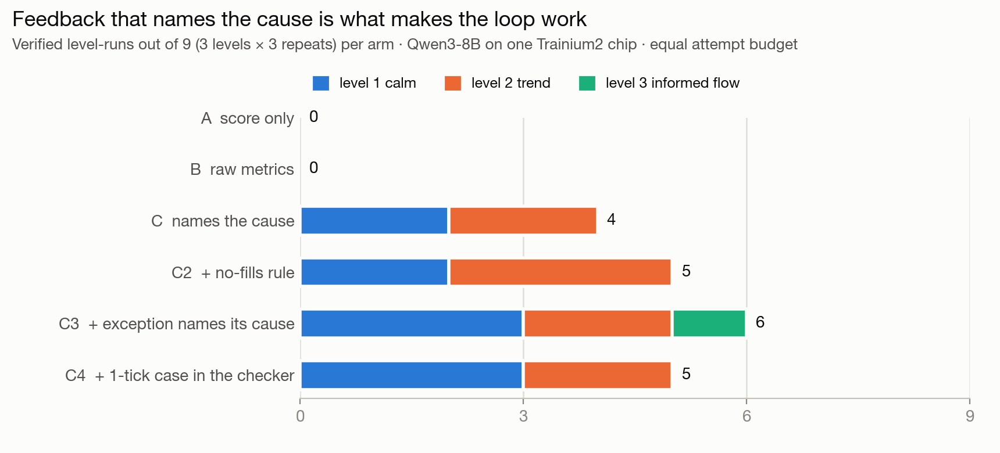
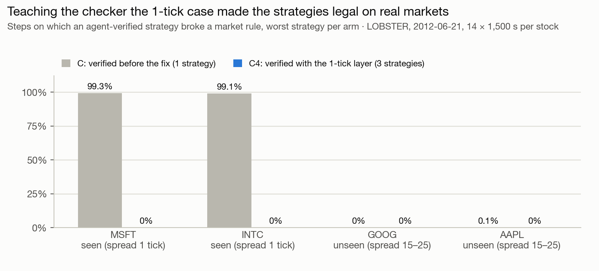
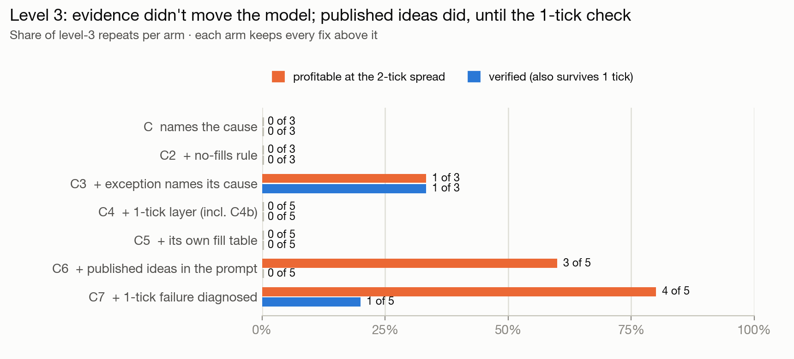
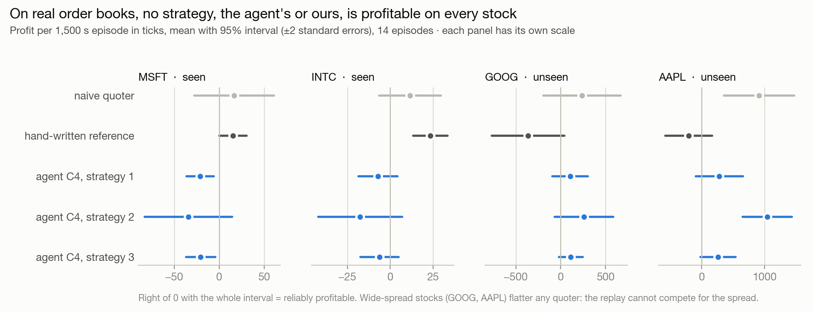
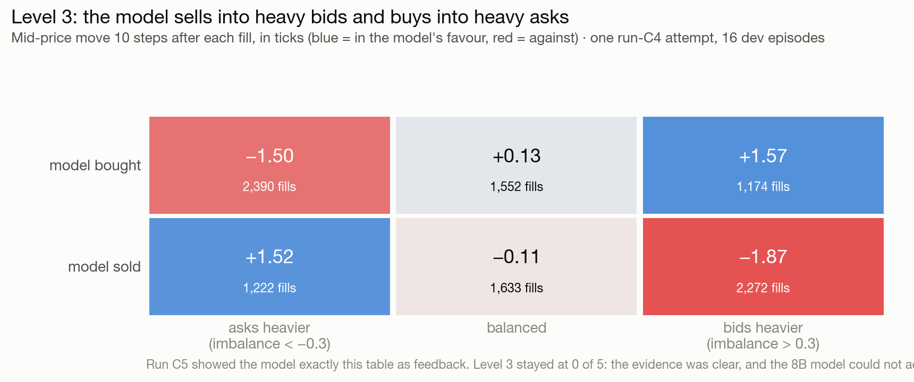

# The market-maker agent

A real transcript from run C, rep 1, on seat 94 (Qwen3-8B on one Trainium2 chip):

```
=========== level 2: trend (located feedback, rep 1) ===========
round 0 [first] s0 0.10 runs EXCEPTION | s1 0.20 rules CROSSED lcb +0  (57s)
   feedback: Rule broken: CROSSED, 24000 times; 24000 in total. First at step 0: bid 1000 >= ask
   1000. Any violation zeroes the profit score. Fix: after all adjustments, if bid >= ask then move
   one of them so bid < ask.
round 1 [repair] s0 SOLVED | s1 SOLVED  (49s)
=> level 2: VERIFIED on dev after 4 attempts; held-out PASS (lcb +74); 3703 tokens, 107s
```

The repair was the two lines the message described (`if bid >= ask: bid -= 1`). That strategy
then **failed the real market**. A one-tick nudge un-crosses quotes only when the spread is at least
two ticks, and real MSFT and INTC sit at one tick 99% of the day. That finding, and the checker
layer it led to, is most of this page.

## What this is

Qwen3-8B, served on a Trainium2 seat, writes the quoting logic of a market maker: a Python function
`quote(state)` that posts a bid and an ask every step. A deterministic, seeded order-book simulator
plays it against 16 markets. The checker grades it, and the grade plus the reason go into the next
attempt. The model never predicts prices. A price prediction gives a checker nothing to say but
"wrong", and retrying the same period against the realized outcome is reading the answer.

**The claim we measure:** at an equal attempt budget, the same model on the same chip clears more
levels when the checker *names the mechanism* behind a failure (run C) than when it returns raw
measurements (B) or only the score (A). Every later arm changes one thing and keeps the rest.

## Results

| arm | what the model is told | L1 | L2 | L3 | verified | distinct strategies | survive 1-tick + 252 hostile states | legal on all 4 real stocks |
|---|---|---|---|---|---|---|---|---|
| A | score only | 0/3 | 0/3 | 0/3 | **0 of 9** | 0 | – | – |
| B | raw metrics (JSON) | 0/3 | 0/3 | 0/3 | **0 of 9** | 0 | – | – |
| C | names the cause | 2/3 | 2/3 | 0/3 | **4 of 9** | 1 | 0/1 | 0/1 |
| C2 | + no-fills message | 2/3 | 3/3 | 0/3 | **5 of 9** | 1 | 0/1 | 0/1 |
| C3 | + exceptions name their cause | 3/3 | 2/3 | 1/3 | **6 of 9** | 2 | 0/2 | 0/2 |
| C4 | + 1-tick layer in the checker | 3/3 | 2/3 | 0/5 | **5 of 11** | 3 | 3/3 | 3/3 |
| C5 | + its own fill table | – | – | 0/5 | **0 of 5** | 0 | – | – |
| C6 | + published ideas in the prompt | 1/2 | 0/2 | 0/5 | **1 of 9** | 1 | 1/1 | 1/1 |
| C7 | + 1-tick failure diagnosed | 2/2 | 1/2 | 1/5 | **4 of 9** | 3 | 3/3 | 3/3 |

Level-3-only arms (C5–C7) ran 5 repeats; C4's level 3 includes 2 extra repeats (C4b); C6 and C7 levels 1–2 are their 2-repeat regression checks (C6r, C7r).

Budget per level: 6 rounds × 2 samples. Verified = the agent's own claim on 16 dev episodes. Every
verified strategy is re-scored on 32 held-out seeds frozen before any run
(`eval/heldout_seeds.txt`). Every "verified" claim also held there. The two right-hand columns
re-score the *distinct* verified strategies: the near-greedy on-chip sampler often repeats a
strategy exactly, so we count strategies, not just solves.







**What it shows:**
1. **Naming the cause is what makes the loop work.** A and B are 0 of 18 combined; C is 4 of 9.
2. **Fixing the message moved the number.** The two most common failures were checker problems:
   a crash our message blamed on the wrong line, and a "never trade" trap with no useful message.
   Fixing them took C from 4 to 6 (C3). See [`TAXONOMY.md`](TAXONOMY.md).
3. **Only fixing what the checker *tests* fixed the real market.** Verified strategies broke a rule
   on 99% of real MSFT/INTC steps until the checker learned the 1-tick case (C4). After that: 0
   violations on all four stocks, including two we never looked at before testing.
4. **Level 3 is where the model, not the checker, is the limit.** Showing it its own losing fills
   changed nothing (C5). Three published market-microstructure ideas in the prompt produced the
   real mechanism, profitable at 2 ticks, in 3 of 5 repeats (C6). Correcting the checker's diagnosis of the 1-tick failure (C7) turned that mechanism into the first robust, verified level-3 strategy, in 1 of 5 repeats.
5. **Nothing is profitable on every real stock, including our own hand-written reference.** That
   reference's rules are in absolute ticks, and a $580 stock moves many ticks a second.

### The level-3 strategy the agent verified (C7, rep 1)

The round before the solve, the 1-tick layer said: *"You traded only 0.0 times per episode … At a 1-tick spread there is no room inside: a bid fills only at exactly best_bid … Quote at best_bid/best_ask."* The next attempt kept the micro-price from C6 and moved its quotes to micro-price ± ½ tick, clamped within one tick of the touch. It passed every layer: dev lcb +313, held-out lcb +347, the 1-tick held-out set, and all 252 hostile states. Its quotes follow the book (imbalance correlation +0.93). Only 132 of its 425 fills per episode were against the book, at −0.02 ticks each, against +1.24 for the rest. On the real days it is legal everywhere (0 violations) but not profitable: MSFT −12 ± 29, INTC +16 ± 20, and heavy losses on wide-spread GOOG and AAPL. The pre-registered target was 2 of 5; it got 1 of 5.

## For judges: test it on your own held-back cases

```bash
python checker.py STRATEGY.py --level 3 --seeds 9001,9002,9003,9004   # any seeds you choose
python checker.py STRATEGY.py --probe     # 252 hostile states: inventory ±9/±10, 1-entry history,
                                          # spreads 1-15 ticks, one-sided books
python checker.py --selftest              # 11 planted bad strategies, plus the calibration table
python audit.py                           # re-grade every logged result on your machine
```

Every strategy the agent wrote is in `runs/*.jsonl` (the `code` field; final choices are rows with
`"final": true`). The naive quoter and the reference pass all 252 hostile states. Every strategy
verified before C4 fails 63 of them, which is the 1-tick fragility the real replay exposed, caught
in under a second with no market data.

**Does the agent know when it failed?** Over 79 claims, its confidence (the probability
the strategy is verified, from the dev mean and standard error) has a Brier score of 0.029.
All 25 claims at ≥ 97.5% confidence held on unseen seeds (25 of 25). Of the
54 claims below that, 0 held.

**Device vs simulator.** All 798 generations ran on the Trainium2 chip (Qwen3-8B,
vLLM-Neuron, TP 2, context 8192, thinking off): 14.5 attempt-hours, median 5.6
tokens/s per request and 61 s per attempt, varying with how many runs shared the chip. All
grading ran on the CPU simulator, at 0.2–0.7 s per 16–32 episodes. Full table: `runs/summary.md`.

**Reproducibility.** Every market is generated from `(level, seed)`, and the grades are
deterministic. `audit.py` re-grades every verified strategy and matches the seat's logged profit
bounds to the decimal, laptop against pod.

## How it works

### The levels, and proof each one is fair

Each level hides one mechanism, and the model sees the same task text on every level. Before any
model ran, `calibrate.py` checked that a naive quoter (`baseline.py`: both sides at the touch)
passes level 1 and fails levels 2–3, and that a hand-written `reference.py` passes all three. Both
were checked on dev and held-out seeds.

| level | market | naive quoter, held-out lcb | reference, held-out lcb |
|---|---|---|---|
| 1 calm | uninformed two-sided flow | +514 pass | +357 pass |
| 2 trend | the price drifts and the flow leans with it | −156 fail | +429 pass |
| 3 informed | a hidden pressure moves the price and shows in the top-of-book sizes | −309 fail | +258 pass |
| 4 volatile | storms with jumps and toxic flow | **excluded**: no setting separated the two fairly | |

Profit is in ticks per 1,500-step episode. "lcb" is the mean minus two standard errors over the
episodes, and it is the pass bar.

### The checker: cheapest layer first, and the first failure is the feedback

| layer | checks | score |
|---|---|---|
| L0 static | parses; defines `quote(state)`; imports only `math`/`numpy`; no I/O, randomness or numpy file access | 0.1 |
| L1 runs | a child process plays every dev episode, with a timeout; exceptions come back with line, step and state | 0.1 |
| L2 rules | every quote, every step: whole ticks, bid < ask, never takes liquidity, sizes 0–5, can't breach ±10 inventory. **One violation zeroes everything above** | 0.2 |
| L3 obligation | both sides within 2 ticks of the market on ≥ 50% of steps (so "never quote" can't pass) | 0.2 |
| L4 profit | mean − 2·SE of profit over 16 episodes > 0 (a lucky run can't pass) | 0.4 |
| L5 robust (C4+) | the same seeds at a 1-tick spread pass L1–L4 again | required to verify |

**Three kinds of feedback, same measurements.** `none` gives the score. `raw` gives every metric
as JSON, the tool output. `located` names the mechanism and a direction, never a coefficient: the
heat-rod project found that revealing target numbers made the model copy them. Look-ahead is
impossible by construction, because the state at step t holds only data up to t.

### The agent

Each round sends 2 prompts in parallel with different framing lines, because identical prompts
return identical text on the seats. A repair prompt carries the spec, the latest code and one
checker message, and older rounds survive only as a one-line ledger. After two rounds without
improvement it restarts from the spec. Then it states a claim (`VERIFIED on dev` or
`NOT VERIFIED`) with a confidence, and the chosen strategy is scored once on the held-out seeds so
the claim itself can be graded.

## Experiment log: one change per row, hypotheses written before the runs

| run | flags (cumulative) | the one change | why, from the previous logs |
|---|---|---|---|
| A, B, C | `--feedback none / raw / located` | the comparison, frozen at commit `b73b918` | the claim |
| C2 | `MM_NO_FILLS_RULE=1` | a message for strategies that never trade | 29–42% of failures sat at exactly 0 profit with a generic message |
| C3 | `+ MM_EXC_RULE=1` | exceptions name their cause | 39–44% of failures were one crash (`a, b = state`), and we blamed the wrong line |
| C4 | `+ MM_ROBUST=1` | layer L5: the dev seeds again at a 1-tick spread | the real replay: verified strategies broke rules on 99% of steps |
| C5 | `+ MM_TABLE=1` | the model sees its own fills as a table | it answered "adverse selection" by leaning the wrong way, or by not trading |
| C6 | `+ MM_HINT=1` | three published ideas in the prompt, cited, no code | C5: the evidence alone did not move it |
| C7 | `+ MM_ROBUST_DIAG=1` | L5 diagnoses its own failure | C6 failed at 1 tick with 0 fills, and the message said "clamp your quotes" |

**Pre-registered hypotheses and results.**
- **C5 (15:30): ≥ 2 of 5 on level 3. Result: 0 of 5, rejected.** The model re-sent the same
  strategy or stopped trading, and 5 repeats were 2 distinct trajectories.
- **C6 (16:19): ≥ 2 of 5. Result: 0 of 5 verified, rejected.** But 3 of 5 built the mechanism:
  imbalance plus micro-price, zero fills against the book, dev lcb +267. They broke even at 1 tick.
- **C7 (17:09): ≥ 2 of 5.** **Result: 1 of 5 verified, so rejected as written.** But it is the first robust level-3 solve: held-out lcb +347, the 1-tick held-out set and all 252 hostile states passed. 4 of 5 repeats were profitable at 2 ticks. C7r: levels 1–2 verified 3 of 4.

C2–C4 were designed after reading the dev logs of the earlier arms, and we say so. Their
improvements are measured, not pre-registered. C5–C7 ran on this folder's code with the flags
shown. The `*r` runs (C6r, C7r) repeat levels 1–2 with the same flags, to check that nothing broke.

## Real data: a sanity check, not part of the claim

`lobster.py` replays LOBSTER's free sample days (Nasdaq, 2012-06-21, 09:45–15:45, 14 episodes of
1,500 s) through the same simulator. MSFT and INTC (1-tick spreads) motivated C4. GOOG and AAPL
(15–25-tick spreads) were opened only after C4 finished, as the out-of-sample check.
- **Legality transferred:** every C4-verified strategy had 0 violations on all four stocks.
- **Profit did not:** one agent strategy is significantly profitable on unseen AAPL (+1,042 ± 196
  per episode), but the naive quoter also profits there, within noise. Nothing the agent wrote is
  profitable on all four.
- **The reference** is reliably profitable only on INTC (+23 ± 5), and loses on both unseen stocks.
- **C6's level-3 strategy** is legal everywhere but loses heavily on GOOG/AAPL. "Micro-price ± 1
  tick" sits deep inside a 25-tick spread, the same absolute-tick overfitting our reference showed.

## Files

| file | what |
|---|---|
| `checker.py` | the checker: layers L0–L5, the three feedback modes, `--selftest`, `--seeds`, `--probe` |
| `mmsim.py` | seeded market generator, the rules, episode simulation, metrics |
| `robust_worker.py`, `probe_worker.py` | child processes for the 1-tick layer and the hostile-state probes |
| `agent.py` | the loop: prompts, framings, repair, restart, claim with confidence, held-out check |
| `baseline.py`, `reference.py`, `calibrate.py` | the naive quoter, the hand-written reference, and the fairness check |
| `report.py`, `audit.py`, `hostile.py`, `lobster.py`, `charts.py` | tables, re-grading, hostile re-scoring, real-data replay, figures |
| `run_all.sh` | runs A, B and C side by side on one seat |
| `runs/` | every attempt (`*.jsonl`), console logs, and the generated tables |
| `eval/heldout_seeds.txt` | the 32 held-out seeds, frozen before any model run |
| `NOTE.md`, `TAXONOMY.md` | the one-page note and the failure taxonomy |

```bash
python checker.py --selftest && python agent.py --offline --levels 2        # no model needed
REPS=3 ROUNDS=6 ./run_all.sh                                                # runs A, B, C on a seat
python report.py --deep && python report.py --taxonomy && python charts.py  # tables and figures
python lobster.py --build --tickers MSFT INTC GOOG AAPL                     # needs the samples*
```

\* LOBSTER level-5 sample files from `php.lobsterdata.com/info/sample/`, unzipped into
`<repo>/../data/lobster/<TICKER>/` (or set `LOBSTER_DIR`). The derived arrays are not committed.

## Limits

* **The market is synthetic.** That is what lets the checker know the true mechanism. Its queue
  model is simple: improve the price and you're first; join it and you get half the fills. There is
  no latency or market impact, and the real-data replay can't react to our quotes either.
* Profit is in ticks, with no fees. Level 4 is excluded. The sample is small: 3–5 repeats per level,
  often reproducing identical code.
* Only one model (Qwen3-8B). A gpt-oss-20b comparison was not run.
