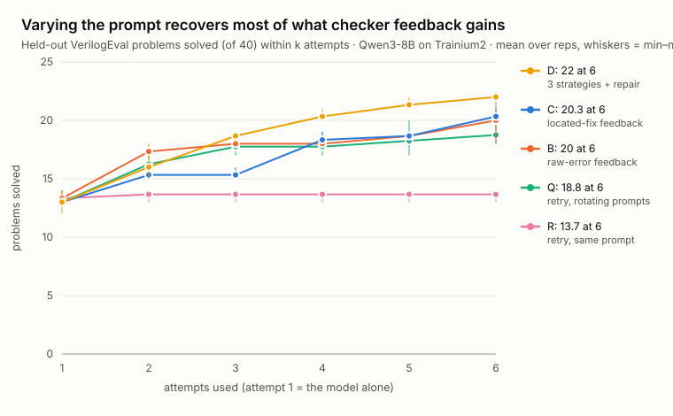

# Verified RTL agent (team 19)

**An 8B model on one Trainium chip writes Verilog. A deterministic checker grades every attempt, a
translator turns the failure into one named fix, and the loop solves problems the model can't solve in
one shot. We measured what actually helps.**

**Result (40 held-out VerilogEval problems, solved per rep).** The model alone: <!--g:A-->14, 13, 14<!--/g-->. Six
retries of the same prompt: <!--g:R-->14, 13, 14<!--/g-->. Six attempts with checker feedback: <!--g:B-->20, 18, 22<!--/g--> (raw
errors) and <!--g:C-->20, 20, 21<!--/g--> (located fixes). Six fresh attempts that only rotate the prompt, with no
feedback at all: <!--g:Q-->19, 20, 18, 18<!--/g-->. Three strategies, then a repair round: <!--g:D-->22, 22, 22<!--/g-->.

- **The loop works: checker-driven attempts lift the 8B model from about a third to about half of the
  held-out problems, and the passes are real.** <!--g:equiv-->235 of 245<!--/g--> combinational passes are proven
  equivalent by Yosys.
- **But most of the gain comes from varying the prompt, not from what the feedback says.** Retrying the
  same prompt adds nothing, because these seats return near-identical code for an identical prompt.
  Rotating three prompts with no feedback gets most of the way: feedback is ahead by about 1–2 problems
  of 40 on average, and in no rep is that difference significant (problem by problem, below). Located vs
  raw wording makes no difference either: our pre-registered primary claim, C beats B, did not hold.
- **Feedback helps most on top of variety.** D, three different starts and then one feedback repair
  round, ties or beats every other run in every rep, and beats rotation alone in every rep (3–0, 3–1, 4–0).
  It is the clearest sign that feedback adds something once the starts are varied, but no single rep is
  significant.
- **Feedback is still cheaper.** Located feedback uses <!--g:cost_c_vs_q-->22%<!--/g--> fewer generated
  tokens per solved problem than rotating prompts.
- **The checker's real job is verification.** It picks the one passing attempt out of six, proves it for
  combinational designs, and tells the loop when to stop.

Every number below cites a run file in `runs/`, and every held-out run records code version `0aaab14`.
Dev numbers are labelled dev.

## What the loop prints

Real output from the held-out runs, one problem solved two ways. `C-1.log`, located feedback, seat-93:

```
Prob110_fsm2                       C  r1  seat-93   L0 0.10  '`out` is assigned inside an always block, so declare it as `output reg'
Prob110_fsm2                       C  r2  seat-93   L0 0.10  '`out` is assigned inside an always block, so declare it as `output reg'
Prob110_fsm2                       C  r3  seat-93   L0 0.10  '`out` is declared twice. Keep one declaration, `output reg out` in the'
Prob110_fsm2                       C  r4  seat-93   L2 1.00  PASS
```

`Q-1.log`, no feedback, the prompt rotates (S1, S2, S4), seat-91:

```
Prob110_fsm2                       Q  r1  seat-91   L0 0.10  ''
Prob110_fsm2                       Q  r2  seat-91   L0 0.10  ''
Prob110_fsm2                       Q  r3  seat-91   L2 1.00  PASS
```

The feedback named the right fix and the model needed three more tries to apply it. A differently
worded prompt, with no feedback, got there one attempt sooner. That is the whole result in one problem.

Real output, dev run C-3 (`runs/dev/C-3.log`, these 7 lines in order with other problems' lines removed), Qwen3-8B on seat-90, one Trainium2 chip:

```
Prob001_zero                       C  r1  seat-90   L0 0.10  'This always block has no trigger. Use `always @(*)` (or `always_comb`)'
Prob001_zero                       C  r2  seat-90   L2 1.00  PASS
Prob073_dff16e                     C  r1  seat-90   L0 0.10  '`byteena` is declared as a single bit, but the code selects bits of it'
Prob073_dff16e                     C  r2  seat-90   L2 0.56  'When `resetn` is high, the outputs do not take their reset values. Tes'
Prob073_dff16e                     C  r3  seat-90   L2 0.56  'When `resetn` is high, the outputs do not take their reset values. Tes'
Prob073_dff16e                     C  r4  seat-90   L0 0.10  '`byteena` is declared as a single bit, but the code selects bits of it'
Prob073_dff16e                     C  r5  seat-90   L2 1.00  PASS
```

How to read it: `L0` means the design didn't compile, `L2` that it simulated, and the number is the
score (1.00 only when the testbench reports zero mismatches). The quoted text is the instruction that
went into the next attempt. Both problems failed on the first try and were fixed by the loop.

This transcript also shows a bug we found by reading it. `resetn` is active low, so "when `resetn` is
high" pointed the model the wrong way. The translator now says "low" for active-low resets (DESIGN
1.6.0).

## The loop

```
VerilogEval spec ──► Qwen3-8B on Trainium ──► checker (L0-L3) ──► translator ──► repair prompt ─┐
                       ▲                                                                       │
                       └───────────────────────── up to 6 attempts ◄───────────────────────────┘
```

| Part | File | What it does |
|---|---|---|
| Problems | `problems.py` | VerilogEval spec-to-RTL (NVIDIA), 156 problems; our fixed split is 20 dev, 40 held-out |
| Model client | `workers.py` | Thinking off, never sends `seed` (it crashes the engine), at most 4 requests per seat |
| Checker | `checker.py` | Grades every attempt; no model involved |
| Translator | `translator.py` | Turns the checker's result into one instruction, at most 400 characters |
| Orchestrator | `agent.py` | Runs the attempts, repairs the latest one, stops on pass, budget or cycling |

## The checker (what it accepts and why)

Four layers, cheapest first. Each stops at the first failure.

| Layer | Tool | Fails when |
|---|---|---|
| L0 static | Python | No Verilog, no `module TopModule`, or a port from the spec is missing |
| L1 compile | Icarus Verilog 12 | The candidate doesn't compile with VerilogEval's testbench and reference |
| L2 simulate | `vvp` + VerilogEval testbench | Any output sample differs from the reference |
| L3 formal | Yosys equivalence miter (combinational only) | A concrete input exists where the design is wrong: a counterexample |

- **Pass means the testbench saw zero mismatches.** That is the benchmark's own criterion, so our
  numbers are comparable with published VerilogEval results.
- **The proof catches what the testbench misses.** `audit.py` re-checks every combinational pass with
  Yosys. A pass the proof rejects is a testbench escape, and we report the count.
- **The checker is tested before it grades anything.** `python checker.py --selftest` plants six bugs,
  including a wrong K-map minterm, a missing reset and an off-by-one counter, and all six must be caught.
  Every dev and held-out reference scores 1.0 through it.

## The translator: turning an error into a fix

The event repo's lesson is that a verdict doesn't move a model, but an instruction does. Each rule matches
one Icarus error the model kept making on **dev** problems and names the change:

| Rule | The model's mistake | Instruction (shortened) | First seen (dev) |
|---|---|---|---|
| R1 | Assigns a signal in `always` but declares it a wire | Declare it `output reg`; change the port list, don't add a line | Prob054, Prob109 |
| R2 | `always` block with no trigger | Use `always @(*)` or `assign` | Prob001 |
| R3 | `break`, unsupported by Icarus | Use a flag variable | Prob071 |
| R4 | Enum assignment without a cast | Add the cast, or use `logic [N:0]` | Prob142 |
| R5 | Variable part-select `in[i+3:i]` | Use `vector[start +: W]` | Prob021 |
| R6 | Selects bits of a 1-bit signal | Declare its full width from the spec | Prob073 |
| R7 | A declaration Icarus rejects inside a block | Declare it at module level | Prob071 |
| R8 | A signal declared twice | Keep one declaration, in the port list | Prob109 |

Simulation failures get a located message instead: the first wrong clock cycle and its inputs for
sequential designs, the Yosys counterexample for combinational ones, "X means it has no value" when
the output is undriven, and the reset's real polarity for reset hints.

**What a message never contains:** the reference code, the testbench code, or the expected value of a
multi-bit output. For 1-bit outputs "is wrong" implies the expected value; we accept that and say so.

## The loop's own fixes, each from a dev measurement

| Problem seen on dev | Fix | Evidence |
|---|---|---|
| 30 of 42 repairs returned the broken code byte for byte, and 0 problems were rescued (`C-1`) | The repair prompt asks for a rewrite (D-013). After a copy, the next attempt starts fresh from the spec with the feedback as a hint (D-014) | `C-1` → `C-2`: copies 71% → 35%, solved 3 → 5, rescued 0 → 2 |
| Fixes didn't stick: `Prob050_kmap1` went 0.82, 0.88, 0.93, 0.87, 0.82, 0.88 | The repair prompt lists up to 4 earlier findings, a ledger (D-016) | Ships in the held-out code `0aaab14`. Its dev check `C-4` was stopped at 14:50 to free the seat, so it is not measured on its own |

## Experiments

| Run | Attempts | Feedback | What it isolates |
|---|---|---|---|
| A | 1 | none | The model alone |
| R | up to 6, fresh each time | none | More attempts without feedback |
| Q | up to 6, fresh, rotating S1, S2, S4 | none | Varied prompts without feedback. Control added after rep 1 (`controls/prompt_rotation.py`), because R's identical retries can't separate information from "any new prompt" |
| B | up to 6 | raw tool text | Feedback, untranslated |
| C | up to 6 | one translated instruction | The pre-registered primary claim: C beats B |
| D | 6, split over 3 seats in parallel | translated | Breadth vs depth at the same budget |
| E | up to 6 | translated, gpt-oss-20b | A bigger model in the same loop |

B, C, D and E get the same copy guard and ledger, so B vs C tests the feedback and nothing else.
Compare only runs made with the same code version; every attempt records it (D-015).

## Results

### Held-out, 40 problems (21 combinational, 19 sequential)

<!-- gen:results-table -->
| Run | Rep | Solved / 40 | comb | seq | Median attempts to pass | Copied repairs | Escapes (formal) | Code |
|---|---|---|---|---|---|---|---|---|
| A, model alone | 1 | 14 | 11/21 | 3/19 | 1 | – | 0 | `0aaab14` |
| A, model alone | 2 | 13 | 10/21 | 3/19 | 1 | – | 0 | `0aaab14` |
| A, model alone | 3 | 14 | 11/21 | 3/19 | 1 | – | 0 | `0aaab14` |
| R, retries (same prompt) | 1 | 14 | 11/21 | 3/19 | 1 | – | 0 | `0aaab14` |
| R, retries (same prompt) | 2 | 13 | 10/21 | 3/19 | 1 | – | 0 | `0aaab14` |
| R, retries (same prompt) | 3 | 14 | 11/21 | 3/19 | 1 | – | 0 | `0aaab14` |
| Q, retries (rotating prompts) | 1 | 19 | 14/21 | 5/19 | 1 | – | 1 | `0aaab14` |
| Q, retries (rotating prompts) | 2 | 20 | 15/21 | 5/19 | 1 | – | 1 | `0aaab14` |
| Q, retries (rotating prompts) | 3 | 18 | 14/21 | 4/19 | 1 | – | 1 | `0aaab14` |
| Q, retries (rotating prompts) | 4 | 18 | 14/21 | 4/19 | 1 | – | 1 | `0aaab14` |
| B, raw-error feedback | 1 | 20 | 12/21 | 8/19 | 1 | 26 of 85 | 1 | `0aaab14` |
| B, raw-error feedback | 2 | 18 | 12/21 | 6/19 | 1 | 31 of 80 | 1 | `0aaab14` |
| B, raw-error feedback | 3 (seats swapped) | 22 | 14/21 | 8/19 | 1 | 30 of 79 | 1 | `0aaab14` |
| C, located-fix feedback | 1 | 20 | 14/21 | 6/19 | 1 | 24 of 82 | 0 | `0aaab14` |
| C, located-fix feedback | 2 | 20 | 14/21 | 6/19 | 1 | 22 of 87 | 0 | `0aaab14` |
| C, located-fix feedback | 3 (seats swapped) | 21 | 13/21 | 8/19 | 1 | 18 of 80 | 0 | `0aaab14` |
| D, 3 strategies + repair | 1 | 22 | 15/21 | 7/19 | 1 | 3 of 63 | 1 | `0aaab14` |
| D, 3 strategies + repair | 2 | 22 | 15/21 | 7/19 | 1 | 3 of 66 | 1 | `0aaab14` |
| D, 3 strategies + repair | 3 | 22 | 15/21 | 7/19 | 1 | 3 of 63 | 1 | `0aaab14` |
<!-- /gen:results-table -->

The full per-run table (tokens, seconds, truncation, stop reasons) is `runs/summary.md`, written by
`report.py` from these files.

**How a pass is checked.** A pass means the VerilogEval testbench saw zero mismatches (simulation).
<!-- gen:audit -->
Across 19 audited runs, 235 of 245 combinational passes are proven equivalent to the reference by Yosys. The rest: `Prob079_fsm3onehot` in 10 runs, where the only counterexample is a state the spec rules out (non-one-hot in a one-hot FSM), so it is outside the spec rather than a wrong design. 99 sequential passes are checked by simulation only.
<!-- /gen:audit -->

### Problem by problem

The comparisons and the test were fixed before rep 2 was read ([`NOTE.md`](NOTE.md), analysis plan,
15:50 EDT). Q was added after viewing rep 1, and that is disclosed there.

<!-- gen:paired -->
| Comparison | Rep 1 | Rep 2 | Rep 3 | Rep 4 |
|---|---|---|---|---|
| **C vs B**: translated vs raw (primary) | 3–3, p = 1.000 | 4–2, p = 0.688 | 3–4, p = 1.000 |  |
| **C vs R**: feedback vs same-prompt retries | 7–1, p = 0.070 | 7–0, p = 0.016 | 8–1, p = 0.039 |  |
| **B vs R**: raw feedback vs same-prompt retries | 7–1, p = 0.070 | 5–0, p = 0.062 | 8–0, p = 0.008 |  |
| **Q vs R**: rotating vs same-prompt retries | 5–0, p = 0.062 | 7–0, p = 0.016 | 4–0, p = 0.125 |  |
| **C vs Q**: feedback vs rotating prompts (added control) | 3–2, p = 1.000 | 3–3, p = 1.000 | 5–2, p = 0.453 |  |
| **B vs Q**: raw feedback vs rotating prompts | 3–2, p = 1.000 | 2–4, p = 0.688 | 5–1, p = 0.219 |  |
| **D vs C**: breadth vs depth | 4–2, p = 0.688 | 3–1, p = 0.625 | 3–2, p = 1.000 |  |
| **D vs Q**: breadth + repair vs rotating prompts | 3–0, p = 0.250 | 3–1, p = 0.625 | 4–0, p = 0.125 |  |

Each cell: problems solved only by the first run – only by the second, then the two-sided exact sign test on those problems. Same 40 problems, same rep number.
<!-- /gen:paired -->

### Solved vs attempts used



Mean over reps, with the min–max range in brackets when the reps differ. Attempt 1 is the model alone,
the same prompt for every run.

<!-- gen:curve -->
| Run | Reps | ≤1 attempt | ≤2 attempts | ≤3 attempts | ≤4 attempts | ≤5 attempts | ≤6 attempts |
|---|---|---|---|---|---|---|---|
| A: model alone | 3 | 13.7 (13–14) |  |  |  |  |  |
| R: retry, same prompt | 3 | 13.3 (13–14) | 13.7 (13–14) | 13.7 (13–14) | 13.7 (13–14) | 13.7 (13–14) | 13.7 (13–14) |
| Q: retry, rotating prompts | 4 | 13 | 16.2 (16–17) | 17.8 (17–19) | 17.8 (17–19) | 18.2 (17–20) | 18.8 (18–20) |
| B: raw-error feedback | 3 | 13.3 (13–14) | 17.3 (17–18) | 18 | 18 | 18.7 (18–19) | 20.0 (18–22) |
| C: located-fix feedback | 3 | 13 | 15.3 (15–16) | 15.3 (15–16) | 18.3 (18–19) | 18.7 (18–19) | 20.3 (20–21) |
| D: 3 strategies + repair | 3 | 13.0 (12–14) | 16.0 (15–17) | 18.7 (18–19) | 20.3 (20–21) | 21.3 (21–22) | 22 |
<!-- /gen:curve -->

### Cost per solved problem

<!-- gen:cost -->
| Run | Reps | Solved, each rep | Completion tokens per solve | Prompt tokens per solve | Wall seconds per solve |
|---|---|---|---|---|---|
| A: model alone | 3 | 14, 13, 14 | 728 | 762 | 34 |
| R: retry, same prompt | 3 | 14, 13, 14 | 3,648 | 3,698 | 169 |
| Q: retry, rotating prompts | 4 | 19, 20, 18, 18 | 3,064 | 2,537 | 141 |
| B: raw-error feedback | 3 | 20, 18, 22 | 2,643 | 5,230 | 121 |
| C: located-fix feedback | 3 | 20, 20, 21 | 2,382 | 4,288 | 111 |
| D: 3 strategies + repair | 3 | 22, 22, 22 | 2,534 | 3,717 | 119 |
<!-- /gen:cost -->

### What it can solve at all

<!--g:union-->28<!--/g--> of the 40 held-out problems were solved by at least one run. That is a ceiling
across every run and rep, not a fair comparison. The ones no run solved, and how their last attempts
failed, are in [`TAXONOMY.md`](TAXONOMY.md).

### Dev, 20 problems (tuning; not results)

| Run file | Code | Solved / 20 | Rescued by the loop | What changed |
|---|---|---|---|---|
| `runs/dev/C-1.jsonl` | `3722668` | 3 | 0 | Original repair prompt |
| `runs/dev/C-s3rewrite-full-1.jsonl` | `1d47f65` | 4 | 1 | Rewrite wording |
| `runs/dev/C-2.jsonl` | `d6cc379` | 5 | 2 | + copy guard |
| `runs/dev/C-3.jsonl` | `79b4221` | 6 | 3 | + translator rules R5, R6, R1 fix |
| `C-4` (not kept) | `2b22cf6` | stopped | stopped | + ledger, R7, R8, X and reset messages; stopped at 14:50 to free seat-90 |

## Observations

**From the experiments**
- **Same-prompt retries are wasted on these seats.** Most of R's retries returned byte-identical code, so
  "6 attempts" was mostly the same attempt six times. Rotating the prompt broke that: Q's retries almost
  never repeated.
- **Prompt variety, not a hidden hint.** Most of Q's later passes came from S2, "write the truth table or
  state table first", not from S4, whose wording ("declare every output with its type") pre-empts the most
  common bug.
- **One error dominates.** "is not a valid l-value", a wire assigned inside an `always` block, is the most
  common failed attempt in every run type ([`TAXONOMY.md`](TAXONOMY.md)). `Prob058_alwaysblock2` hit it in
  every run, even when the feedback named the exact fix.
- **Breadth with a repair round is the best configuration we ran** (D: 22 in every rep, tied by B in rep 3).
  It beats rotating prompts alone in every rep, by 3–4 problems, which is not significant in any single rep.
- **Translation doesn't help when the knowledge is missing.** On the organisers' NKI kernel ladder, raw,
  translated and translated-plus-API-docs feedback solved 0 of 36 level-runs
  (`kernel-transfer/README.md`).

**About the seats** (Qwen3-8B, vLLM-Neuron, one Trainium2 chip per seat, 2026-10-10)
- **Identical prompts in parallel return identical answers.** The kernel agent's 4 parallel samples per
  round were byte-identical in every round on seat 93, so `--samples 4` is one sample. Sequential calls do
  vary, but only a little: with an identical first prompt, every held-out run got 12–14 first-attempt
  passes, mostly the same problems.
- **`seed` kills the engine.** A request carrying `seed` crashed vLLM on the seat (`EngineDeadError`, then
  HTTP 500 for everyone on that seat). `workers.py` refuses to send one.
- **Generation is slow under load.** About 5.5 tokens/s per request with 4 in flight; a 40-problem,
  6-attempt run took about 40 minutes per seat.
- **The organisers' kernel-agent baseline did worse today than in their README.** With `--samples 1`
  (forced by the identical-samples behaviour), 0 of 3 runs solved any level, including level 2, which their
  README reports at 4 of 5 with 4 samples.

## Reproduce

```bash
cd /workspace/projects/19-verified-rtl-agent && ./setup.sh     # tools, VerilogEval @ c498220, every self-test
cd /workspace && ./serve.sh                                      # Qwen3-8B on the chip
cd /workspace/projects/19-verified-rtl-agent
python agent.py --run C --rep 1 --problems eval/heldout.txt      # one run; A, R, B, D and E the same way
python controls/prompt_rotation.py --run Q --rep 1 --problems eval/heldout.txt   # the Q control
python audit.py runs/*-[0-9].jsonl && python report.py           # formal audit, runs/summary.md, chart
python taxonomy.py runs/R-1.jsonl runs/C-1.jsonl                # failure modes, attempt by attempt
```

## Prior art

- **VerilogEval** (NVIDIA): the benchmark and its testbenches. https://github.com/NVlabs/verilog-eval
- **AutoChip** (NYU): an LLM repair loop on compiler and simulator feedback. https://arxiv.org/abs/2311.04887
- **RTLFixer** (NVIDIA, DAC 2024): fixing Verilog syntax errors with retrieval-augmented prompting.

What we add: a small model on one Trainium chip, a formal check behind the testbench, rules taken only
from dev failures, and the R, B and Q controls. Q is the one that matters: it shows that, on this setup,
varying the prompt recovers most of what checker feedback gains.

## Limits

- Pass/fail is the VerilogEval testbench. The formal audit covers combinational passes only;
  sequential designs are checked by simulation alone.
- One model, one benchmark, 2 to 4 reps per run on 40 problems. The seats' partial determinism makes reps
  less independent than usual, and statistical power is set by the 40 problems.
- Q was added after viewing rep 1, to close a weakness in R. Its comparisons are labelled that way.
- The budget is 6 attempts. Larger budgets might separate feedback from prompt variety; we didn't run them.
- VerilogEval is public, so Qwen3-8B may have seen these problems. That affects every run equally.
- The translator's rules came from 20 dev problems. Held-out problems can fail in ways no rule covers.
