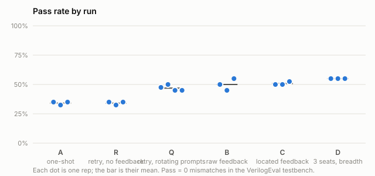

# Results: `runs`

Generated 2026-10-10 21:57 UTC by `report.py` from the run files named in each row. Pass = the VerilogEval testbench reports 0 mismatches (simulator). Escapes = combinational passes that yosys proves NOT equivalent (formal).

| Run | Rep | Solved | Pass rate | comb | seq | Median attempts to pass | Tokens / solve | Seconds / solve | Truncated | Unverified | Escapes | Copied repairs | Code | Run file |
|---|---|---|---|---|---|---|---|---|---|---|---|---|---|---|
| A | 1 | 14/40 | 35% | 11/21 | 3/19 | 1 | 708 | 33 | 0% of 40 | 0 | 0 | 0 of 0 | 0aaab14 | `A-1.jsonl` |
| A | 2 | 13/40 | 32% | 10/21 | 3/19 | 1 | 809 | 37 | 2% of 40 | 0 | 0 | 0 of 0 | 0aaab14 | `A-2.jsonl` |
| A | 3 | 14/40 | 35% | 11/21 | 3/19 | 1 | 668 | 30 | 0% of 40 | 0 | 0 | 0 of 0 | 0aaab14 | `A-3.jsonl` |
| R | 1 | 14/40 | 35% | 11/21 | 3/19 | 1 | 3528 | 164 | 0% of 171 | 0 | 0 | 0 of 0 | 0aaab14 | `R-1.jsonl` |
| R | 2 | 13/40 | 32% | 10/21 | 3/19 | 1 | 3979 | 184 | 1% of 175 | 0 | 0 | 0 of 0 | 0aaab14 | `R-2.jsonl` |
| R | 3 | 14/40 | 35% | 11/21 | 3/19 | 1 | 3437 | 159 | 0% of 170 | 0 | 0 | 0 of 0 | 0aaab14 | `R-3.jsonl` |
| Q | 1 | 19/40 | 48% | 14/21 | 5/19 | 1 | 3063 | 140 | 2% of 159 | 0 | 1 | 0 of 0 | 0aaab14 | `Q-1.jsonl` |
| Q | 2 | 20/40 | 50% | 15/21 | 5/19 | 1 | 2767 | 125 | 1% of 152 | 0 | 1 | 0 of 0 | 0aaab14 | `Q-2.jsonl` |
| Q | 3 | 18/40 | 45% | 14/21 | 4/19 | 1 | 3076 | 143 | 1% of 157 | 0 | 1 | 0 of 0 | 0aaab14 | `Q-3.jsonl` |
| Q | 4 | 18/40 | 45% | 14/21 | 4/19 | 1 | 3351 | 153 | 2% of 160 | 0 | 1 | 0 of 0 | 0aaab14 | `Q-4.jsonl` |
| B | 1 | 20/40 | 50% | 12/21 | 8/19 | 1 | 2677 | 124 | 2% of 149 | 0 | 1 | 26 of 85 | 0aaab14 | `B-1.jsonl` |
| B | 2 | 18/40 | 45% | 12/21 | 6/19 | 1 | 2864 | 129 | 3% of 149 | 0 | 1 | 31 of 80 | 0aaab14 | `B-2.jsonl` |
| B | 3 | 22/40 | 55% | 14/21 | 8/19 | 1 | 2388 | 108 | 2% of 146 | 0 | 1 | 30 of 79 | 0aaab14 | `B-3.jsonl` |
| C | 1 | 20/40 | 50% | 14/21 | 6/19 | 1 | 2537 | 115 | 2% of 150 | 0 | 0 | 24 of 82 | 0aaab14 | `C-1.jsonl` |
| C | 2 | 20/40 | 50% | 14/21 | 6/19 | 1 | 2458 | 115 | 1% of 153 | 0 | 0 | 22 of 87 | 0aaab14 | `C-2.jsonl` |
| C | 3 | 21/40 | 52% | 13/21 | 8/19 | 1 | 2150 | 102 | 0% of 144 | 0 | 0 | 18 of 80 | 0aaab14 | `C-3.jsonl` |
| D | 1 | 22/40 | 55% | 15/21 | 7/19 | 1 | 2464 | 115 | 1% of 183 | 0 | 1 | 3 of 63 | 0aaab14 | `D-1.jsonl` |
| D | 2 | 22/40 | 55% | 15/21 | 7/19 | 1 | 2572 | 120 | 0% of 186 | 0 | 1 | 3 of 66 | 0aaab14 | `D-2.jsonl` |
| D | 3 | 22/40 | 55% | 15/21 | 7/19 | 1 | 2565 | 121 | 0% of 183 | 0 | 1 | 3 of 63 | 0aaab14 | `D-3.jsonl` |

## Paired, problem by problem

Same problems, same rep number. Only the discordant problems carry information; p is the two-sided exact sign test on them.

- **C vs B, rep 1** (40 problems): both 17, only C 3, only B 3, neither 17; p = 1.000
  - only C: Prob083_mt2015_q4b, Prob102_circuit3, Prob130_circuit5
  - only B: Prob041_dff8r, Prob079_fsm3onehot, Prob105_rotate100
- **C vs B, rep 2** (40 problems): both 16, only C 4, only B 2, neither 18; p = 0.688
  - only C: Prob083_mt2015_q4b, Prob090_circuit1, Prob110_fsm2, Prob130_circuit5
  - only B: Prob041_dff8r, Prob079_fsm3onehot
- **C vs B, rep 3** (40 problems): both 18, only C 3, only B 4, neither 15; p = 1.000
  - only C: Prob034_dff8, Prob110_fsm2, Prob130_circuit5
  - only B: Prob079_fsm3onehot, Prob090_circuit1, Prob107_fsm1s, Prob119_fsm3
- **C vs R, rep 1** (40 problems): both 13, only C 7, only R 1, neither 19; p = 0.070
  - only C: Prob031_dff, Prob044_vectorgates, Prob061_2014_q4a, Prob083_mt2015_q4b, Prob102_circuit3, Prob110_fsm2, Prob130_circuit5
  - only R: Prob090_circuit1
- **C vs R, rep 2** (40 problems): both 13, only C 7, only R 0, neither 20; p = 0.016
  - only C: Prob031_dff, Prob044_vectorgates, Prob061_2014_q4a, Prob083_mt2015_q4b, Prob090_circuit1, Prob110_fsm2, Prob130_circuit5
- **C vs R, rep 3** (40 problems): both 13, only C 8, only R 1, neither 18; p = 0.039
  - only C: Prob031_dff, Prob034_dff8, Prob041_dff8r, Prob044_vectorgates, Prob061_2014_q4a, Prob083_mt2015_q4b, Prob110_fsm2, Prob130_circuit5
  - only R: Prob090_circuit1
- **C vs A, rep 1** (40 problems): both 13, only C 7, only A 1, neither 19; p = 0.070
  - only C: Prob031_dff, Prob044_vectorgates, Prob061_2014_q4a, Prob083_mt2015_q4b, Prob102_circuit3, Prob110_fsm2, Prob130_circuit5
  - only A: Prob090_circuit1
- **C vs A, rep 2** (40 problems): both 13, only C 7, only A 0, neither 20; p = 0.016
  - only C: Prob031_dff, Prob044_vectorgates, Prob061_2014_q4a, Prob083_mt2015_q4b, Prob090_circuit1, Prob110_fsm2, Prob130_circuit5
- **C vs A, rep 3** (40 problems): both 13, only C 8, only A 1, neither 18; p = 0.039
  - only C: Prob031_dff, Prob034_dff8, Prob041_dff8r, Prob044_vectorgates, Prob061_2014_q4a, Prob083_mt2015_q4b, Prob110_fsm2, Prob130_circuit5
  - only A: Prob090_circuit1
- **D vs C, rep 1** (40 problems): both 18, only D 4, only C 2, neither 16; p = 0.688
  - only D: Prob041_dff8r, Prob064_vector3, Prob079_fsm3onehot, Prob090_circuit1
  - only C: Prob102_circuit3, Prob130_circuit5
- **D vs C, rep 2** (40 problems): both 19, only D 3, only C 1, neither 17; p = 0.625
  - only D: Prob041_dff8r, Prob079_fsm3onehot, Prob102_circuit3
  - only C: Prob130_circuit5
- **D vs C, rep 3** (40 problems): both 19, only D 3, only C 2, neither 16; p = 1.000
  - only D: Prob079_fsm3onehot, Prob090_circuit1, Prob102_circuit3
  - only C: Prob034_dff8, Prob130_circuit5
- **B vs R, rep 1** (40 problems): both 13, only B 7, only R 1, neither 19; p = 0.070
  - only B: Prob031_dff, Prob041_dff8r, Prob044_vectorgates, Prob061_2014_q4a, Prob079_fsm3onehot, Prob105_rotate100, Prob110_fsm2
  - only R: Prob090_circuit1
- **B vs R, rep 2** (40 problems): both 13, only B 5, only R 0, neither 22; p = 0.062
  - only B: Prob031_dff, Prob041_dff8r, Prob044_vectorgates, Prob061_2014_q4a, Prob079_fsm3onehot
- **B vs R, rep 3** (40 problems): both 14, only B 8, only R 0, neither 18; p = 0.008
  - only B: Prob031_dff, Prob041_dff8r, Prob044_vectorgates, Prob061_2014_q4a, Prob079_fsm3onehot, Prob083_mt2015_q4b, Prob107_fsm1s, Prob119_fsm3
- **C vs Q, rep 1** (40 problems): both 17, only C 3, only Q 2, neither 18; p = 1.000
  - only C: Prob031_dff, Prob102_circuit3, Prob130_circuit5
  - only Q: Prob079_fsm3onehot, Prob090_circuit1
- **C vs Q, rep 2** (40 problems): both 17, only C 3, only Q 3, neither 17; p = 1.000
  - only C: Prob031_dff, Prob061_2014_q4a, Prob130_circuit5
  - only Q: Prob041_dff8r, Prob064_vector3, Prob079_fsm3onehot
- **C vs Q, rep 3** (40 problems): both 16, only C 5, only Q 2, neither 17; p = 0.453
  - only C: Prob031_dff, Prob034_dff8, Prob041_dff8r, Prob061_2014_q4a, Prob130_circuit5
  - only Q: Prob079_fsm3onehot, Prob090_circuit1
- **B vs Q, rep 1** (40 problems): both 17, only B 3, only Q 2, neither 18; p = 1.000
  - only B: Prob031_dff, Prob041_dff8r, Prob105_rotate100
  - only Q: Prob083_mt2015_q4b, Prob090_circuit1
- **B vs Q, rep 2** (40 problems): both 16, only B 2, only Q 4, neither 18; p = 0.688
  - only B: Prob031_dff, Prob061_2014_q4a
  - only Q: Prob064_vector3, Prob083_mt2015_q4b, Prob090_circuit1, Prob110_fsm2
- **B vs Q, rep 3** (40 problems): both 17, only B 5, only Q 1, neither 17; p = 0.219
  - only B: Prob031_dff, Prob041_dff8r, Prob061_2014_q4a, Prob107_fsm1s, Prob119_fsm3
  - only Q: Prob110_fsm2
- **Q vs R, rep 1** (40 problems): both 14, only Q 5, only R 0, neither 21; p = 0.062
  - only Q: Prob044_vectorgates, Prob061_2014_q4a, Prob079_fsm3onehot, Prob083_mt2015_q4b, Prob110_fsm2
- **Q vs R, rep 2** (40 problems): both 13, only Q 7, only R 0, neither 20; p = 0.016
  - only Q: Prob041_dff8r, Prob044_vectorgates, Prob064_vector3, Prob079_fsm3onehot, Prob083_mt2015_q4b, Prob090_circuit1, Prob110_fsm2
- **Q vs R, rep 3** (40 problems): both 14, only Q 4, only R 0, neither 22; p = 0.125
  - only Q: Prob044_vectorgates, Prob079_fsm3onehot, Prob083_mt2015_q4b, Prob110_fsm2
- **D vs Q, rep 1** (40 problems): both 19, only D 3, only Q 0, neither 18; p = 0.250
  - only D: Prob031_dff, Prob041_dff8r, Prob064_vector3
- **D vs Q, rep 2** (40 problems): both 19, only D 3, only Q 1, neither 17; p = 0.625
  - only D: Prob031_dff, Prob061_2014_q4a, Prob102_circuit3
  - only Q: Prob064_vector3
- **D vs Q, rep 3** (40 problems): both 18, only D 4, only Q 0, neither 18; p = 0.125
  - only D: Prob031_dff, Prob041_dff8r, Prob061_2014_q4a, Prob102_circuit3

## Where unsolved problems stopped

Layer reached by the last attempt (-1 no usable code, 0 compile, 1 simulate, 2 wrong output, 3 wrong output with a formal counterexample).

- A-1: {0: 14, 2: 9, 3: 3}; stop reasons {'passed': 14, 'budget': 26}
- A-2: {0: 16, 2: 8, 3: 3}; stop reasons {'passed': 13, 'budget': 27}
- A-3: {0: 13, 2: 10, 3: 3}; stop reasons {'passed': 14, 'budget': 26}
- R-1: {0: 13, 2: 10, 3: 3}; stop reasons {'passed': 14, 'budget': 26}
- R-2: {0: 14, 2: 10, 3: 3}; stop reasons {'passed': 13, 'budget': 27}
- R-3: {0: 13, 2: 10, 3: 3}; stop reasons {'passed': 14, 'budget': 26}
- Q-1: {0: 10, 2: 9, 3: 2}; stop reasons {'passed': 19, 'budget': 21}
- Q-2: {0: 9, 2: 9, 3: 2}; stop reasons {'passed': 20, 'budget': 20}
- Q-3: {0: 10, 2: 10, 3: 2}; stop reasons {'passed': 18, 'budget': 22}
- Q-4: {0: 10, 2: 10, 3: 2}; stop reasons {'passed': 18, 'budget': 22}
- B-1: {0: 12, 2: 6, 3: 2}; stop reasons {'passed': 20, 'budget': 15, 'cycling': 5}
- B-2: {0: 10, 2: 10, 3: 2}; stop reasons {'passed': 18, 'budget': 19, 'cycling': 3}
- B-3: {0: 9, 2: 7, 3: 2}; stop reasons {'passed': 22, 'cycling': 3, 'budget': 15}
- C-1: {0: 6, 2: 12, 3: 2}; stop reasons {'passed': 20, 'cycling': 7, 'budget': 13}
- C-2: {0: 8, 2: 9, 3: 3}; stop reasons {'passed': 20, 'cycling': 6, 'budget': 14}
- C-3: {0: 7, 2: 8, 3: 4}; stop reasons {'passed': 21, 'budget': 11, 'cycling': 8}
- D-1: {0: 7, 2: 9, 3: 2}; stop reasons {'passed': 22, 'budget': 18}
- D-2: {0: 7, 2: 10, 3: 1}; stop reasons {'passed': 22, 'budget': 18}
- D-3: {0: 8, 2: 9, 3: 1}; stop reasons {'passed': 22, 'budget': 18}

## Failure taxonomy (every failed attempt, one mode each)

| Mode | A-1 | A-2 | A-3 | R-1 | R-2 | R-3 | Q-1 | Q-2 | Q-3 | Q-4 | B-1 | B-2 | B-3 | C-1 | C-2 | C-3 | D-1 | D-2 | D-3 |
|---|---|---|---|---|---|---|---|---|---|---|---|---|---|---|---|---|---|---|---|
| compile: R1 is not a valid l-value | 9 | 10 | 9 | 55 | 57 | 48 | 42 | 42 | 45 | 42 | 30 | 39 | 38 | 28 | 33 | 28 | 36 | 37 | 37 |
| wrong output (comb) | 6 | 6 | 7 | 39 | 41 | 41 | 34 | 27 | 30 | 32 | 34 | 29 | 33 | 34 | 42 | 35 | 35 | 35 | 36 |
| wrong output (seq) | 6 | 5 | 6 | 33 | 34 | 35 | 31 | 33 | 35 | 33 | 17 | 29 | 22 | 38 | 27 | 25 | 36 | 37 | 33 |
| compile: R8 has already been declared in this scope | 1 | 1 | 1 | 6 | 6 | 6 | 9 | 8 | 10 | 10 | 9 | 9 | 8 | 7 | 9 | 8 | 13 | 11 | 9 |
| compile: syntax error | 1 | 1 | 1 | 7 | 6 | 5 | 7 | 7 | 8 | 6 | 9 | 6 | 6 | 4 | 4 | 5 | 9 | 8 | 8 |
| compile: other | 1 | 1 | 1 | 6 | 6 | 7 | 5 | 5 | 4 | 4 | 12 | 9 | 7 | 4 | 8 | 9 | 4 | 3 | 7 |
| compile: R4 requires an explicit cast | 1 | 2 | 1 | 6 | 7 | 7 | 1 | 2 | 2 | 2 | 6 | 4 | 6 | 5 | 4 | 4 | 2 | 3 | 1 |
| wrong: reset behaviour | 0 | 0 | 0 | 4 | 3 | 5 | 5 | 4 | 3 | 5 | 8 | 1 | 1 | 3 | 3 | 3 | 4 | 5 | 7 |
| compile: interface does not match testbench | 0 | 1 | 0 | 0 | 2 | 0 | 1 | 1 | 2 | 2 | 3 | 4 | 1 | 5 | 1 | 4 | 1 | 0 | 0 |
| compile: R6 can not select part of scalar | 1 | 0 | 0 | 1 | 0 | 2 | 3 | 2 | 0 | 5 | 1 | 1 | 0 | 2 | 2 | 2 | 1 | 3 | 1 |
| no module TopModule | 0 | 0 | 0 | 0 | 0 | 0 | 2 | 1 | 0 | 1 | 0 | 0 | 0 | 0 | 0 | 0 | 0 | 0 | 0 |
| compile: syntax error (truncated) | 0 | 0 | 0 | 0 | 0 | 0 | 0 | 0 | 0 | 0 | 0 | 0 | 2 | 0 | 0 | 0 | 0 | 0 | 0 |

