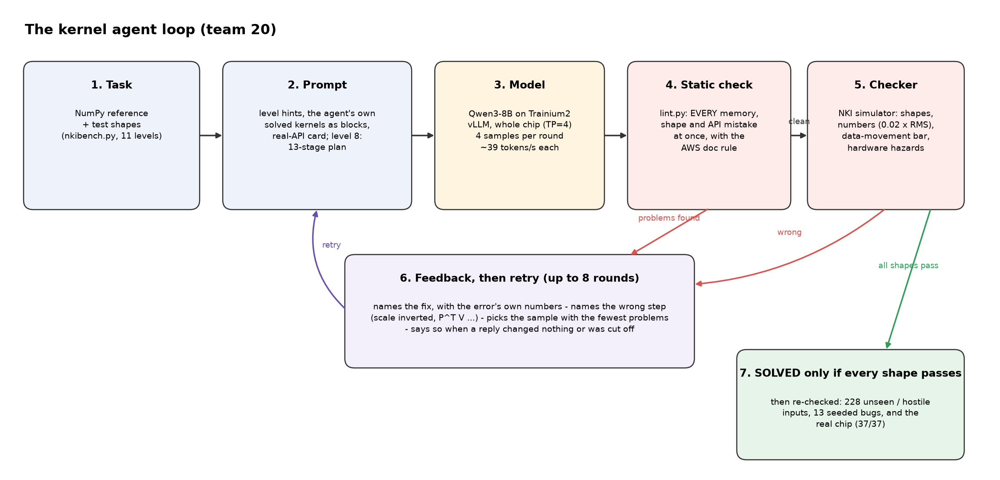
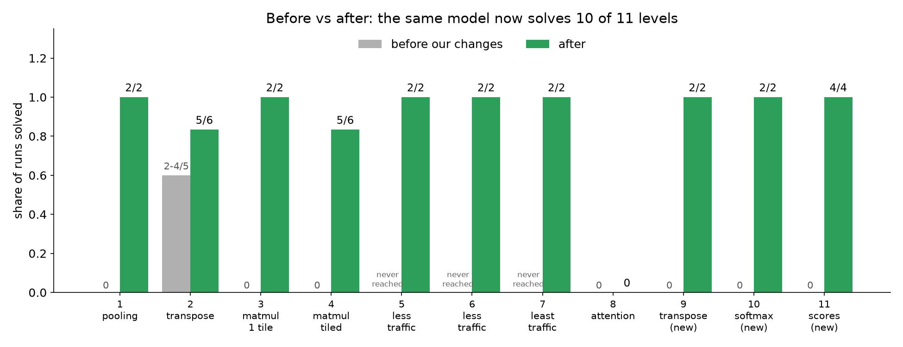
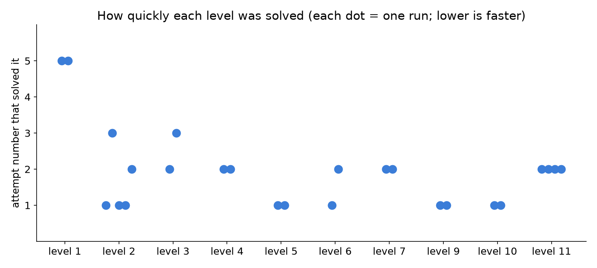
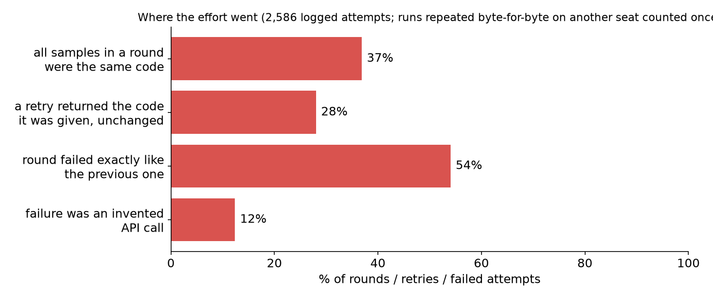
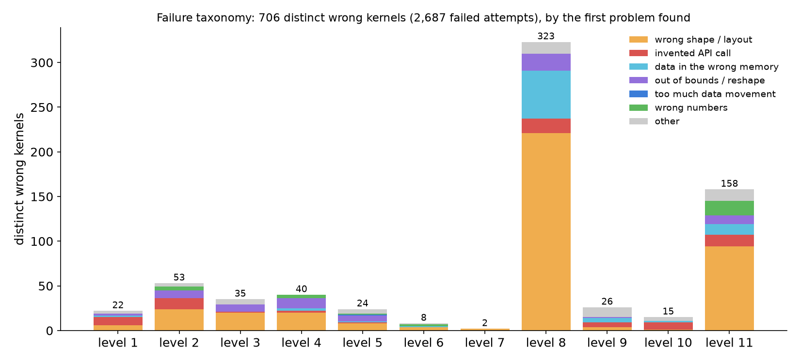
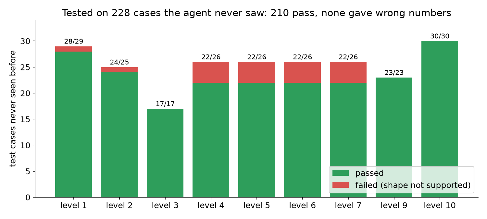

# Project 2 — teaching a small model to write chip code

**In one line:** the same small AI model (Qwen3-8B, running on one Trainium2 chip) went from being stuck on
most levels to solving **9 of 10** — not by changing the model, but by changing **what the checker tells it
after each failed try**, and by letting it **reuse code it had already got right**.



## How it works

1. The model is asked to write a small program ("kernel") for the chip.
2. A **checker** runs it and compares the output with the right answer on several test inputs.
3. If it's wrong, the checker's message goes back to the model, and it tries again (4 tries per round, up to 8 rounds).
4. A level counts as **solved** only when every test input comes out right — and every solved program was
   checked again afterwards, separately.

## Results



| level | what the program does | before | after |
|---|---|---|---|
| 1 | average pooling | never solved | **solved in 2 of 2 runs** |
| 2 | transpose | 2–4 of 5 runs | 2 of 3 runs — *no real change* |
| 3 | matrix multiply, small | never solved | **2 of 2** |
| 4 | matrix multiply, large | never solved | **5 of 6** |
| 5–7 | the same, but moving less data | never reached | **2 of 2 each** |
| 8 | attention | never solved | **still not solved** |
| 9–10 *(we added these)* | transpose and softmax, as stepping stones to level 8 | stuck | **2 of 2 each** |



Most levels are now solved on the 1st or 2nd try; levels 5–7, 9 and 10 often on the very first.

## What made the difference

1. **Say what to change, not just "wrong".** The original checker said things like "this size is too big".
   We made it say *how* the program should be structured to fix it — in words, never by handing over code.
2. **Use the error's own numbers.** "You put 32,768 values into a space for 65,536 — that's the wrong
   container" fixed level 3 after vaguer messages didn't.
3. **Keep helping as the mistake changes.** Fixing one error exposes the next; the help has to follow it.
4. **Reuse what already works.** Levels 5–7 are a harder version of level 4. Starting the model from its
   *own* correct level-4 program let it solve them on the first or second try.
5. **Show the real commands up front.** On levels 9 and 10 the model kept inventing commands that don't
   exist. Showing it the real ones — one line each — took both from stuck to solved on the first try.

## Where the effort was going to waste



From all 866 attempts we logged:

* In **70%** of rounds, the model's 4 tries were the **exact same code** — 3 of every 4 tries wasted.
  *Fix:* ask for each try with a different amount of randomness. (Measured: it helped only a little — this
  model is very sure of itself.)
* In **39%** of retries, the model sent back **the code it was given, unchanged**, and the loop didn't notice.
  *Fix:* the loop now tells it "you changed nothing".
* **26%** of rounds repeated a mistake already seen twice. Nearly every solve came by the 3rd round, so
  stopping earlier and starting fresh is a better use of time *(recommended; not yet used in our runs)*.
* **15%** of mistakes were **made-up commands** — fixed by showing the real ones up front (see above).

## What the model got wrong, level by level



Each level had one dominant mistake: level 1 invented commands, levels 3–5 used the wrong size of
container, level 8 kept putting data in the wrong kind of memory.

## Is it real? Two checks

**Tested on inputs it had never seen** (`holdout_check.py`): 228 new test cases — new sizes, new random
data, extreme values.



210 pass, and **not a single one gave wrong numbers**. Every failure was a size the program simply doesn't
handle (the matrix programs only work when sizes are exact multiples of 128 or 512).

**Run on the real chip** (`device_check.py`): the level 3, 4, 7, 9 and 10 programs ran on the actual Trainium2
chip, not just the simulator — **15 of 15 correct**, with errors around one in a million.

## Attacking level 8 (attention) — still open

The model knows the maths; what it gets wrong is how this chip's instructions behave. Its last mistake on
every level-8 run: it multiplies `q` by `k` directly to get q·kᵀ — correct maths — but the chip's matrix
multiply sums over the *first* axis, so the result comes out the wrong shape. NumPy habits, not maths.

What we built for it:

* **A static checker** (`lint.py`, switch `--lint`). The simulator stops at the *first* error, so each try
  fixed one mistake and revealed the next — about two minutes per mistake. The checker reads the program
  before running it and lists **every** memory, shape and operator mistake at once, each with its line and
  the fix. Checked against our logs: it caught all 58 logged level-8 mistakes of these kinds, found 3–6 per
  failing program (the simulator reports one per run), and raises no false alarm on any solved program.
* **Stepping stones**: levels 9 (transpose) and 10 (softmax) are solved; level 11 (the q·kᵀ step) is not yet.
* **Building blocks**: level 8 and 11 runs are shown the model's own solved programs to reuse.
* **Four different framings per round** instead of four temperatures (e.g. "plan every tile's memory first").

Status: level 8 and level 11 are **not solved**. Mistakes per program now range 1–7 and do not shrink steadily
round to round. One finding: the checker's first version gave advice that contradicted itself on one line,
and the model flipped between the two answers; that is fixed. Its newest message spells out the exact
transpose steps for q·kᵀ — very prescriptive, so a solve with it would be "the checker teaching the method".

## Experiment tooling

* **Every attempt now records** real token counts, whether the answer was cut off, response time, which
  sample the loop picked, a session id, and a fingerprint of the exact code used.
* **`ab.py`** runs fair comparisons: baseline and improved runs alternate, with the same budget, and it stops
  if the code changes mid-experiment.
* **Repetition, not circles**: across all logged rounds, 45% repeated the previous round's mistake, while only
  2% went back to an older one. The stall is repetition.
* **A measured "no difference"**: on level 4, varying the samples' randomness plus the "you changed nothing"
  check gave 3 of 3 — the same as without them (3 of 3).

## Honest limits

* Few runs per level (2–3), one model. Read "2 of 2" as "two tries", not a guarantee.
* The help messages describe the solution's structure in a lot of detail (level 1's most of all) — this is
  "the checker teaches the method", not the model discovering it alone.
* We checked correctness on the real chip, **not speed**.
* Level 8 (attention) is still unsolved: every attempt failed on a new mistake before it ever produced numbers.
* We also fixed a bug in the provided checker that crashed on correct level-8 programs.

## Rerun it

```bash
cd /workspace/projects/20-kernel-agent
python nkibench.py --selftest                     # the checker checks itself
COMMON="--rounds 8 --samples 4 --context 8192 --model Qwen/Qwen3-8B"
python agent.py --level 4 $COMMON --repeat 3      # original behaviour
python agent.py --level 4 $COMMON --repeat 3 --level-hints                                    # better messages
python agent.py --level 7 $COMMON --repeat 2 --level-hints --seed-from solved/level04_matmul_tiled.py   # reuse
python agent.py --level 9 $COMMON --repeat 2 --level-hints --portfolio --echo-check          # real commands shown
python holdout_check.py                           # unseen inputs
NEURON_PLATFORM_TARGET_OVERRIDE=trn2 NEURON_RT_VISIBLE_CORES=2 python device_check.py   # real chip, a free core
python analysis/make_charts.py                    # redraw the charts
```

Every change is behind a switch: without them, the agent behaves exactly like the original.

## Files

| file | what it is |
|---|---|
| `agent.py` | the loop, with our changes |
| `nkibench.py` | the checker (bug fix, stricter re-checks, levels 9–11) |
| `solved/` | every program the model wrote that passed, plus its re-check printout |
| `holdout_check.py`, `device_check.py` | the two "is it real?" checks |
| `lint.py` | the static checker (memory, shape and operator mistakes, all at once) |
| `ab.py` | fair A/B experiment runner |
| `analysis/` | the attempt-log analysis and the chart script |
| `assets/` | the diagram and charts |
