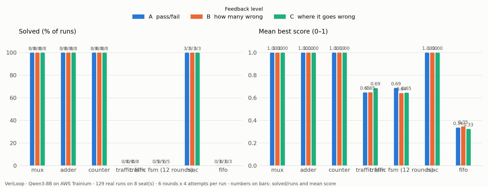

# VeriLoop — a small model on Trainium designs chip hardware, a simulator grades it

**Team Six Seven** · Hack the Chip, NYU × Annapurna Labs, 2026-10-10

Qwen3-8B, running on an AWS Trainium chip, writes digital hardware in Verilog. A simulator checks every
design against a reference on every test and sends feedback back; the model tries again. We measured
whether the **quality of that feedback** — A: only *pass/fail*, B: *how many tests fail*, C: *where it first
goes wrong* — decides whether the loop succeeds.



## The result in four lines

- **Easy blocks need no feedback:** mux, adder and counter were solved on the first try in all 72 runs.
- **Feedback did not turn hard failures into solves:** the traffic-light state machine and the FIFO were never
  solved, with any feedback — not even with 12 rounds (0/15). C's small edge at 6 rounds (0.69 vs 0.65)
  vanished at 12. The MAC cell was fixed on round 2 with A, B and C alike.
- **The model's mistakes are systematic** — one wrong idea, repeated (`results/TAXONOMY.md`).
- **The model does not know when it is wrong** — designs it rated 80–100% confident were right only half the
  time, so only the checker may declare success (`results/calibration.txt`).

Full one-page note: **[`SUBMISSION.md`](SUBMISSION.md)** · the checker: **[`CHECKER.md`](CHECKER.md)** ·
demo script: [`DEMO.md`](DEMO.md)

## What is where

| path | what |
|---|---|
| [`SUBMISSION.md`](SUBMISSION.md) | the one-page note: what we ran, on what, how many runs, the spread, findings |
| [`CHECKER.md`](CHECKER.md) | what the checker accepts and rejects, and how we proved it |
| [`veriloop/`](veriloop/) | the code: `checker.py`, `agent.py`, `run_experiment.py`, `selftest.py`, `calibrate.py`, `taxonomy.py`, `plot.py` |
| [`veriloop/levels/`](veriloop/levels/) | the six hardware levels: spec, Python reference, a correct design, 3–5 broken designs each |
| [`results/`](results/) | every run and every attempt; what is counted and what is excluded is in `results/README.md` |
| [`DEMO.md`](DEMO.md) | the 2-minute demo |
| [`TASKS.md`](TASKS.md) | the task board we used: every task, its files, and who did it |
| [`SETUP.md`](SETUP.md) | get on a seat, start the model, install Icarus Verilog, run long jobs |

## Reproduce

```bash
python veriloop/selftest.py                    # proves every level: good design passes, broken ones are caught
python veriloop/tests/test_compile.py          # checker tests (also test_simulate.py, test_feedback.py)
python veriloop/run_experiment.py --tag me --levels veriloop/levels/04_traffic_fsm --runs 1
python veriloop/plot.py                        # table + graph from results/
```
Run from this folder. Running the model needs a seat with the model served — README Part 1 at the top of
this repo (`./serve.sh`) — plus Icarus Verilog in the seat: `apt-get update && apt-get install -y iverilog`.
The checker alone runs anywhere with Icarus Verilog (`brew install icarus-verilog` on a Mac).
Our team's working repo, with the plan and task board: github.com/krishmehtagit/Six_Seven (private).

## Team

| name | email | contribution |
|---|---|---|
| **Krish Mehta** | km6152@nyu.edu | built VeriLoop with Claude Code: the checker, agent loop, six levels, experiments on Trainium, analysis and write-up — see the task board (`TASKS.md`) |
| Dhriti Vaidya | dv2567@nyu.edu | proposed idea 1, "ShapeGuard" (in our working repo) |
| Smruthi Ramesh | sr8406@nyu.edu | proposed idea 7, a biomedical signal front-end designer (in our working repo) |
| Manish Reddy | mg9444@nyu.edu | — |
| Bhagavan Madala | bm4245@nyu.edu | — |
| Ankit Singh | avs8866@nyu.edu | — |

Registered with the organisers as team 7, **Six Seven**.

Built on this repo's kernel-agent loop design. Our working repo, with the plan and task board:
github.com/krishmehtagit/Six_Seven (private).
