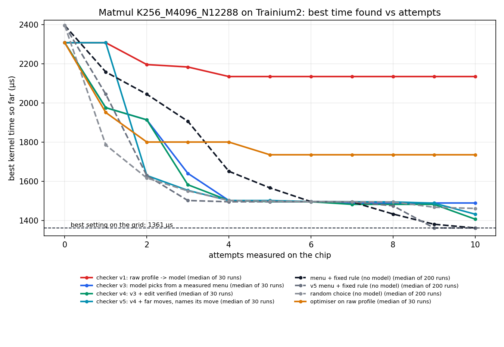
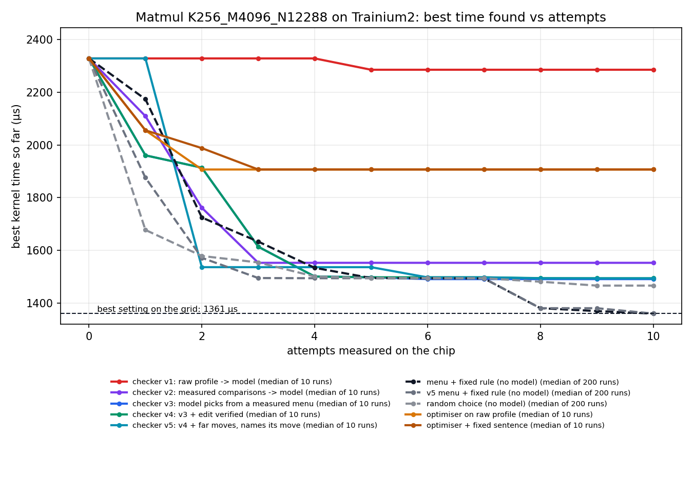

# KernelTune: an on-chip kernel autotuner driven by two small models

Team Skywalker. Hack the Chip (NYU × Annapurna Labs), kernel optimisation track.

**The pitch in four lines.**

1. A hand-written Trainium kernel has settings that decide its speed. Pick wrong and it is up to **7.1x slower**, and the right answer changes with every shape and precision.
2. We built a loop where two 8B models tune those settings, with every attempt compiled, checked and timed **on the real chip**.
3. The model is not what makes it work; the checker is. With the same model and a redesigned checker, good runs went from **3 of 30 to 29 of 30**. Random guessing gets 73%.
4. Tuned by the loop, a hand-written kernel is **level with AWS's compiler** on every layer shape of Qwen3-8B at 32-bit, and within 5% at 16-bit. It does not beat it.

Longer versions: `docs/explainer.md` (the idea without jargon), `docs/pitch.md` (the 3-minute script),
`docs/note.md` (the full hand-in note).

## The problem

Before a kernel can compute, it has to move data from the chip's large memory into a small on-chip
buffer. Our kernel, AWS's blocked matrix multiply, has three settings (M, N, K) that say how much
to move per trip and how much to keep on the chip for reuse. Bigger blocks mean fewer trips but need
more of a buffer that is small. Each setting must divide the number of tiles in its dimension, which
leaves 75 to 96 legal combinations depending on the shape.

There is no formula for the right one. Today an engineer finds it by trial and error, per shape.

## What we built

| Role | What it is |
|---|---|
| Workload | AWS's blocked matmul kernel, with the three settings exposed |
| Checker | Code runs the kernel on a Trainium2 core, verifies the answer against NumPy and profiles it; a Qwen3-8B model reads the measurements and says what to change |
| Optimiser | A second Qwen3-8B model edits the setting in the kernel; the chip measures again |

Ten attempts per run, always keeping the fastest setting found. Nothing larger than 8B is in the loop,
and nothing is scored on a simulator. The on-chip checker (`chip.py`, `hwcheck.py`) is the part the
hackathon's harness did not have.

## What we tried, and what we got

Everything is from a Trainium2 NeuronCore, one physical core, verified against a reference on every
attempt and timed with `neuron-explorer`. Timings repeat to under 1%.

### 1. Does the setting matter? We measured every legal setting.

| Shape | Settings | Best | Untuned (1, 1, 1) | Worst | Within 2% of best |
|---|---|---|---|---|---|
| 2048 × 2048 × 2048 | 75 (74 run) | 904.7 µs | 1,209.3 µs | 1,209.3 µs | 39 of 75 |
| K=256, M=4096, N=12288 (adapter-style, on Qwen3-8B's layer widths) | 96 | 1,360.9 µs | 1,629.2 µs | 9,716.6 µs | 4 of 96 |

- At the 2048 square it barely matters: half of all settings are near the best, and AWS's suggested settings (905.5 µs) are among them.
- At the adapter shape it matters a great deal: the worst setting is **7.1x slower** than the best, only 4 of 96 are good, and AWS's suggested settings are not legal there.
- "Bigger blocks are better" is true at the first shape and badly wrong at the second.

### 2. Can two small models find the best setting? Five checker designs, one model.

At the adapter shape, 30 starting settings, 10 attempts each. Each design fixes a failure we read in the
previous design's log (the reasons are in the docstrings in `kopt.py`).

| Approach | Runs | Final time, median | Ends within 10% of best | Finds the best (within 2%) | Attempts with no measurement |
|---|---|---|---|---|---|
| Random choice (no model) | 200 | 1,460.8 µs | 73% | 38% | 0 |
| Small model on raw profile numbers, no checker | 30 | 1,735.2 µs | 3 of 30 | 0 of 30 | 178 of 300 |
| Checker v1: model reads raw profile numbers | 30 | 2,135.2 µs | 3 of 30 | 1 of 30 | 217 of 300 |
| Checker v3: model picks from a menu of measured moves | 30 | 1,488.7 µs | 19 of 30 | 10 of 30 | 83 of 300 |
| Checker v4: v3, and the optimiser's edit is verified before chip time | 30 | 1,406.2 µs | 26 of 30 | 15 of 30 | 5 of 300 |
| Checker v5: v4, with far moves, and the model names its move | 30 | 1,431.6 µs | **29 of 30** | 15 of 30 | **0 of 300** |
| The same menu with a one-line rule (no model) | 200 | 1,361.0 µs | 88% | 71% | 0 |



- **The first design lost to random guessing.** Its log shows the model repeating a rule of thumb ("increase N, fewer transfers") while the chip kept coming back slower: from 1,572 µs it went to 4,112 µs and kept going.
- **Changing only what the checker says fixed it.** Same model, 3 of 30 good runs became 29 of 30, and wasted attempts went from 217 of 300 to none.
- **The final design is more reliable than random** (97% against 73% within 10% of best). It finds the exact best more often too (50% against 38%), but with 30 runs that gap is not conclusive.
- **A one-line rule on our checker's menu beats the model** at finding the best (71% against 50%). The value is in the measured menu, not in the model choosing from it.

All five designs, from the 10-start experiment (v2 was not rerun at 30 starts):

| Design | What the checker model is shown | Final time, median | Attempts with no measurement |
|---|---|---|---|
| v1 | Raw profile numbers | 2,284.8 µs | 66 of 100 |
| v2 | Comparisons worked out in code ("raising N from 2 to 24: 2.62x slower") | 1,553.3 µs | 70 of 100 |
| v3 | A menu of untried moves, each with its measured record | 1,491.6 µs | 25 of 100 |
| v4 | v3, plus the optimiser's edit is checked against the instruction | 1,494.9 µs | 2 of 100 |
| v5 | v4, plus far moves; the model names its move | 1,494.2 µs | 0 of 100 |



At the 2048 square nothing separates the approaches: the median run of every one, including random,
ends within 1% of the best.

### 3. Does it reach a model? Qwen3-8B's layer shapes, against AWS's compiler.

One loop run per linear-layer shape at 512 tokens, 32-bit, measured live on the chip. "Untuned" is
our kernel with all three settings at 1. "AWS compiler" is the same multiply written as plain PyTorch
and compiled by `neuronx-cc`, with no hand-written kernel.

| Qwen3-8B layer | Our kernel, untuned | Our kernel, tuned by the loop | AWS compiler | Tuned against compiler |
|---|---|---|---|---|
| Attention query and output projections | 1,075.3 µs | 906.2 µs | 908.1 µs | 0.2% faster |
| Attention key and value projections | 321.4 µs | 245.0 µs | 248.0 µs | 1.2% faster |
| Feed-forward gate and up projections | 3,117.5 µs | 2,667.2 µs | 2,665.9 µs | 0.05% slower |
| Feed-forward down projection | 3,029.1 µs | 2,664.7 µs | 2,706.3 µs | 1.5% faster |
| Whole model, 252 projections | 434.1 ms | 370.9 ms | 372.6 ms | 0.5% faster |

- Untuned, the hand-written kernel is 12% to 30% slower than the compiler. Tuned by the loop it is **level with it on every layer**.
- This is a tie, not a win: the compiler was measured on different seats from the kernel, and timings across seats have agreed to about 0.3%.
- The totals are sums of standalone kernel times, not the model running. Raw compiler measurements: `results/compiler_default_layers.json`.

**Measured inside a model** (`inference/`): the kernel placed in a traced PyTorch model built from
Qwen3-8B's feed-forward block, random weights, timed as whole-model inference.

| Two feed-forward blocks, 512 tokens, 32-bit | Inference time |
|---|---|
| Our kernel, untuned | 20.12 ms |
| Our kernel, at the settings the loop chose per layer | 17.40 ms (13.5% less) |
| AWS compiler | 17.26 ms |

**At 16-bit**, the precision real models run in, we ran the loop itself scored on inference time
(`inference/kopt16.py`, the same loop with only the measurement replaced) and measured all 72 settings
for ground truth:

| One feed-forward block, 16-bit | Inference time |
|---|---|
| Our kernel, untuned | 8,635 µs |
| Our kernel, tuned by the loop (five runs, five different starts) | 2,862 to 2,894 µs |
| Best of all 72 settings | 2,860 µs |
| AWS compiler | 2,745 µs |

- Untuned, the kernel is **3.1x slower** than the compiler at 16-bit. All five loop runs ended within 2% of the best setting, 4% to 5% behind the compiler.
- Settings tuned at 32-bit do not carry over: used at 16-bit they are 1.7x off the best.
- Random choice also ends within 2% of the best in 166 of 200 runs on this problem, so this shows the loop working on real inference time, not the model beating random.

### 4. What building the checker caught

- **The simulator and the chip disagree.** At the hackathon's small test shapes the chip moved the minimum amount of data where `nki.simulate` counted up to 2x. The hackathon's optimisation levels are scored on the simulator.
- **The pod's default core setting doubles every profile count.** Our first profile was wrong for this reason.
- **The README's "two cores stay free beside the model server" does not hold** on these pods: every core request was refused while the server was up.
- **AWS's suggested settings run on none of Qwen3-8B's four layer shapes at 512 tokens.**
- **An untuned 16-bit kernel came out 2.4% wrong with no error raised.** The checker's accuracy stage is what catches it.

## What we do not claim

- **We do not beat AWS's compiler.** Tuned, the hand-written kernel ties it at 32-bit and is 4% to 5% behind at 16-bit. Where the compiler can merge the multiply with the next operation it is 28% ahead.
- **The 8B model does not beat a one-line rule** on the same menu, and is not conclusively better than random at finding the exact best.
- **The loop chooses three numbers.** It does not write kernel code.
- **One operation.** We tested matrix multiply because it has a public reference kernel, a compiler version to compare against, and few enough settings to measure all of them. Nobody needs to hand-write a matmul.
- **No tokens-per-second figure for Qwen3-8B.** The served model's multiplies come from the compiler, so our settings have nothing to plug into. We timed small models built from its layer sizes.
- **No energy figures.** The pods expose no power reading.

## Where this is useful

Hand-written kernels exist for what the compiler does not cover or covers badly: fused operations such
as fused attention, custom normalisation, quantised multiplies. Those have settings like these, no
compiler version to fall back on, and are tuned by trial and error per shape, per precision and per chip
generation. The loop needs three things from any kernel: named settings, a reference answer, and the
rule for which values are legal. Pointing it at one of those kernels is the next step; we have not
done it.

## Files

| File | What it is |
|---|---|
| `kernels/matmul_blocked.py` | The kernel being tuned: AWS's tutorial blocked matmul, with its three block-size lines set to 1 |
| `chip.py` | Compile one kernel, run it on a NeuronCore, verify it against NumPy, profile it |
| `hwcheck.py` | The same on-chip check for the hackathon's `nkibench.py` levels (its missing layers 2 and 3) |
| `kopt.py` | The loop: the checker and optimiser agents, every arm, and the no-model baselines |
| `report.py` | Tables and charts from the attempt logs |
| `results/grid_*.jsonl` | Every setting measured on the chip, one JSON line each |
| `runs/*.jsonl` | Every attempt of every run: setting, stage reached, time, the checker's instruction, the optimiser's reply |
| `results/summary_*.json`, `curve_*.csv`, `curve_*.png` | The numbers and charts above (`s30` = the 30-start experiment) |
| `inference/` | The kernel inside a traced PyTorch model: scripts, raw results and setup notes |

## Reproduce it

You need two seat pods from the hackathon cluster: one serves the model, the other's chip runs
kernels. They cannot be the same seat, because the model server takes every core on its chip.

### 1. Without a chip: recompute the tables from the logs (any laptop)

```bash
pip install matplotlib
S=K256_M4096_N12288
python report.py $S runs/random_x200_s10_$S.jsonl runs/greedy_x200_s10_$S.jsonl \
    runs/raw_$S.jsonl runs/template_$S.jsonl runs/checker_$S.jsonl \
    runs/checker2_$S.jsonl runs/checker3_$S.jsonl runs/checker4_$S.jsonl runs/checker5_$S.jsonl
```

The no-model arms replay from the cached chip measurements, so they also run anywhere:

```bash
pip install httpx
python kopt.py --arm random --runs 200 --nstarts 10 --size $S --starts spread --no-live --out /tmp/random.jsonl
python kopt.py --arm greedy --runs 200 --nstarts 10 --size $S --starts spread --no-live --out /tmp/greedy.jsonl
```

### 2. With the chips: run the loop

On your laptop, with the workshop credentials and `kubectl` pointed at the cluster (the hackathon
README, steps 1 to 4). Below, `seat-A` serves the model and `seat-B` has the free chip.

```bash
# start the model on seat-A (about 4 minutes) and note its address
kubectl exec seat-A -- bash -c 'cd /workspace && ./serve.sh'
IP=$(kubectl get pod seat-A -o jsonpath='{.status.podIP}')

# put this repo on seat-B
tar cf - chip.py hwcheck.py kopt.py report.py kernels results | \
    kubectl exec -i seat-B -- bash -c 'mkdir -p /workspace/kopt && cd /workspace/kopt && tar xf -'
kubectl exec -it seat-B -- bash
```

Inside `seat-B`:

```bash
cd /workspace/kopt
export KOPT_BASE_URL=http://<IP of seat-A>:8000/v1

# one kernel on the chip: correct? how fast? how busy was each engine?
python chip.py --grid "1,1,1;4,1,2" --size K256_M4096_N12288

# the loop: checker v5 and the Qwen3-8B optimiser, 10 runs of 10 attempts
python kopt.py --arm checker5 --runs 10 --attempts 10 --size K256_M4096_N12288 \
    --starts spread --out runs/my_checker5.jsonl

# a shape nobody has measured: every attempt is compiled and timed live (about 30 s each)
python kopt.py --arm checker5 --runs 1 --attempts 10 --size K4096_M512_N4096 \
    --starts unblocked --out runs/my_layer.jsonl
```

Arms: `random`, `raw`, `template`, `checker` (v1), `checker2` … `checker5`, `greedy`, `greedy5`.
Settings already in `results/grid_<shape>.jsonl` are read from that cache instead of being measured
again; delete the file to force every attempt onto the chip.

To measure a whole grid yourself:

```bash
python chip.py --grid "1,1,1;1,1,2;..." --size K256_M4096_N12288 --reps 3 --out results/grid_mine.jsonl
```

## Things that will bite you

All found the hard way on these pods.

- **Measure at one physical core.** At the pod's default (`NEURON_LOGICAL_NC_CONFIG=2`) a kernel runs
  on both physical cores and every byte and transfer count comes back exactly doubled. `chip.py` and
  `hwcheck.py` set it to 1.
- **The model server and a kernel cannot share a chip.** The hackathon README says two cores stay
  free; on our pods every core request was refused with "cores busy" while the server was up.
- **Do not send the model server a `seed` parameter.** It killed the vLLM engine and the server had
  to be restarted.
- **Repeating a run is not an independent sample.** The server answers the same prompt almost
  identically each time, so runs here differ by their starting setting.
- **The simulator's byte counts are not the chip's.** At the hackathon's small test shapes the chip
  moved the minimum where `nki.simulate` counted up to 2x; at 2048 the waste is real on the chip.
- **Call kernels with NumPy arrays.** The pods have no `torch_neuronx`, so the torch route in AWS's
  profiling skill fails; NKI's standalone mode works.

## Credits

The kernel is adapted from the AWS Neuron NKI matrix multiplication tutorial. The hackathon harness
(`nkibench.py`, `serve.sh`) is from `yahavb/trainium-agent-labs`.
