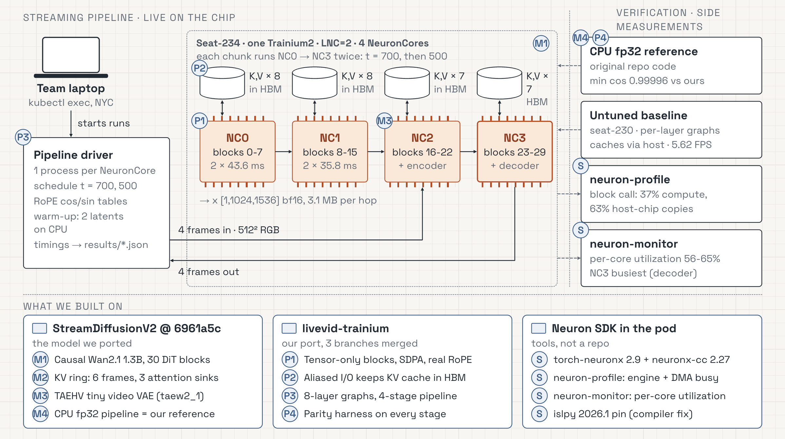

# LiveVid: real-time diffusion video on Trainium2

**Team 41 - Skywalkers.** Live video restyling running entirely on AWS Trainium2 NeuronCores, in two tiers.
Every number below was measured on a trn2.48xlarge seat (4 logical NeuronCores) on 2026-10-10.

| | Tier 1: SD-Turbo image-to-image | Tier 2: StreamDiffusionV2 causal Wan DiT |
|---|---|---|
| Model | `stabilityai/sd-turbo`, 1 UNet step, TAESD encode/decode | Wan2.1-T2V-1.3B causal DiT (`jerryfeng/StreamDiffusionV2`), 2 steps, TAEHV |
| Resolution | 512x512 | 512x512 |
| 1 core | 11.2 FPS | 15.1 FPS (DiT only) |
| 4 cores | **43.8 FPS** | 44.5 FPS (DiT only), **38.4 FPS** end to end |
| Correctness vs CPU | UNet cosine >= 0.99993 | cosine >= 0.99996, 47 to 51 dB PSNR |
| Write-up | `reports/tier1_bench.md`, `reports/tier1_profile.md` | `reports/tier2_story.md` |

## System architecture

The Tier 2 streaming pipeline as it runs on the chip: a driver on the pod feeds four NeuronCores in sequence,
each holding a group of DiT blocks with its KV cache resident in device memory, with the TAEHV encoder and
decoder sharing two of the cores. The right-hand column is how each stage was verified and measured.



**Streaming pipeline.** One Trainium2 chip at LNC=2 exposes four NeuronCores. The 30 DiT blocks of the causal
Wan2.1 1.3B model are split across them as a 4-stage pipeline, and each chunk runs NC0 to NC3 twice, at
timesteps t = 700 and then t = 500.

| Core | Holds | Time per chunk |
|---|---|---|
| NC0 | blocks 0-7, KV x 8 in HBM | 2 x 43.6 ms |
| NC1 | blocks 8-15, KV x 8 in HBM | 2 x 35.8 ms |
| NC2 | blocks 16-22 + TAEHV encoder, KV x 7 in HBM | |
| NC3 | blocks 23-29 + TAEHV decoder, KV x 7 in HBM | |

- Activations hop between cores as `[1, 1024, 1536]` bf16 tensors, 3.1 MB per hop.
- Each core's KV cache uses aliased graph inputs and outputs, so it stays in HBM instead of crossing to the
  host on every call.
- Four 512x512 RGB frames go in at the encoder on NC2, and four frames come out of the decoder on NC3.
- The pipeline driver runs one process per NeuronCore. It owns the t = 700, 500 schedule and the RoPE cos/sin
  tables, warms up on two latents on CPU, and writes timings to `results/*.json`. Runs are started from a
  laptop over `kubectl exec`.

**Verification and side measurements.**

- CPU fp32 reference: the original repo code, matched at a minimum cosine of 0.99996.
- Untuned baseline: per-layer graphs with the caches going through the host, measured at 5.62 FPS on another seat.
- `neuron-profile`: a block call was 37% compute and 63% host-to-chip copies before the caches were kept
  resident.
- `neuron-monitor`: 56-65% utilization per core, with NC3 (the decoder core) the busiest.

**What it is built on.**

- [StreamDiffusionV2](https://github.com/chenfengxu714/StreamDiffusionV2) at `6961a5c`: causal Wan2.1 1.3B
  (30 DiT blocks), a 6-frame KV ring with 3 attention sinks, the TAEHV tiny video VAE (`taew2_1`), and the CPU
  fp32 pipeline used as our reference.
- `livevid-trainium`, our port (three branches merged): tensor-only blocks with SDPA and real RoPE, aliased
  I/O for the HBM-resident KV cache, 8-layer graphs in a 4-stage pipeline, and a parity harness on every stage.
- The Neuron SDK in the pod: torch-neuronx 2.9 and neuronx-cc 2.27, `neuron-profile`, `neuron-monitor`, and an
  `islpy` 2026.1 pin to work around a compiler issue.

## Tier 1: SD-Turbo restyling with a live webcam demo

- Three graphs compiled separately with `torch_neuronx.trace` (bf16, fixed shapes, batch 1): TAESD encoder,
  UNet (`--model-type=unet-inference`), TAESD decoder. No diffusers pipeline object at runtime; the scheduler
  math (add noise at one timestep, epsilon -> x0) runs on the host.
- One worker process per NeuronCore, round-robin dispatch, outputs reordered: 3.95x scaling from 1 to 4 cores.
- Per frame on one core: encode 14.7 ms, UNet 56.2 ms, decode 17.2 ms, 89.4 ms total.
- Quality settings picked from a sweep on a real webcam clip (`reports/tier1_quality.json`): one fixed noise
  tensor per stream, per-style strength (anime 0.55, oil painting 0.65, claymation 0.75, pixel art 0.75) and
  0.35 blending of each predicted latent with the previous output latent.
- The full SD VAE encoder was tried and rejected: 379 ms per encode against 14.7 ms for TAESD.
- Live demo: `tier1/server.py` is a daemon on the pod (4 pinned workers, newest-frame-wins scheduling, a
  block-based similarity filter that reuses the last output for unchanged frames, per-core utilization from
  `neuron-monitor`). `tier1/client.py` runs on a laptop and streams webcam JPEGs through `kubectl exec`
  (`tier1/relay.py`), with automatic reconnect. Server compute is 92 ms per frame; glass-to-glass was about
  355 ms from New York to a cluster in ap-south-2, of which about 230 ms is the network round trip.

## Tier 2: StreamDiffusionV2's causal Wan DiT

- The causal attention block was rewritten for a static graph with a fixed-size KV cache and matches CPU at
  cosine 0.999993.
- Profiling showed 7.2 ms of an 11.4 ms block call was moving the KV caches between host and device. Keeping
  the caches resident on the NeuronCore and grouping 8 layers per graph brought it to 4.4 ms per block.
- Full details, charts and the measured end-to-end pipeline are in `reports/tier2_story.md` and `tier2/`.

## Layout

| Path | What |
|---|---|
| `tier1/` | SD-Turbo pipeline, CPU reference, benchmark, quality sweep, profile, live server/relay/client |
| `tier2/` | Causal Wan DiT port, compile and run scripts, results and charts |
| `reports/` | Benchmarks, correctness checks, profiles and the Tier 2 story |
| `scripts/` | Seat pod helpers (`kubectl exec` wrappers, venv setup, environment probes) |

## Running Tier 1

The helper scripts assume `kubectl` access to a Trainium2 seat pod and the venv built by `scripts/setup_venv.sh`
(torch-neuronx 2.9, neuronx-cc 2.27). `tier1/_seat.sh` pins the seat name.

```bash
tier1/push.sh                                        # sync tier1/ to the pod
tier1/remote.sh "bash tier1/start_downloads.sh"      # sd-turbo (fp16) and TAESD
tier1/remote.sh "cd tier1 && python get_test_images.py && python reference_cpu.py"
tier1/remote.sh "cd tier1 && for c in taesd_enc unet taesd_dec; do python pipeline_neuron.py compile --component \$c; done"
tier1/remote.sh "cd tier1 && python pipeline_neuron.py prepare && python pipeline_neuron.py check"
tier1/remote.sh "cd tier1 && python bench.py"        # writes reports/tier1_bench.{json,md}
tier1/run_live.sh --record                           # live webcam demo (keys 1-4 switch style, q quits)
```

The pod reports 192 CPUs but has an 11-CPU cgroup quota, so CPU-side jobs must cap their thread counts
(`OMP_NUM_THREADS`); the scripts do this.
