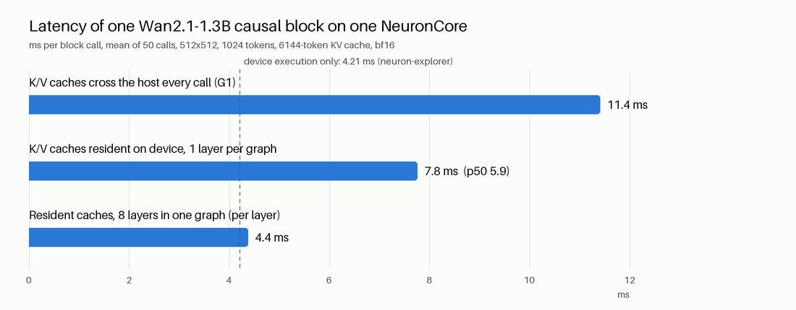
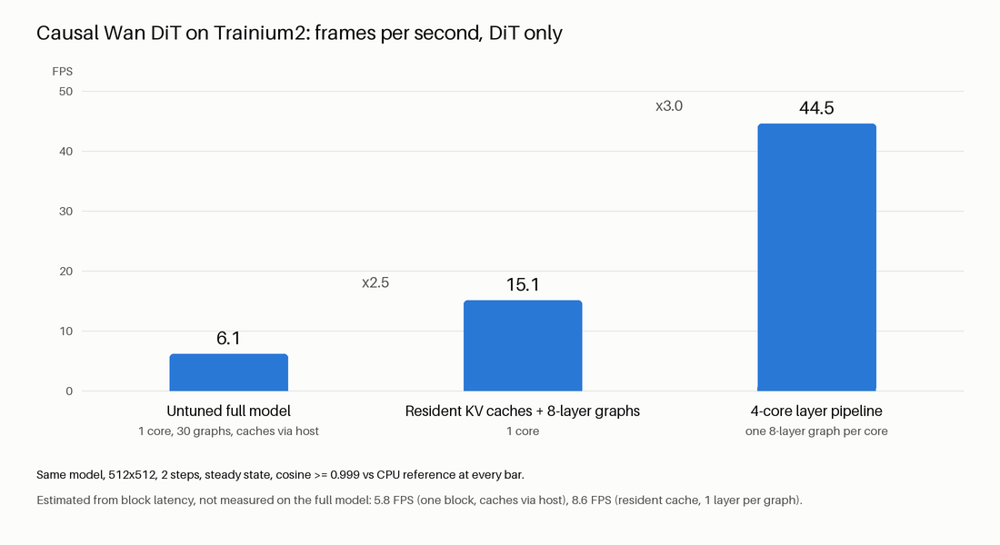
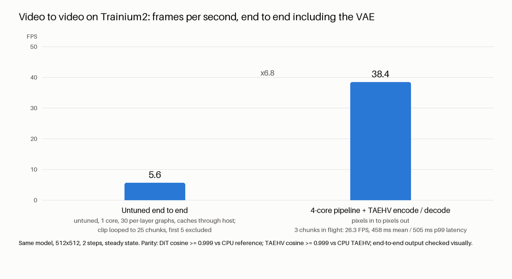

# Tier 2 story: StreamDiffusionV2's causal Wan DiT on Trainium2

Track 2, seat-234 (trn2.48xlarge, one logical NeuronCore unless stated), 2026-10-10. Model: Wan2.1-T2V-1.3B causal
DiT from `jerryfeng/StreamDiffusionV2` (`wan_causal_dmd_v2v`), demo config: 512x512, 2 denoising steps, 6-frame KV
cache. Everything below is measured unless it is explicitly labeled a projection (section 7).

## The short version

1. **It runs and it is correct.** One causal block with a fixed-size KV cache matches CPU at cosine 0.999993
   (G1). All 30 blocks, denoising real video for 6 chunks with the cache carried forward, match the original repo
   pipeline at cosine >= 0.99996 and 47 to 51 dB PSNR on decoded frames.
2. **Most of the block's time was not compute.** Of 11.4 ms per block call, 4.2 ms is the chip executing; 7.2 ms
   is moving the KV caches to the device and back.
3. **Keeping the caches on the device and grouping layers gets it back.** 11.4 ms -> 4.4 ms per block, which is
   the device execution time.
4. **Measured on the full DiT: 15.1 FPS on one core, 44.5 FPS on four** (DiT only, parity gate still passing),
   with one 8-layer resident-cache graph per core.
5. **Measured end to end, pixels in to pixels out, all on Trainium2: 38.4 FPS on four cores**, with the TAEHV
   encoder and decoder sharing two of those cores.

## 1. G1: one block, fixed-size KV cache, on Neuron

- Rewrote `CausalWanAttentionBlock` for a static graph (`tier2/block_port.py`): flash_attn -> scaled dot-product
  attention, complex RoPE -> real cos/sin, the repo's in-place ring buffer -> a slice-and-concat cache update
  with the 3 sink frames passed through.
- CPU check against the original repo block: cosine 1.0000000 (max abs error 1e-5) over 9 consecutive chunks.
- Traced in bf16 at the exact demo shapes (x 1024 tokens, cache 6144 tokens): compile 26.6 s.
- 3 consecutive chunks, Neuron vs CPU, each feeding its own caches forward: y 0.999993, K cache 0.999996,
  V cache 0.999997. **Gate 0.999: pass.** Details: `reports/g1.md`.

## 2. Where the 11.4 ms goes

`neuron-explorer` profile of the same block (`tier2/G2_NOTES.md`, section c).

| | ms per call | share |
|---|---|---|
| Wall time seen by the host | 11.41 | 100% |
| Device execution | 4.21 | 37% |
| Host<->device copies + call overhead | 7.20 | 63% |

- Each call carried about 43 MB in and 41 MB out; the two KV caches are 89% of that.
- Inside the 4.21 ms of device time: tensor engine (matmuls) active 68% of the time, DMA active 49% (they
  overlap).
- **Percent of peak.** One block call is 132.1 GFLOP (counted with `torch.utils.flop_counter`). Peak used:
  130.7 TFLOPS per logical NeuronCore, the figure implied by the profiler's own utilisation number (not a
  published spec).

| Basis | Throughput | % of peak |
|---|---|---|
| Wall clock, caches through the host (11.41 ms) | 11.6 TFLOPS | 8.9% |
| Device execution only (4.21 ms) | 31.4 TFLOPS | 24% |
| Resident caches, 8 layers per graph (4.37 ms) | 30.2 TFLOPS | 23% |

## 3. KV cache resident on the device

Mechanism: the caches become parameters of the traced module and `torch_neuronx.trace(..., input_output_aliases=
{param: output_index})` marks each new-cache output as that parameter's next value;
`torch_neuronx.move_trace_to_device` then keeps them on the NeuronCore. Same input/output aliasing NxD Inference
uses for LLM KV caches. Only x, the time modulation, the text context, RoPE and the bias cross the host.
Script: `tier2/g2_resident.py`.

| One layer per graph | Caches through host (G1) | Caches resident |
|---|---|---|
| Latency, mean | 11.41 ms | **7.76 ms** |
| Latency, p50 | 11.39 ms | **5.91 ms** |
| Latency, p99 | 11.67 ms | 29.2 ms |
| y cosine vs CPU, 3 consecutive chunks | 0.999993 to 0.999994 | 0.999994, 0.999994, 0.999994 |
| y max abs error | 0.18 to 0.21 | 0.18 to 0.21 |
| Compile | 26.6 s | 25.2 s |

- Parity is unchanged from G1.
- The state really advances on the device: comparing against a CPU run whose cache is frozen, the effect of the
  updated state matches at cosine 0.994 (the effect is small in layer 0, RMS 0.02, so bf16 noise shows).
- The p99 is worse (occasional 29 ms calls); the mean is pulled up by those. Not yet investigated.

## 4. Several layers in one graph

8 blocks (layers 0 to 7, real weights) chained in one graph with 16 resident cache tensors.

| | Value |
|---|---|
| Latency for all 8 layers, mean / p50 / p99 | 34.96 / 34.95 / 35.18 ms |
| **Per layer** | **4.37 ms** |
| y cosine vs CPU after 8 layers, 3 consecutive chunks | 0.999973, 0.999966, 0.999973 |
| State-effect cosine vs CPU (chunks 2 and 3) | 0.9978, 0.9995 |
| Compile | 183 s |

Per-layer latency is now within 4% of the profiled device execution time (4.21 ms), and the tail is gone
(p99 35.2 ms for 8 layers).

## 5. Full pipeline today (measured, caches still through the host)

All 30 layers as 30 single-layer graphs, 6 chunks of real video, against the original repo pipeline on CPU.

| | |
|---|---|
| Latent cosine per chunk, final output row | 0.999981, 0.999977, 0.999972, 0.999963, 0.999960 |
| Decoded-frame PSNR vs CPU reference | 50.8, 50.4, 49.9, 47.9, 47.1 dB |
| DiT time per chunk (60 block calls) | 0.65 s |
| **DiT-only FPS, one core** | **6.1** |

Video: `tier2/out/g2_side_by_side.mp4` (input | CPU reference | Neuron). The Neuron output is visually identical
to the reference. Cosine drifts down slowly with chunk count; longer runs should be checked.

## 6. Full DiT with resident caches: 1 core vs 4 cores (measured)

The whole DiT as 4 resident-cache graphs (layers 0-7, 8-15, 16-22, 23-29). Each graph is loaded twice, once per
denoising row, because each row has its own caches. Only the hidden state (3 MB) and the small per-call inputs
move between graphs. `tier2/g3_pipeline.py`, raw numbers in `tier2/results/g3_pipeline_*.json`.

| | 1 core | 4 cores | 4 cores, fewer chunks in flight |
|---|---|---|---|
| Layout | one process, 4 graphs run in sequence | one process per graph, one core each | same |
| Jobs in flight | 1 | 6 | 3 |
| **Steady-state FPS (DiT only)** | **15.1** | **44.5** | 37.6 |
| Time per chunk (throughput) | 265 ms | 90 ms | 106 ms |
| Latency of one chunk, submit to final output | 265 ms | 541 ms | 319 ms |
| Final-latent cosine vs CPU reference (frames 3 to 6) | 0.999977, 0.999972, 0.999963, 0.999960 | identical | identical |
| Gate 0.999 | pass | pass | pass |

- 4 cores give **2.96x** the 1-core throughput. Chunks are fed back to back (the 6-chunk clip looped to 120
  chunks for the 4-core runs, 40 for 1 core), so all 4 stages work on different chunks at once. The first 5 chunks
  are excluded from the steady-state figures.
- The 1-core result, 265 ms per chunk, matches what the block measurements predicted (4.37 ms x 30 x 2 = 262 ms).
- Mean time per stage call on 4 cores: 44.1, 35.8, 31.3, 31.3 ms for 8, 8, 7, 7 layers. Stage 0 is the
  bottleneck (2 calls per chunk = 88 ms of the 90 ms period); the other cores wait on it.
- **Per-core utilisation from neuron-monitor** (1 s samples during the 4-core run; monitor index = core + 2 mod 4):

| Core | Stage (layers) | Monitor index | Utilisation |
|---|---|---|---|
| 0 | 0-7 | 2 | 67.5% |
| 1 | 8-15 | 3 | 67.6% |
| 2 | 16-22 | 0 | 58.4% |
| 3 | 23-29 | 1 | 58.5% |

- Throughput vs latency: with 6 jobs in flight a chunk waits in queues (541 ms end to end); with 3 in flight
  latency drops to 319 ms at 37.6 FPS.
- Parity covers the frames that have a reference: frame 2 (0.999981, produced during warm-up) and frames 3 to 6
  through the resident pipeline. The values are the same as the earlier host-cache run to 6 digits.
- **Warm-up is on the host.** The session start (2-frame chunk, CPU) and the first stream frame of each row
  (frame 2, the last sink frame) run on the single-layer graphs with host-side caches; their K/V are then loaded
  into the stage graphs as initial resident state. From frame 3 on the caches never leave the device.

## 6b. End to end including the VAE: 38.4 FPS on 4 cores (measured)

Pixels in, pixels out, everything on Trainium2: TAEHV encode -> DiT (2 passes, 30 blocks) -> TAEHV decode.
`tier2/g4_e2e.py`, raw numbers in `tier2/results/g4_e2e_4core.json`. The TAEHV graphs are Session C's
(`tier2/vae_neuron.py`, recompiled on seat-234). They run inside the existing stage processes, on the two
least-loaded cores: encoder with stage 2 (core 2), decoder with stage 3 (core 3). No extra processes.

| | Value |
|---|---|
| **Steady-state end-to-end FPS** | **38.4** |
| Time per chunk (throughput) | 104 ms |
| Latency of one chunk, pixels in to pixels out (6 chunks in flight) | 629 ms mean, 924 ms max |
| Encode call (4 frames) | 19.0 ms |
| Decode call (4 frames) | 38.9 ms |
| DiT stage calls | 43.6, 35.8, 31.4, 31.4 ms |
| Utilisation, cores 0 / 1 / 2 / 3 (monitor index 2 / 3 / 0 / 1) | 58.7% / 58.7% / 64.5% / 56.5% |

- 120 chunks of the looped clip, first 5 excluded. Adding the VAE costs 14% of throughput (44.5 -> 38.4 FPS).
  Core 3 is now the bottleneck: 2 x 31.4 ms of DiT plus 38.9 ms of decode is 102 ms of the 104 ms period.
- TAEHV latents are rescaled to the pipeline's raw-latent convention (`lat * std + mean`), and the encoder is fed
  with its 3 frames of lookahead (TAEHV chunk f = pixel frames 4f..4f+3), as Session C's report describes.
- **Visual check:** `tier2/out/e2e_4core.mp4` (input | output) and `tier2/out/e2e_contact.png`. The output matches
  the G2 video in style and follows the input's motion frame for frame. There is **no numeric parity figure** for
  this run: it uses the TAEHV encoder and fresh noise, so it is not comparable sample-for-sample with the CPU
  reference. DiT parity is covered by section 6; VAE parity by Session C's report.
- Not timed in this figure: reading/decoding the source video and colour conversion to uint8 for display. Warm-up
  (first 3 latent frames) is done before the timed loop: KV caches as in section 6, encoder state from pixel
  chunks 0 to 2, decoder state from the 3 warm-up latents.
- Latency is high because 6 chunks are kept in flight to maximise throughput; the table below has the
  3-in-flight run.

### Throughput vs latency, end to end (measured)

| Chunks in flight | End-to-end FPS | Chunk latency mean | p99 | max |
|---|---|---|---|---|
| 6 | 38.4 | 629 ms | not recorded | 924 ms |
| 3 | **26.3** | **458 ms** | **505 ms** | 505 ms |

One chunk's own work is about 350 ms (encode 19 ms + 8 DiT stage calls about 285 ms + decode 39 ms + host), so
latency cannot go much below that with this layout; more chunks in flight buys throughput at the cost of queueing.

## Charts

Same model, 512x512, 2 steps, steady state, cosine >= 0.999 vs CPU reference at every bar. The first bar is the
measured untuned full model from G2 (0.65 s per chunk). Estimated from block latency and not on the chart: 5.8 FPS
(one block, caches via host) and 8.6 FPS (resident cache, 1 layer per graph).

Same model, 512x512, 2 steps, steady state. Parity: DiT cosine >= 0.999 vs CPU reference; TAEHV cosine >= 0.999 vs
CPU TAEHV (Session C); end-to-end output checked visually. The first bar, 5.62 FPS, is Session C's measured
untuned end-to-end run on seat-230 (branch `tier2-g2`, commit `8b92545`): 1 core, 30 per-layer graphs, caches
through the host; clip looped to 25 chunks, first 5 excluded. The 4-core pipeline is 6.8x that. With 3 chunks in
flight instead of 6 it runs at 26.3 FPS with 458 ms mean / 505 ms p99 latency.

## 7. What is still projected or missing

- **1-core end to end is not measured.** The end-to-end figure is 4 cores only. From measured parts, 1 core would
  be about 265 + 19 + 39 = 323 ms per chunk, about 12 FPS (projection).
- The end-to-end run uses TAEHV for both encode and decode. The repo's default uses the Wan VAE for both, and its
  `--use_taehv` only swaps the decoder; a TAEHV encoder changes the input latents slightly (Session C measured
  cosine 0.997 against the Wan encoder). The stylised output looks the same, but that is a visual judgement.
- **Projection, not measured:** balancing the stages (stage 0 takes 44 ms against 31 ms for stages 2 and 3)
  should lift the 4-core figure toward 4 / (2 x 35 ms) = about 57 FPS. Not tried.
- Resident-cache warm-up inside the graph, the adaptive sink refresh and the 50-frame RoPE rewind are still host
  or CPU side. The looped 120-chunk throughput run simply lets RoPE positions grow to frame 122, where the repo
  would have rewound at frame 50; that is fine for timing, and parity is only claimed for the first frames.

## Errors and caveats, verbatim where there was an error

- The first resident pipeline runs failed parity (cosine 0.94 to 0.98). Cause: torch_neuronx re-keys the alias
  map in module-parameter order while tracing, so the traced states are ordered k0..k7, v0..v7; I had loaded the
  warmed caches interleaved (k0, v0, k1, ...). Fixed in `g3_pipeline.py:load_stage`; all numbers above are from
  the fixed runs.
- Several processes cannot share one NeuronCore:
  `NRT:nrt_allocate_neuron_cores  Logical Neuron Core(s) not available - Requested:lnc0-lnc0 Available:0 Logical
  Core size:2 (cores busy, ret=-16)`. The 1-core comparison therefore runs the 4 graphs in one process.
- Reading an aliased cache back to the host failed:
  `RuntimeError('Expected self.dtype() == dst.dtype() to be true, but got false.  (Could this error message be
  improved?  If so, please report an enhancement request to PyTorch.)')`. Parity was therefore checked through y
  and the state-effect metric, not by reading the on-device caches.
- `kubectl exec` dropped several file pulls (`websocket: close 1006 (abnormal closure): unexpected EOF`,
  `connection reset by peer`); retried, no data affected.
- A first run of the 30-layer script crashed on a host-side shape bug of mine
  (`RuntimeError: permute(sparse_coo): number of dimensions in the tensor input does not match ...`); fixed and
  rerun, numbers above are from the rerun.
- `torch.utils.flop_counter` does not count `scaled_dot_product_attention`; FLOPs were counted on the equivalent
  matmul + softmax path.

## Where things are

Branch `tier2-g1`. `tier2/SHAPES.md` (shapes and non-portable ops), `tier2/G2_NOTES.md` (pass count, VAE path,
profile), `reports/g1.md`, raw numbers in `tier2/results/`, videos and chart in `tier2/out/`. Neuron artifacts on
seat-234 under `/workspace/livevid/artifacts/tier2/`.
