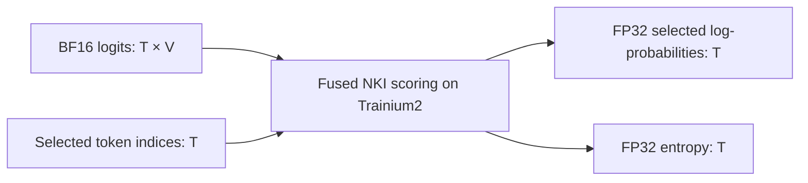

# Fused Token Scoring on Trainium2

**Hackathon project proposal · Draft for team review · October 10, 2026**

| Item | Decision |
| --- | --- |
| Problem | Compute selected-token log-probabilities and entropy efficiently for large vocabularies |
| Platform | AWS Trainium2, using NKI and the Neuron runtime |
| Proposed MVP | A standalone forward scoring kernel with correctness checks and device benchmarks |
| Implementation budget | Four hours after project selection |
| Team repository | [Rottenblasters/trainium-agent-labs](https://github.com/Rottenblasters/trainium-agent-labs) |
| Proposal branch | `proposal/fused-token-scoring` |
| Current stage | Research and environment inspection complete; implementation awaits team selection |

## 1. Proposal in one paragraph

Build an NKI kernel that reads a language model's token scores in vocabulary tiles and computes two outputs together: the log-probability of a selected token and the entropy of the token distribution. Compare it against correct, separate-operation implementations on the same Trainium2 device. Deliver a reusable forward kernel, numerical validation, reproducible benchmarks, and a before/after results table. The proposed performance target is **at least 20% lower median device latency on two predefined representative workloads**, with the declared accuracy preserved. This is a project target, not a forecast or an official organizer requirement.

## 2. The problem, from the basics

A language model produces a **logit**, or unnormalized score, for every possible next token. The collection of possible tokens is its **vocabulary**. With a large vocabulary, processing these scores becomes substantial work even when the caller needs only a few outputs.

| Term | Meaning in this project |
| --- | --- |
| `T` | Number of token positions being scored; batch and sequence dimensions are flattened |
| `V` | Vocabulary size: number of scores at each position |
| Logits | Input array of shape `[T, V]` |
| Selected token | One token index per position, supplied by the caller |
| Selected log-probability | Logarithm of the selected token's probability under the distribution |
| Entropy | One number per position describing the distribution's uncertainty |
| Kernel | A small program executing directly on the accelerator |
| Fusion | Computing related outputs together while reusing the same loaded data |
| Tiling | Processing bounded chunks that fit the accelerator's on-chip memory |

Selected-token log-probabilities are useful in language-model scoring and post-training objectives. Entropy is useful when monitoring or using the uncertainty of those distributions. These operations appear in workflows such as GRPO, a reinforcement-learning method for language models.

Separate implementations may read the same logits repeatedly, repeat expensive reductions/exponentiation, or materialize vocabulary-sized probability arrays. Our hypothesis is that a fused Trainium implementation can reuse that work and reduce device latency.

The user-facing benefit is a faster scoring primitive that a later training or evaluation integration could call. The hackathon MVP proves the primitive's behavior and performance; its speedup alone does not establish a complete training-step speedup.

## 3. What already exists

### Public implementations and evidence

| Existing resource | What it establishes | How we use it |
| --- | --- | --- |
| [Hugging Face TRL v1.14.0](https://github.com/huggingface/trl/releases/tag/v1.14.0) | Fused log-probability/entropy computation already exists in Triton, with CUDA, ROCm, and XPU backends listed | Evidence that the operation matters and fusion is a credible technique |
| [TRL scoring implementation](https://github.com/huggingface/trl/blob/v1.14.0/trl/kernels/logprob_entropy.py) | A concrete algorithm and interface, including a GPU backward path | A mathematical reference; the MVP implements forward computation in NKI |
| [TRL v1.15.0](https://github.com/huggingface/trl/releases/tag/v1.15.0) | A newer fused linear language-model head can also avoid building the logits tensor | Related prior work; this broader operation is outside our MVP |
| [AWS NKI cross entropy](https://awsdocs-neuron.readthedocs-hosted.com/en/latest/nki/library/api/cross-entropy.html) | An existing Trainium loss kernel uses online log-sum-exp | A compatible baseline component or implementation reference to inspect |
| [Provided kernel-agent harness](../../projects/02-kernel-agent/nkibench.py) | Static checks, CPU simulation, and a roofline estimate are available | A development reference; it does not time this operation on Trainium |
| [Neuron Agentic Development](https://github.com/aws-neuron/neuron-agentic-development) | NKI authoring, debugging, and profiling guidance is available | Assistance for implementation and diagnosis |

TRL reports **12.8 ms for separate scoring versus 0.89 ms for fused scoring** on one H100, with BF16 inputs, 8192 token positions, and vocabulary size 151936. These published GPU measurements motivate the experiment. They are not our baseline, a Trainium performance prediction, or proof of an end-to-end training improvement. [Published benchmark](https://github.com/huggingface/trl/releases/tag/v1.14.0)

The contribution is a verified NKI implementation and a measured Trainium optimization for a defined operation. We are not claiming to invent kernel fusion, establish a globally missing algorithm, or replace TRL's full training stack.

### Provided pod: inspected October 10, 2026

| Resource | Observed state | Implication |
| --- | --- | --- |
| Assigned pod | `seat-256`, Running and Ready | Use this assigned environment |
| Host | `trn2.48xlarge` | The pod receives an allocated device on this host, not the entire host |
| Visible accelerator | One Trainium2 device, 96 GB memory | Enough visible device memory for the proposed workloads |
| Logical cores | Four, with logical NeuronCore configuration 2 | Confirm available cores before allocating the benchmark |
| Python | 3.13.7 | Match the pod environment |
| NKI | `0.6.0+31049202112.g85070674` | Use this installed API rather than blindly copying older examples |
| Compiler | `neuronx-cc 2.27.5334.0+f702b353` | Record this version in experiment metadata |
| Runtime | `neuron-ls` reports `2.34.10` | Record the runtime version separately from the compiler |
| PyTorch / NumPy | 2.11.0 / 2.4.6 | Available for host-side references and input generation |
| `nrtpy`, `nkilib` | Modules are importable | Inspect their installed interfaces and relevant kernels first |
| `torch_neuronx` | Module is not importable | A compiled PyTorch-Neuron baseline is optional, not a prerequisite |
| Modern `nki` module | `jit` exists; `benchmark` and `baremetal` attributes are absent | Build timing around a supported installed execution interface |

Importability and device visibility do not prove that our kernel can compile, execute, or benchmark. The first milestone must demonstrate those steps with a minimal kernel. The workshop model server was verified during setup; its availability and core placement should be rechecked before experiments.

The provided model can assist with kernel development if desired. Its chat endpoint does not supply the logits required by this project. The MVP uses deterministic generated logits, so model inference and model downloads are not dependencies.

## 4. Exact MVP contract

Proposed logical interface:

```python
selected_logprobs, entropy = score_tokens(logits, token_indices)
```

This defines the operation, not an already implemented Python or framework API.



| Property | Required behavior |
| --- | --- |
| Logits | Contiguous `[T, V]`, BF16, `T >= 1`, `V >= 1` |
| Supported values | Finite input scores with absolute value at most 10000 |
| Token indices | Contiguous `[T]`, int32, each index in `[0, V)` |
| Outputs | Two `[T]` arrays, FP32 |
| Arithmetic | FP32 reductions and running state |
| Temperature | Fixed at 1 for the MVP |
| Layout | Flattened token positions; no arbitrary strides |
| Shape handling | Correctly process partial row and vocabulary tiles |
| Invalid inputs | Host-side validation rejects invalid shape, dtype, values, or indices |
| Differentiation | Forward only; no autograd integration |

BF16 is a compact floating-point representation. The reference must promote the **same quantized BF16 inputs** to FP32; comparing against different, unquantized source values would confound input quantization with kernel error.

For one row with scores `x[j]` and selected index `y`, the required outputs are:

```text
m = max_j x[j]
z[j] = x[j] - m
s = sum_j exp(z[j])
u = sum_j exp(z[j]) * z[j]

selected_logprob = (x[y] - m) - log(s)
entropy         = log(s) - u / s
```

Both outputs use natural logarithms. Max subtraction stabilizes exponentiation, and using shifted scores in the weighted sum avoids unnecessary cancellation from a large common score offset.

## 5. Proposed optimization

1. Process a bounded batch of rows and vocabulary columns in on-chip tiles.
2. Maintain a running maximum, exponential sum, and weighted shifted-score sum for each row.
3. Rescale previously accumulated state when a later tile raises the maximum.
4. Reuse each tile's exponentials and reductions for both outputs.
5. Obtain the selected score with a supported gather or masked reduction strategy.
6. Write only the two output vectors and any small required execution state.

Initialize the running state from the first valid tile. Padded columns must contribute neither probability nor weighted score; avoid evaluating `0 * -inf` in the entropy reduction.

For subsequent valid tiles, the weighted state requires a shift correction as well as rescaling. Per row, with previous state `(m_old, s_old, u_old)`:

```text
m_new = max(m_old, max(valid_tile_scores))
delta = m_old - m_new
scale = exp(delta)
z_tile = valid_tile_scores - m_new

s_new = scale * s_old + sum(exp(z_tile))
u_new = scale * (u_old + delta * s_old) + sum(exp(z_tile) * z_tile)
```

This is primarily a data-movement and reduction workload. The initial optimization does not need matrix multiplication, model weights, distributed collectives, or a new hardware instruction.

**Memory boundary:** the input logits still occupy `O(T*V)` device memory. We aim to avoid extra full probability/log-probability arrays and repeated work. The memory benefit may be large against a materializing baseline and small against an existing streaming baseline; report both honestly. Bounded on-chip tiles are still required.

## 6. Baselines and comparison contract

The primary performance claim must compare against the **fastest correct compatible baseline measured for each case**, using matching input/output semantics, precision, and core allocation.

| Baseline | Purpose | Requirement |
| --- | --- | --- |
| Host FP32 reference | Validate outputs and edge cases | Required; never used as the Trainium timing baseline |
| Separate-operation NKI implementation | Compute log-probability and entropy in separate device passes, with stable reductions and reasonable tiling | Required; avoid a deliberately slow baseline |
| Compatible `nkilib` loss component plus entropy | Check whether existing optimized loss code improves the separate-operation baseline | Inspect early; measure if it supports the contract within the time budget |
| Compiled framework path | Compare with compiler-generated fusion | Optional; currently blocked by missing `torch_neuronx` import |

An online separate-operation baseline can avoid full intermediate arrays too. The fused implementation must compete on reuse and execution time, not just against a naive materializing reference. A loss-only library call does not satisfy the two-output contract; include its entropy computation, conversions, and required device work in the comparison.

Record unavailable or incompatible baselines and the reason. Do not silently label an unmeasured library path slower. If we measure only our separate-operation baseline, state that limitation in the result.

## 7. Accuracy and benchmark plan

### Correctness

Proposed acceptance tolerance for each output:

```text
abs(actual - reference) <= 1e-3 + 1e-4 * abs(reference)
```

Freeze this protocol before optimization. If it proves inappropriate, justify a revised contract before final benchmarking and disclose the change; do not loosen it merely to pass a failing candidate.

Required checks include:

- Seeded random scores with several scales, including peaked distributions.
- Uniform and all-zero rows: log-probability `-log(V)` and entropy `log(V)`.
- A single-token vocabulary: both outputs zero.
- Large positive and negative common offsets, evaluated against the actual BF16 input values.
- Selected indices at the beginning, middle, and final valid column.
- Odd/partial tiles, including `(T,V)=(3,17)`, `(129,8193)`, and `(7,32769)`.
- Rejection of invalid indices and unsupported inputs.

Check finite outputs, log-probabilities no greater than zero, and entropy within `[0, log(V)]`, allowing the declared numerical tolerance. Produce maximum and mean absolute errors for both outputs. Validate through ordinary device execution separately from the timing mechanism.

### Predefined workload matrix

| Case | `T` | `V` | Role |
| --- | --- | --- | --- |
| A | 128 | 8192 | Required performance case and first implementation target |
| B | 512 | 32768 | Required performance case |
| C | 129 | 8193 | Required partial-tile correctness case; also report timing |
| D | 512 | 151936 | Optional large-vocabulary case |
| E | 2048 | 151936 | Optional scaling case if compilation and timing remain practical |

These are proposed workloads, not shapes already verified on device. Synthetic inputs give controlled, reproducible operator measurements; they do not establish a full-model speedup or a real training input distribution.

### Timing protocol

- Reuse compiled artifacts and preallocated device inputs where the runtime allows it.
- Match core count, precision, shape, and transfer boundaries across implementations.
- Start with 10 warm-up executions and at least 100 timed executions per case, in three alternating baseline/optimized rounds. Record any runtime-tool differences from this requested protocol.
- Use a supported runtime measurement interface with proper synchronization. Host dispatch time alone is not device latency.
- Report median and p95 device latency, repeat-to-repeat spread, and throughput `T / latency_seconds`.
- Report host/device-inclusive call latency separately; state whether transfers and validation are included.
- Report compilation time separately from warm execution latency.
- Coordinate device usage so the model server or other team experiments do not compete for the allocated cores.
- Capture one representative profile if the installed tooling supports it within the budget.

The [nrtpy validation and benchmark tutorial](https://awsdocs-neuron.readthedocs-hosted.com/en/latest/neuron-runtime/nrtpy/tutorial-validate-benchmark.html) is a reference. Its latest interfaces must be checked against the installed module before implementation.

## 8. Success criteria and result reporting

| Outcome | Acceptance condition |
| --- | --- |
| Functional MVP | Kernel compiles and executes on seat-256; required correctness cases pass |
| Performance goal | At least 20% lower p50 device latency on both A and B against the best measured compatible baseline |
| Equivalent speedup | `baseline_p50 / fused_p50 >= 1.25` for the performance goal |
| Measurement credibility | Repeated measurements, matching precision/core allocation, version metadata, and disclosed baselines |
| Reproducibility | A teammate can run documented validation and benchmarks from the submitted code |
| Submission completeness | Kernel, references, benchmark artifacts, results, explanation, limitations, and PR |

Report every predefined case attempted, including regressions and compilation failures. Report p95 and numerical error even if the median meets the target. A correct implementation that misses the performance goal remains a partial outcome; document it rather than claiming success.

Results table to populate after implementation:

| Case | Baseline implementation | Baseline p50 / p95 | Fused p50 / p95 | Speedup | Max error: log-prob / entropy | Workspace evidence |
| --- | --- | --- | --- | --- | --- | --- |
| A | Pending | Pending | Pending | Pending | Pending | Pending |
| B | Pending | Pending | Pending | Pending | Pending | Pending |
| C | Pending | Pending | Pending | Pending | Pending | Pending |

Use consistent time units. Separate measured peak memory, compiler/runtime allocation information, and theoretical byte estimates. Input storage is common to both implementations and must not be presented as eliminated memory.

## 9. Deliverables and proposed implementation layout

If selected, create a separate project directory while retaining the existing workshop projects:

```text
projects/03-fused-token-scoring/       # Proposed; not implemented yet
├── README.md                        # Selected scope, setup, results, reproduction
├── reference.py                     # High-precision reference and input generation
├── baseline.py                      # Separate-operation device baselines
├── kernel.py                        # Fused NKI implementation
├── runtime.py                       # Installed compiler/runtime execution adapter
├── validate.py                      # Contract, numerical, and device checks
├── benchmark.py                     # Repeated timings and result export
└── results/
    ├── environment.json             # Versions, core allocation, shapes, seed, commit
    ├── measurements.csv             # Raw measurements and error summaries
    └── summary.md                   # Before/after table and explanation
```

Keep artifacts compact; large compiled binaries or traces do not need to be committed unless necessary and permitted for submission. The final README should state what improved, why the optimization helped, where it regressed, and what remains incomplete.

Minimum demonstration: show the operation's two outputs, run the correctness report, reproduce A and B, and display their before/after measurements. A small timing chart is useful; a web application is not required.

## 10. Work on the provided pod

After configuring workshop AWS credentials and Kubernetes access on the laptop:

```bash
# Laptop
kubectl get pod seat-256
kubectl exec -it seat-256 -- bash

# Inside the assigned pod
cd /workspace
neuron-ls
```

Inspect the existing processes and core placement before selecting `NEURON_RT_VISIBLE_CORES`. Do not assume a particular pair is free. Preserve the model server and existing team work; the scoring experiment can run independently of model inference.

During the first milestone, verify the installed NKI-to-runtime compilation/execution path with a minimal kernel, then run the separate-operation baseline. Inspect compatible `nkilib` source before writing duplicate functionality. Dependency changes should be justified by a concrete missing interface; avoid broad SDK upgrades during the four-hour build.

The final implementation must expose simple validation and benchmark commands. Proposed interfaces to implement, **not runnable commands today**:

```bash
python projects/03-fused-token-scoring/validate.py
python projects/03-fused-token-scoring/benchmark.py \
    --warmup 10 --iterations 100 --repeats 3 \
    --output projects/03-fused-token-scoring/results/measurements.csv
```

## 11. Four-hour execution plan

| Time | Work | Exit condition |
| --- | --- | --- |
| 0–20 min | Verify runtime interfaces, free cores, minimal device execution, and usable baseline primitives | A compiled kernel executes and produces credible device timing |
| 20–60 min | Implement reference, contract checks, and separate-operation baseline; lock protocol | Correct baseline and fixed workload matrix |
| 60–140 min | Implement fused NKI scoring; handle partial tiles and stable state | Correct device outputs for A, B, and edge cases |
| 140–190 min | Repeat device benchmarks; tune only demonstrated bottlenecks | Results against the strongest measured baseline |
| 190–220 min | Prepare results, demo, README, and limitations | Reviewable submission artifacts |
| 220–240 min | Reproduce from documented commands, integrate commits, and prepare submission PR | Code and evidence submitted within the deadline |

At minute 20, reassess if execution or timing is unavailable. At minute 140, freeze feature expansion. Use the remaining time for correctness, measurement, and submission rather than adding training integration.

## 12. Five-person ownership and collaboration

| Owner | Primary responsibility | Handoff |
| --- | --- | --- |
| Person 1 | Reference, input contract, and numerical validation | Fixed inputs, tolerances, and actionable error reports |
| Person 2 | Fused NKI kernel and tiling | Correct callable device kernel |
| Person 3 | Runtime adapter, baselines, and benchmarking | Repeatable timings and environment metadata |
| Person 4 | Integration, reproduction, and demonstration | End-to-end validation/benchmark commands |
| Person 5 | Prior-work checks, results narrative, documentation, and submission | Reviewed README and submission PR |

Agree on shapes, dtypes, function signatures, and file ownership first. Build references and runtime support concurrently, then validate the kernel through the shared contract. AI tools can assist all roles; passing device execution and numerical checks remains the evidence of correctness.

Use individual branches in the shared team fork and merge into one integration branch. Avoid simultaneous edits or branch switches in the same `/workspace` checkout; use separate checkouts/worktrees when available and coordinate accelerator access. Push work frequently during implementation. Include no workshop credentials in code or artifacts.

## 13. Risks, fallbacks, and scope boundaries

| Risk | Response |
| --- | --- |
| Latest documentation differs from installed APIs | Inspect installed code and verify a minimal runtime path before authoring the main kernel |
| Existing optimized components are already fast | Use them in the baseline and measure actual fusion headroom |
| Partial tiles or running-state rescaling produce wrong numbers | Validate hostile inputs and selected-index boundaries before tuning |
| Large static programs compile too slowly | Bound the tile/configuration search; prioritize A and B before optional cases |
| Other workloads distort timings | Use a fixed free core allocation and coordinated benchmark periods |
| Fused code is correct but slower | Profile if possible; reduce scope and report the measured outcome honestly |

Required scope is forward scoring on existing logits. Backward gradients, variable temperature, row masking, arbitrary strides, model-derived inputs, and training-framework integration are stretch goals. A fused linear LM head, full GRPO training, multi-device execution, and model-quality claims are outside this hackathon MVP.

## 14. Team decision and next step

This proposal is ready for comparison with teammates' alternatives. Select it if the team wants a bounded LLM scoring optimization with explicit correctness and performance criteria. On selection, treat the MVP contract, baseline requirements, and benchmark matrix here as the implementation reference.

The immediate action is review of this document. Publishing the proposal branch to the team fork awaits Shubham's approval; publishing it does not itself select the project or authorize implementation.
